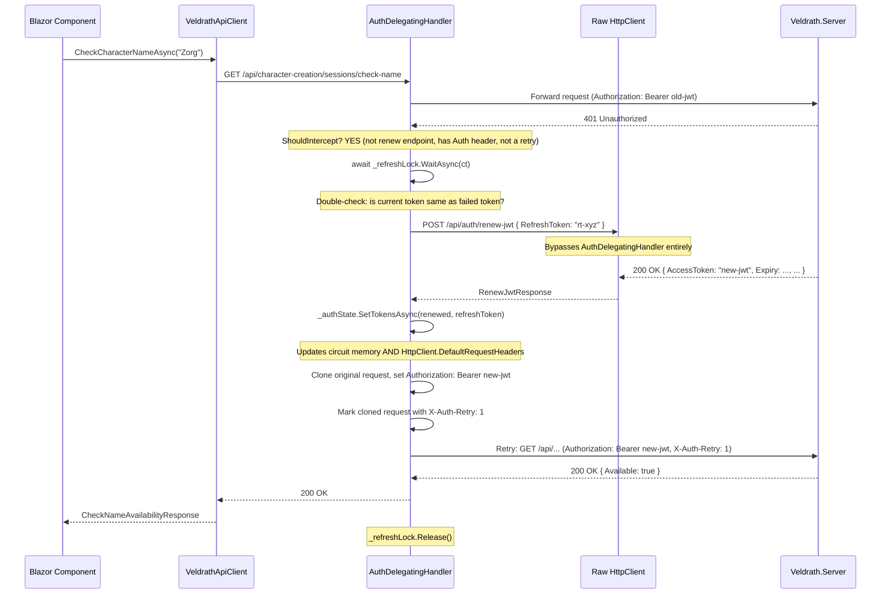
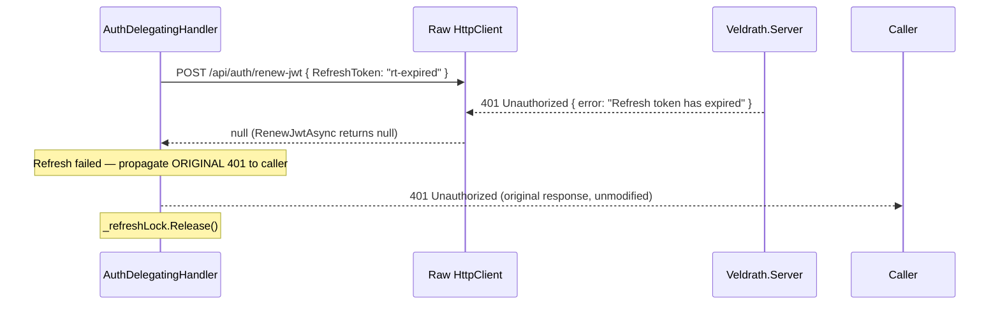

# AuthDelegatingHandler — Design Document

## Reactive 401 → Token Refresh → Retry for Blazor Server

**Status:** Draft  
**Date:** 2026-07-21  
**Phase:** 2 — Design (implementation to follow in separate phase)

---

## Table of Contents

1. [Problem Statement](#problem-statement)
2. [Class Design](#class-design)
3. [DI Registration Approach](#di-registration-approach)
4. [Full Flow — Sequence Diagram](#full-flow--sequence-diagram)
5. [Concurrency Control Strategy](#concurrency-control-strategy)
6. [Circular Dependency Avoidance](#circular-dependency-avoidance)
7. [Integration with Existing AuthStateServiceBase and VeldrathApiClient](#integration-with-existing-authstateservicebase-and-veldrathapiclient)
8. [Coexistence of Proactive and Reactive Refresh](#coexistence-of-proactive-and-reactive-refresh)
9. [Configuration](#configuration)
10. [Files Changed / Added Summary](#files-changed--added-summary)

---

## Problem Statement

The Veldrath Web app (Blazor Server) currently uses a **proactive-refresh-only** pattern for JWT management. Components must explicitly call [`AuthStateServiceBase.TryRefreshAsync()`](Veldrath.Auth.Blazor/AuthStateServiceBase.cs:135) before making authenticated API calls. If a component forgets (e.g., [`CreateCharacter.razor`](Veldrath.GameClient.Components/Components/Pages/CreateCharacter.razor:1094)), the API call fails with 401 and the error handler shows a generic message like _"Server error while checking name."_ — indistinguishable from a genuine 5xx server error. There is **no** `DelegatingHandler` anywhere in the codebase that intercepts 401 responses for automatic token refresh.

The solution is an `AuthDelegatingHandler` — a reactive safety net that catches 401 responses at the `HttpClient` pipeline level, attempts a one-time token refresh, and retries the original request with the fresh JWT.

---

## Class Design

### Namespace & Location

```
File: Veldrath.Auth.Blazor/AuthDelegatingHandler.cs
Namespace: Veldrath.Auth.Blazor
```

**Rationale:** The handler depends on `AuthStateServiceBase` (defined in this project) and is specific to Blazor Server's scoped circuit lifetime. Placing it in [`Veldrath.Auth.Blazor/`](Veldrath.Auth.Blazor/) keeps it alongside the auth state management it integrates with, while remaining reusable by any Blazor Server consumer (Veldrath.Web, RealmFoundry, etc.). It does NOT belong in [`Veldrath.Auth/`](Veldrath.Auth/) (which is framework-agnostic) or [`Veldrath.Web/`](Veldrath.Web/) (which is too application-specific).

### Constructor Dependencies

```csharp
public sealed class AuthDelegatingHandler : DelegatingHandler
{
    private readonly AuthStateServiceBase _authState;
    private readonly IHttpClientFactory _httpClientFactory;
    private readonly IConfiguration _configuration;
    private readonly ILogger<AuthDelegatingHandler> _logger;
    private readonly SemaphoreSlim _refreshLock = new(1, 1);

    // Tracks the token value that was in use when a 401 was received,
    // so we can detect if another concurrent request already refreshed it.
    private string? _lastFailedAccessToken;
}
```

| Dependency | Role |
|---|---|
| `AuthStateServiceBase` | Provides the refresh token (`RefreshToken` — see [§7](#integration-with-existing-authstateservicebase-and-veldrathapiclient)), the new JWT setter (`SetTokensAsync`), and expiry metadata |
| `IHttpClientFactory` | Creates a **raw** `HttpClient` (named `"veldrath-web-raw"`) for the renew call, bypassing this handler entirely |
| `IConfiguration` | Reads the server base URL and optional timeout/retry settings |
| `ILogger<AuthDelegatingHandler>` | Structured diagnostic logging for 401 interception, refresh attempts, and failures |
| `SemaphoreSlim` | Instance-level lock (per scope = per circuit) that prevents thundering-herd concurrent refreshes |

### Method Signatures

```csharp
/// <summary>
/// Intercepts HTTP responses. On 401, attempts a one-time JWT renewal and retries
/// the original request. On refresh failure, propagates the original 401.
/// </summary>
protected override async Task<HttpResponseMessage> SendAsync(
    HttpRequestMessage request, CancellationToken cancellationToken);
```

### Helper Methods

```csharp
/// <summary>
/// Calls POST /api/auth/renew-jwt with the stored refresh token using a raw
/// HttpClient that bypasses this handler. Returns the RenewJwtResponse on
/// success, or null on failure.
/// </summary>
private async Task<RenewJwtResponse?> RenewJwtAsync(CancellationToken ct);

/// <summary>
/// Determines whether the handler should intercept this response for refresh.
/// Returns false for renew-jwt endpoint itself, non-401 status codes,
/// and requests that already carry no Authorization header.
/// </summary>
private static bool ShouldIntercept(HttpRequestMessage request, HttpResponseMessage response);
```

### Key Design Decisions Within the Class

1. **One retry only.** After a successful refresh, the request is retried exactly once with the new token. If that retry ALSO returns 401, the handler propagates the 401 — it does not loop. This is enforced by setting a `"X-Auth-Retry"` marker on the retried request message, which `ShouldIntercept` checks to prevent re-interception.

2. **Token staleness detection.** After acquiring `_refreshLock`, the handler compares the current `Authorization` header token against `_lastFailedAccessToken`. If they differ, another request already refreshed the token — skip the refresh call, update the request's token, and retry.

3. **`RefreshToken` property added to `AuthStateServiceBase`.** The base class currently has `_refreshToken` as a `protected` field. A new `public string? RefreshToken => _refreshToken;` property is added so the handler can read the current refresh token without subclassing. The existing `AuthStateService` in [`Veldrath.Web/Services/AuthStateService.cs`](Veldrath.Web/Services/AuthStateService.cs:34) already shadows this — its `new` keyword can be removed after this addition.

4. **`SetBearerToken` call after refresh.** After a successful renew, the handler calls `_authState.SetTokensAsync(renewed, _authState.RefreshToken!)` which both updates the JWT in circuit memory AND calls `api.SetBearerToken()` on the scoped `HttpClient`'s `DefaultRequestHeaders`. This ensures subsequent requests use the new token automatically.

---

## DI Registration Approach

### Named HttpClient Strategy — Two Clients

In [`Veldrath.Web/Program.cs`](Veldrath.Web/Program.cs:50), the current registration is:

```csharp
builder.Services.AddHttpClient("veldrath-web", client =>
    client.BaseAddress = new Uri(serverUrl));
```

This is replaced with:

```csharp
// Primary authenticated client — all game API calls go through this pipeline.
// AuthDelegatingHandler intercepts 401 responses for automatic token refresh.
builder.Services.AddScoped<AuthDelegatingHandler>();
builder.Services.AddHttpClient("veldrath-web", client =>
    client.BaseAddress = new Uri(serverUrl))
    .AddHttpMessageHandler<AuthDelegatingHandler>();

// Raw client with NO auth handler — used exclusively by AuthDelegatingHandler
// for the renew-jwt call, avoiding circular interception.
builder.Services.AddHttpClient("veldrath-web-raw", client =>
    client.BaseAddress = new Uri(serverUrl));
```

### Why Scoped?

The `AuthDelegatingHandler` is registered as **scoped** (via `AddScoped` before `AddHttpMessageHandler`) for these reasons:

1. **Blazor Server circuits are scoped.** Each circuit has its own `AuthStateServiceBase` instance with its own `_refreshToken`. A transient handler could be created mid-circuit and lose access to the scoped auth state.

2. **Per-circuit concurrency control.** The `SemaphoreSlim` in the handler is instance-scoped, meaning it only serializes refresh attempts within a single user's circuit — not across all users.

3. **`AddHttpMessageHandler<T>` respects existing DI registrations.** By registering the handler as scoped first, `AddHttpMessageHandler` uses that registration rather than creating a new transient one.

### Registration in Other Blazor Server Apps

For [`RealmFoundry`](RealmFoundry/), the same pattern would be used in its [`Program.cs`](RealmFoundry/Program.cs):

```csharp
builder.Services.AddScoped<AuthDelegatingHandler>();
builder.Services.AddHttpClient("foundry-api", client =>
    client.BaseAddress = new Uri(serverUrl))
    .AddHttpMessageHandler<AuthDelegatingHandler>();
builder.Services.AddHttpClient("foundry-api-raw", client =>
    client.BaseAddress = new Uri(serverUrl));
```

---

## Full Flow — Sequence Diagram



### Failure Path — Refresh Token Invalid/Expired



---

## Concurrency Control Strategy

### The Problem — Thundering Herd

In a Blazor Server circuit, multiple UI events can fire concurrently (e.g., rapid name-check debounce plus a simultaneous class selection). If the JWT expires between these calls, ALL of them receive 401 simultaneously. Without coordination, each would independently call the renew endpoint, wasting resources and potentially causing race conditions.

### The Solution — Per-Circuit `SemaphoreSlim`

```
┌────────────────────────────────────────────────────┐
│ Single Blazor Circuit (one user)                    │
│                                                     │
│  Request A ──► 401 ──► WaitAsync(lock)              │
│                              │                      │
│  Request B ──► 401 ──► WaitAsync(lock) [blocked]   │
│                                                     │
│  [A enters critical section]                        │
│  [A calls renew-jwt → success]                      │
│  [A updates token in auth state]                    │
│  [A retries → 200 OK]                               │
│  [A releases lock]                                  │
│                                                     │
│  [B enters critical section]                        │
│  [B detects: current token ≠ failed token]          │
│  [B skips renew, updates request with new token]    │
│  [B retries → 200 OK]                               │
│  [B releases lock]                                  │
│                                                     │
└────────────────────────────────────────────────────┘
```

### Key Details

| Aspect | Implementation |
|---|---|
| Lock scope | Per-instance (`SemaphoreSlim` is an instance field). Since the handler is scoped to the circuit, this is per-user-session. |
| Max count | `new SemaphoreSlim(1, 1)` — at most one refresh at a time per circuit. |
| Async-friendly | `WaitAsync(cancellationToken)` — does not block the Blazor SignalR message loop. |
| Timeout | `WaitAsync` is passed the request's `CancellationToken`. If the user navigates away (circuit disposed), the `CancellationToken` fires and the wait is cancelled. Optionally, a hard timeout (e.g., 10 seconds) can be combined via `CancellationTokenSource.CreateLinkedTokenSource`. |
| Double-check after acquire | After acquiring the lock, the handler reads the current `Authorization` header from `_authState.AccessToken`. If it differs from the failed token stored in `_lastFailedAccessToken`, another request already refreshed — skip the renew call entirely and proceed directly to retry. |
| Lock release | Always released in a `finally` block after the critical section, even on exceptions. |

### Why Not a Static/Global Lock?

A static `SemaphoreSlim` would serialize refresh across ALL users/circuits. If User A's refresh takes 500ms, User B's refresh (for a completely different token) would unnecessarily wait. Per-circuit locking provides isolation — each user's circuit refreshes independently.

---

## Circular Dependency Avoidance

### The Circularity Problem

```
AuthDelegatingHandler intercepts 401
  → calls POST /api/auth/renew-jwt
    → which goes through the SAME HttpClient pipeline
      → which goes through AuthDelegatingHandler again
        → if renew also returns 401 → INFINITE LOOP
```

### Solution — Dual Named HttpClients + Path Guard

Two independent mechanisms prevent circularity:

#### 1. Raw HttpClient for Renew Calls (Primary Defense)

The handler does NOT use the same `HttpClient` pipeline for the renew call. Instead, it uses `IHttpClientFactory` to create a client from a **separate named registration** (`"veldrath-web-raw"`) that has no `AuthDelegatingHandler` in its pipeline:

```
"veldrath-web" pipeline:
  HttpMessageHandler → AuthDelegatingHandler → HttpClient (for game API calls)

"veldrath-web-raw" pipeline:
  HttpMessageHandler → HttpClient (for renew-jwt call only)
```

The renew call bypasses the handler entirely.

#### 2. Path-Based Skip (Defense in Depth)

As a safety measure, `ShouldIntercept()` also returns `false` for any request whose URI path ends with `/api/auth/renew-jwt`. This prevents accidental interception if a raw client is misconfigured or unavailable.

```csharp
private static bool ShouldIntercept(HttpRequestMessage request, HttpResponseMessage response)
{
    // Never intercept the renew endpoint itself
    if (request.RequestUri?.AbsolutePath.EndsWith("/api/auth/renew-jwt", 
            StringComparison.OrdinalIgnoreCase) == true)
        return false;

    // Only intercept 401
    if (response.StatusCode != HttpStatusCode.Unauthorized)
        return false;

    // Only intercept requests that had an Authorization header
    // (unauthenticated requests getting 401 is expected)
    if (request.Headers.Authorization is null)
        return false;

    // Don't intercept an already-retried request
    if (request.Headers.Contains("X-Auth-Retry"))
        return false;

    return true;
}
```

#### 3. Retry Marker (Loop Prevention)

The retried request carries a custom header `X-Auth-Retry: 1`. `ShouldIntercept` checks for this and returns `false`, ensuring exactly one retry attempt per original request.

### Why Not Use a Single Client with Path Skip?

Using a single `HttpClient` pipeline with only path-based skipping would work but creates a subtle dependency: the handler would need access to an `HttpClient` to make the renew call, but the only `HttpClient` available in the pipeline is the one that goes through the handler. The handler doesn't have a reference to the outer `HttpClient` — it only sees `HttpRequestMessage` objects flowing through `SendAsync`. It would need to construct its own HTTP request using an `HttpClientHandler` directly, which bypasses the `IHttpClientFactory` lifetime management.

The dual-client approach is cleaner: `IHttpClientFactory` manages both client lifetimes, the handler gets a properly configured `HttpClient` for renew calls, and the separation of concerns is explicit.

---

## Integration with Existing AuthStateServiceBase and VeldrathApiClient

### What Changes in AuthStateServiceBase

A single new property is added to expose the refresh token:

```csharp
// NEW — added to AuthStateServiceBase at line ~66 (after AccessToken):
/// <summary>
/// Gets the raw refresh token held in circuit memory, or <see langword="null"/>
/// if not authenticated. Exposed for the <see cref="AuthDelegatingHandler"/> to
/// perform reactive token renewal on 401 responses.
/// </summary>
public string? RefreshToken => _refreshToken;
```

The existing [`AuthStateService`](Veldrath.Web/Services/AuthStateService.cs:34) in Veldrath.Web shadows `RefreshToken` with `new` — that `new` keyword is removed since the base class now provides it.

### What Changes in VeldrathApiClient

**No changes needed.** [`VeldrathApiClient`](Veldrath.Web/Services/VeldrathApiClient.cs) continues to work exactly as before. The `AuthDelegatingHandler` operates transparently in the `HttpClient` pipeline — from the client's perspective, it just gets successful responses (or the final 401 if refresh fails). Methods like `EnsureSuccessStatusCode()` work correctly because the handler retries at the HTTP level before the response reaches the client code.

### Data Flow After Login

```
1. User logs in
2. AuthStateService.SetTokensAsync(AuthResponse)
   ├── _accessToken = response.AccessToken
   ├── _refreshToken = response.RefreshToken
   └── api.SetBearerToken(response.AccessToken)  // sets DefaultRequestHeaders
3. VeldrathApiClient now has Authorization: Bearer <jwt> on all requests
4. AuthDelegatingHandler has access to _authState.RefreshToken
```

### Data Flow During 401 Recovery

```
1. API call returns 401
2. AuthDelegatingHandler reads _authState.RefreshToken
3. AuthDelegatingHandler calls POST /api/auth/renew-jwt via raw client
4. On success: _authState.SetTokensAsync(renewed, refreshToken)
   ├── _accessToken = new JWT
   ├── _refreshToken = unchanged
   └── api.SetBearerToken(new JWT)  // updates DefaultRequestHeaders for future requests
5. Handler retries original request with new JWT in Authorization header
6. VeldrathApiClient receives successful response — never saw the 401
```

### The RefreshToken Field Is NOT Rotated

The [`RenewJwtAsync`](Veldrath.Server/Features/Auth/AuthService.cs:145) endpoint issues a fresh JWT **without rotating the refresh token**. This is intentional — the Blazor circuit holds one refresh token for its lifetime, and `RenewJwtAsync` keeps it valid. The refresh token only rotates during full login/register flows (which return `AuthResponse` with a new refresh token).

This design means the `AuthDelegatingHandler` doesn't need to worry about refresh token rotation — it just passes the same refresh token each time.

---

## Coexistence of Proactive and Reactive Refresh

### Two Complementary Layers

```
┌──────────────────────────────────────────────────────────┐
│                                                          │
│  LAYER 1: Proactive (TryRefreshAsync)                    │
│  ┌────────────────────────────────────────────────────┐  │
│  │ Component calls TryRefreshAsync() before API call  │  │
│  │ - Checks AccessTokenExpiry                         │  │
│  │ - If within 2 min of expiry → renew now            │  │
│  │ - Prevents MOST 401s at the application layer      │  │
│  └────────────────────────────────────────────────────┘  │
│                         │                                │
│                         ▼                                │
│  LAYER 2: Reactive (AuthDelegatingHandler)               │
│  ┌────────────────────────────────────────────────────┐  │
│  │ Handler intercepts 401 at HTTP pipeline            │  │
│  │ - Catches 401s that slip through Layer 1           │  │
│  │ - One-time refresh + retry                         │  │
│  │ - Safety net, not the primary mechanism            │  │
│  └────────────────────────────────────────────────────┘  │
│                                                          │
└──────────────────────────────────────────────────────────┘
```

### Interaction Scenarios

| Scenario | Proactive Result | Reactive Result | Net Effect |
|---|---|---|---|
| Component calls `TryRefreshAsync()`, token is fresh (>2 min) | Skips renew, returns `true` | Handler never sees 401 | No double-renew, normal flow |
| Component calls `TryRefreshAsync()`, token near expiry (<2 min) | Renews successfully | Handler never sees 401 | One renew via proactive path |
| Component forgets `TryRefreshAsync()`, token just expired | N/A | Handler catches 401, renews, retries | One renew via reactive path |
| Both fire: proactive renews, but server clock skew causes 401 anyway | Renews (token is now fresh) | Handler catches 401, calls renew again | Two renews — harmless. Second renew returns a fresh JWT that's only seconds newer. |

### Potential Double-Renew Mitigation

The proactive `TryRefreshAsync()` uses a 2-minute threshold. After a successful proactive renew, `AccessTokenExpiry` is ~15 minutes in the future. If a 401 still arrives (due to clock skew, server restart with new signing key, etc.), the reactive handler will attempt a second renew — which succeeds because the refresh token is still valid. This is harmless and serves as a robust fallback.

### Recommendation

Existing components should continue calling `TryRefreshAsync()` before authenticated API calls. The `AuthDelegatingHandler` is a safety net, not a replacement for the proactive pattern. The proactive approach is more efficient (avoids the 401 round-trip entirely) and gives the component an early signal if the refresh token itself is invalid.

---

## Configuration

### appsettings.json — New Section

```json
{
  "Auth": {
    "CookieDomain": "",
    "RefreshHandler": {
      "RenewTimeoutSeconds": 10,
      "Enabled": true
    }
  }
}
```

| Key | Type | Default | Description |
|---|---|---|---|
| `Auth:RefreshHandler:RenewTimeoutSeconds` | `int` | `10` | Hard timeout for the renew-jwt HTTP call. If the server doesn't respond within this window, the handler propagates the original 401. |
| `Auth:RefreshHandler:Enabled` | `bool` | `true` | Master kill-switch. Set to `false` to disable reactive refresh entirely (e.g., for debugging auth issues). |

### Why Not appsettings for Retry Count?

The design intentionally hardcodes **exactly one retry**. Allowing configuration of retry count invites misconfiguration (e.g., setting it to 5, causing 5 sequential renew calls). One retry is the correct number for JWT refresh — if the refresh token itself is invalid, no amount of retrying will help.

### Server Base URL

The handler reads the server base URL from `IConfiguration["Veldrath:ServerUrl"]`, which is already configured in [`appsettings.Development.json`](Veldrath.Web/appsettings.Development.json:9). This is the same URL used by the named `HttpClient`. The handler uses this to construct the renew endpoint URL when building the raw HTTP request.

---

## Files Changed / Added Summary

### New Files

| File | Description |
|---|---|
| [`Veldrath.Auth.Blazor/AuthDelegatingHandler.cs`](Veldrath.Auth.Blazor/AuthDelegatingHandler.cs) | The `DelegatingHandler` implementation (~150 lines) |
| [`Veldrath.Auth.Blazor.Tests/AuthDelegatingHandlerTests.cs`](Veldrath.Auth.Blazor.Tests/AuthDelegatingHandlerTests.cs) | Unit tests covering all scenarios |

### Modified Files

| File | Change |
|---|---|
| [`Veldrath.Auth.Blazor/AuthStateServiceBase.cs`](Veldrath.Auth.Blazor/AuthStateServiceBase.cs:66) | Add `public string? RefreshToken => _refreshToken;` property |
| [`Veldrath.Web/Program.cs`](Veldrath.Web/Program.cs:50) | Register `AuthDelegatingHandler` as scoped; add `"veldrath-web-raw"` named `HttpClient`; add `AddHttpMessageHandler<AuthDelegatingHandler>()` to primary client |
| [`Veldrath.Web/Services/AuthStateService.cs`](Veldrath.Web/Services/AuthStateService.cs:34) | Remove `new` keyword from `RefreshToken` property (now inherited from base) |
| [`Veldrath.Web/appsettings.json`](Veldrath.Web/appsettings.json:9) | Add `Auth:RefreshHandler` section |
| [`Veldrath.Auth.Blazor/Veldrath.Auth.Blazor.csproj`](Veldrath.Auth.Blazor/Veldrath.Auth.Blazor.csproj) | Add `Microsoft.Extensions.Http` package reference (for `IHttpClientFactory`) |

### Test Coverage Plan

| Scenario | Test Approach |
|---|---|
| Non-401 response passes through unchanged | Arrange handler with fake inner handler returning 200; assert response is 200 |
| 401 with valid refresh token → refresh succeeds → retry returns 200 | `FakeHttpMessageHandler` returns 401 then 200; assert final response is 200; verify renew was called exactly once |
| 401 with invalid/expired refresh token → refresh fails → 401 propagated | Renew returns null; assert original 401 is propagated |
| Concurrent 401s → only one refresh call | Fire 3 concurrent requests that all get 401; assert renew endpoint was hit exactly once |
| Renew endpoint path skipped | Request to `/api/auth/renew-jwt` returns 401; assert handler does NOT intercept (passes through) |
| Request with X-Auth-Retry header skipped | Already-retried request returns 401; assert handler does NOT re-intercept |
| Unauthenticated request (no Authorization header) getting 401 | Assert 401 passes through without refresh attempt |
| Refresh succeeds but retry also fails → propagates second 401 | Renew succeeds, second request returns 401; assert final 401 propagated, no infinite loop |
| Handler disposed during refresh | CancellationToken fires; assert `OperationCanceledException` propagated |
| `Enabled: false` in config → all 401s pass through | Assert no refresh attempt when disabled |

---

## Appendix: Design Decisions Log

| # | Decision | Alternatives Considered | Rationale |
|---|---|---|---|
| 1 | Handler location: `Veldrath.Auth.Blazor/` | `Veldrath.Auth/` (too low-level, no Blazor awareness); `Veldrath.Web/` (too specific, not reusable by RealmFoundry) | Right layer of abstraction — Blazor-aware but app-agnostic |
| 2 | Scoped lifetime for handler | Transient (default for `AddHttpMessageHandler`); Singleton (shared lock across all users) | Scoped matches Blazor circuit lifetime and provides per-user isolation for concurrency control |
| 3 | Dual named `HttpClient` for renew calls | Single client with path-based skip only; direct `HttpClientHandler` construction | Dual client is explicit, leverages `IHttpClientFactory` lifetime management, and has clear separation |
| 4 | `SemaphoreSlim` per instance | Static `SemaphoreSlim` (global lock); `ConcurrentDictionary` keyed by user ID; no lock at all | Per-instance = per-circuit = per-user. Simplest correct implementation |
| 5 | `RefreshToken` property on `AuthStateServiceBase` | Delegate/func token provider; `IHttpContextAccessor` resolution; new interface | Adding one property to the base class is the minimal change with no new abstractions |
| 6 | Hardcoded one retry (not configurable) | Configurable retry count | One retry is always correct for JWT refresh; configurability invites misconfiguration |
| 7 | `X-Auth-Retry` custom header for loop prevention | `HttpRequestMessage.Properties` dictionary; separate boolean flag | Custom header is transparent, survives cloning, and is easy to inspect in logs |
| 8 | `IConfiguration` for server URL + settings | Hardcoded defaults; separate options class | Already established pattern in the project; minimal ceremony |
