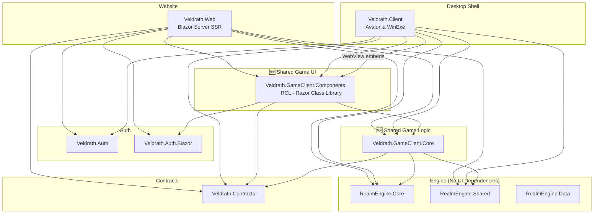
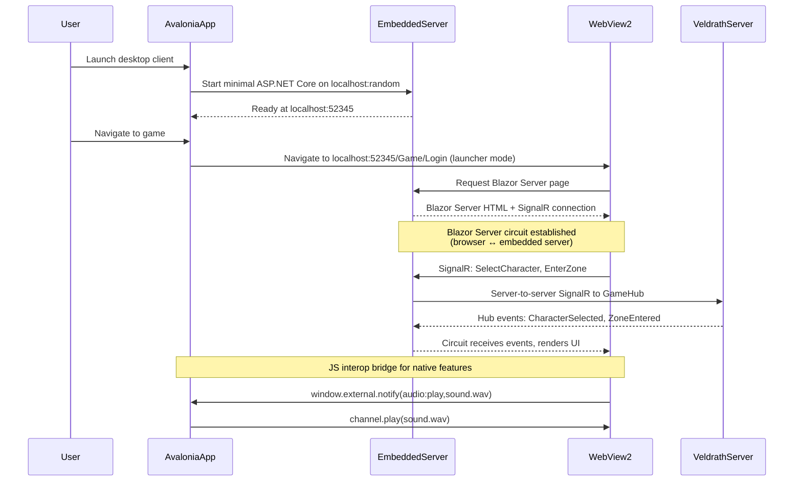
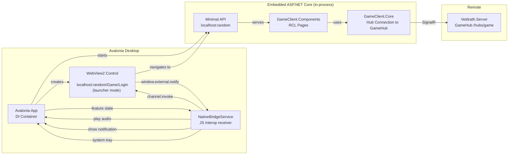

# Game Client Unification Plan — Veldrath

> **Date:** 2026-07-01
> **Status:** Final — Approved
> **Scope:** Restructure Veldrath projects to achieve identical game client experiences across browser and desktop, with the game UI in a single place for updates.

---

## Table of Contents

1. [Current State Analysis](#1-current-state-analysis)
2. [Target Project Structure](#2-target-project-structure)
3. [File Migration Map](#3-file-migration-map)
4. [Dependency Graph](#4-dependency-graph)
5. [WebView/Blazor Hosting Decision](#5-webviewblazor-hosting-decision)
6. [Phased Migration Plan](#6-phased-migration-plan)
7. [Risks and Mitigations](#7-risks-and-mitigations)
8. [Open Questions for User Input](#8-open-questions-for-user-input)

---

## 1. Current State Analysis

### 1.1 Veldrath.Web (Blazor Server Interactive SSR)

**Mixed concerns** — the project bundles a marketing/community website AND a full game client:

| Website Pages | Game Pages (to extract) |
|---|---|
| [`Index.razor`](Veldrath.Web/Components/Pages/Index.razor) | [`CharacterSelect.razor`](Veldrath.Web/Components/Pages/Game/CharacterSelect.razor) |
| [`Community.razor`](Veldrath.Web/Components/Pages/Community.razor) | [`CreateCharacter.razor`](Veldrath.Web/Components/Pages/Game/CreateCharacter.razor) |
| [`Lore/Index.razor`](Veldrath.Web/Components/Pages/Lore/Index.razor) | [`Game.razor`](Veldrath.Web/Components/Pages/Game/Game.razor) |
| [`Lore/Detail.razor`](Veldrath.Web/Components/Pages/Lore/Detail.razor) | [`GameChat.razor`](Veldrath.Web/Components/Pages/Game/GameChat.razor) |
| [`PatchNotes/Index.razor`](Veldrath.Web/Components/Pages/PatchNotes/Index.razor) | [`GameCombat.razor`](Veldrath.Web/Components/Pages/Game/GameCombat.razor) |
| [`PatchNotes/Detail.razor`](Veldrath.Web/Components/Pages/PatchNotes/Detail.razor) | [`GameFooter.razor`](Veldrath.Web/Components/Pages/Game/GameFooter.razor) |
| [`Login.razor`](Veldrath.Web/Components/Pages/Login.razor) | [`GameHeader.razor`](Veldrath.Web/Components/Pages/Game/GameHeader.razor) |
| [`Register.razor`](Veldrath.Web/Components/Pages/Register.razor) | [`GameOverlay.razor`](Veldrath.Web/Components/Pages/Game/GameOverlay.razor) |
| [`ForgotPassword.razor`](Veldrath.Web/Components/Pages/ForgotPassword.razor) | [`GameSidebar.razor`](Veldrath.Web/Components/Pages/Game/GameSidebar.razor) |
| [`ResetPassword.razor`](Veldrath.Web/Components/Pages/ResetPassword.razor) | [`GameTilemap.razor`](Veldrath.Web/Components/Pages/Game/GameTilemap.razor) |
| [`ConfirmEmail.razor`](Veldrath.Web/Components/Pages/ConfirmEmail.razor) | [`Shared/Tile.razor`](Veldrath.Web/Components/Shared/Tile.razor) |
| [`Account/Profile.razor`](Veldrath.Web/Components/Pages/Account/Profile.razor) | [`Shared/StatusBar.razor`](Veldrath.Web/Components/Shared/StatusBar.razor) |
| | [`Shared/ActionBar.razor`](Veldrath.Web/Components/Shared/ActionBar.razor) |
| | [`Shared/GamePanel.razor`](Veldrath.Web/Components/Shared/GamePanel.razor) |
| | [`GameLayout.razor`](Veldrath.Web/Components/Layout/GameLayout.razor) |

**Web-specific game services:**

| Service | Role |
|---|---|
| [`GameHubConnectionService`](Veldrath.Web/Services/GameHubConnectionService.cs) | Manages server-to-server SignalR `HubConnection` to `Veldrath.Server`'s `GameHub` |
| [`GameStateService`](Veldrath.Web/Services/GameStateService.cs) | Per-circuit game state with `INotifyPropertyChanged` for Blazor rendering |
| [Payload DTOs](Veldrath.Web/Components/Pages/Game/Game.razor.cs#L429-L478) | Inline `sealed record` types matching server hub broadcast events |

### 1.2 Veldrath.Client (Avalonia Desktop, WinExe)

**Pure game client** — no website concerns. Uses ReactiveUI MVVM with 26 Views, 28 ViewModels.

Key characteristics:
- [`GameViewModel`](Veldrath.Client/ViewModels/GameViewModel.cs) (2,791 lines) is the orchestration hub — receives all SignalR events, manages all game state reactively
- [`ZoneLocationPanelViewModel`](Veldrath.Client/ViewModels/ZoneLocationPanelViewModel.cs) — post-reactive-pivot panel-driven location UI (replaced tilemap)
- [`ServerConnectionService`](Veldrath.Client/Services/ServerConnectionService.cs) — richer connection management than web version (ping, connection state machine, version checking)
- Native-only features: LibVLC audio, DPAPI token persistence (Windows), system tray, `FluentAvaloniaUI` dialogs
- Direct SignalR connection from client to `Veldrath.Server`'s `GameHub`

### 1.3 Key Differences Between Web and Desktop Clients

| Aspect | Veldrath.Web (Blazor) | Veldrath.Client (Avalonia) |
|---|---|---|
| SignalR Connection | Server-to-server (Blazor circuit → GameHub) | Direct (desktop → GameHub) |
| State Management | `GameStateService` + `INotifyPropertyChanged` | ReactiveUI `ObservableAsPropertyHelper` + `ReactiveCommand` |
| Game UI Paradigm | CSS Grid tilemap-based (pre-pivot) | Panel-driven text/list (post-pivot) |
| Main Controller | `.razor` page + code-behind (426 lines) | `GameViewModel` (2,791 lines) |
| Payload DTOs | Inline `sealed record` types per page | ViewModel-scoped records + shared from [`Veldrath.Contracts`](Veldrath.Contracts/) |
| Audio | None (browser) | LibVLC (desktop) |
| Token Persistence | Cookie-based (browser) | DPAPI-encrypted file (Windows) |
| Tile Description | Tile type → CSS class mapping | [`TileDescriptionService`](Veldrath.Client/Services/TileDescriptionService.cs) |

---

## 2. Target Project Structure

### 2.1 New Project Definitions

| # | Project | Type | Purpose |
|---|---------|------|---------|
| ✅ | `Veldrath.Web` | Blazor Server App (keep) | **Website only** — landing, community, lore, patch notes, account management. Remove all `Game/` folders and references. |
| 🆕 | `Veldrath.GameClient.Core` | .NET Class Library | **Non-visual shared game logic**: SignalR connection abstraction, game state service, hub event payload contracts, connection management interfaces. No UI framework dependencies. |
| 🆕 | `Veldrath.GameClient.Components` | Razor Class Library (RCL) | **All game Razor components**: CharacterSelect, CreateCharacter, Game, GameChat, GameCombat, GameTilemap, and all shared sub-components. Zero dependency on `Veldrath.Web`. |
| 🔄 | `Veldrath.Client` | Avalonia WinExe (restructure) | **Desktop shell** — hosts the RCL game UI via WebView/embedded browser. Keeps native features: LibVLC audio, system tray, DPAPI persistence, window management. |

### 2.2 Project Details

```
Veldrath.GameClient.Core/              # 🆕 Class Library
├── Veldrath.GameClient.Core.csproj
├── Abstractions/
│   ├── IGameHubConnectionService.cs   # Interface extracted from Veldrath.Web
│   └── IGameStateService.cs           # Interface extracted from Veldrath.Web
├── Services/
│   ├── GameHubConnectionService.cs    # Moved from Veldrath.Web, refactored to interface
│   ├── GameStateService.cs            # Moved from Veldrath.Web, refactored to interface
│   └── ConnectionState.cs             # Enum + state machine (unified web+desktop)
├── Payloads/
│   ├── CharacterSelectedPayload.cs    # Shared record (was inline in Game.razor.cs)
│   ├── CombatPayloads.cs              # CombatStarted, CombatTurn, CombatEnded payloads
│   ├── ChatPayloads.cs                # ChatMessageDto (was inline)
│   ├── ZonePayloads.cs                # ZoneEntered, ZoneTileMap, PlayerEntered/Left
│   └── EntityPayloads.cs              # CharacterMoved, ZoneEntitiesSnapshot, EnemyDefeated
└── Models/
    ├── CharacterBasicInfo.cs          # Moved from Veldrath.Web
    ├── EnemyInfo.cs                   # Moved from Veldrath.Web
    └── OccupantInfo.cs                # Moved from Veldrath.Web

Veldrath.GameClient.Components/        # 🆕 Razor Class Library
├── Veldrath.GameClient.Components.csproj
├── _Imports.razor
├── Components/
│   ├── Layout/
│   │   └── GameLayout.razor           # Moved from Veldrath.Web
│   ├── Pages/
│   │   ├── CharacterSelect.razor       # Moved from Veldrath.Web
│   │   ├── CharacterSelect.razor.cs
│   │   ├── CreateCharacter.razor       # Moved from Veldrath.Web
│   │   ├── CreateCharacter.razor.cs
│   │   ├── Game.razor                  # Moved from Veldrath.Web
│   │   ├── Game.razor.cs
│   │   ├── GameChat.razor
│   │   ├── GameCombat.razor
│   │   ├── GameFooter.razor
│   │   ├── GameHeader.razor
│   │   ├── GameOverlay.razor
│   │   ├── GameSidebar.razor
│   │   └── GameTilemap.razor
│   └── Shared/
│       ├── ActionBar.razor
│       ├── GamePanel.razor
│       ├── StatusBar.razor
│       └── Tile.razor
├── wwwroot/
│   └── css/
│       └── game.css                    # Moved from Veldrath.Web
└── Services/ (page-specific service wiring — uses DI from host)

Veldrath.Web/                          # 🔄 Cleaned
├── Veldrath.Web.csproj               # REMOVE: Game/ pages, RCL references
│                                    # REMOVE: GameHubConnectionService, GameStateService
│                                    # REMOVE: SignalR Client package
│                                    # ADD: Reference to GameClient.Components
├── Program.cs                        # REMOVE: GameHubConnectionService, GameStateService DI
├── Services/
│   ├── AuthStateService.cs           # KEEP (website auth)
│   └── VeldrathApiClient.cs          # KEEP (website API calls)
├── Components/
│   ├── Pages/
│   │   ├── Index.razor              # KEEP
│   │   ├── Community.razor          # KEEP
│   │   ├── Login.razor              # KEEP
│   │   ├── Register.razor           # KEEP
│   │   ├── Lore/                    # KEEP
│   │   └── PatchNotes/              # KEEP
│   └── Layout/
│       ├── MainLayout.razor         # KEEP (website layout)
│       └── NavMenu.razor            # KEEP (remove Play Game link, redirect to desktop/separate URL)
└── [Game/ directory REMOVED]        # Entire game folder deleted

Veldrath.Client/                       # 🔄 Restructured (Desktop Shell)
├── Veldrath.Client.csproj            # ADD: WebView2 package, GameClient.Components RCL ref
├── App.axaml.cs                      # ADD: Self-hosted ASP.NET Core bootstrap (Minimal API)
├── Services/
│   ├── ServerConnectionService.cs    # KEEP (direct SignalR to GameHub — no double hop)
│   ├── ... (all existing services)   # KEEP
├── ViewModels/
│   ├── GameViewModel.cs              # MODIFY: Delegate to RCL components via WebView bridge
│   └── ... (all existing VMs)        # KEEP
├── Views/
│   ├── Game/GameView.axaml           # MODIFY: Replace ZoneLocationPanelView with WebView control
│   ├── ... (all existing views)      # KEEP (login, menu, settings, splash, map)
│   └── NativeBridge/                # 🆕 JS interop layer for audio, notifications, system tray
│       ├── NativeBridgeService.cs
│       └── bridge.js
└── HostedWeb/                        # 🆕 Embedded Minimal API for Blazor Server
    ├── GameHost.cs                   # Minimal API startup: map RCL components, configure CORS
    └── HostedWebProgram.cs           # WebApplication.CreateBuilder for embedded server
```

---

## 3. File Migration Map

### 3.1 Game Razor Components: Veldrath.Web → Veldrath.GameClient.Components

| Source (`Veldrath.Web/Components/`) | Target | Changes Needed |
|---|---|---|
| [`Pages/Game/CharacterSelect.razor`](Veldrath.Web/Components/Pages/Game/CharacterSelect.razor) | `Components/Pages/CharacterSelect.razor` | Change `@page` directive route (optional), update namespace |
| [`Pages/Game/CharacterSelect.razor.cs`](Veldrath.Web/Components/Pages/Game/CharacterSelect.razor.cs) | `Components/Pages/CharacterSelect.razor.cs` | Inject `IGameHubConnectionService` + `IGameStateService` instead of concrete types |
| [`Pages/Game/CreateCharacter.razor`](Veldrath.Web/Components/Pages/Game/CreateCharacter.razor) | `Components/Pages/CreateCharacter.razor` | Same pattern |
| [`Pages/Game/CreateCharacter.razor.cs`](Veldrath.Web/Components/Pages/CreateCharacter.razor.cs) | `Components/Pages/CreateCharacter.razor.cs` | Same pattern |
| [`Pages/Game/Game.razor`](Veldrath.Web/Components/Pages/Game/Game.razor) | `Components/Pages/Game.razor` | Inject interfaces |
| [`Pages/Game/Game.razor.cs`](Veldrath.Web/Components/Pages/Game/Game.razor.cs) | `Components/Pages/Game.razor.cs` | Reference `GameClient.Core.Payloads` instead of inline records |
| [`Pages/Game/GameChat.razor`](Veldrath.Web/Components/Pages/Game/GameChat.razor) | `Components/Pages/GameChat.razor` | Namespace update only |
| [`Pages/Game/GameCombat.razor`](Veldrath.Web/Components/Pages/Game/GameCombat.razor) | `Components/Pages/GameCombat.razor` | Namespace update only |
| [`Pages/Game/GameFooter.razor`](Veldrath.Web/Components/Pages/Game/GameFooter.razor) | `Components/Pages/GameFooter.razor` | Namespace update only |
| [`Pages/Game/GameHeader.razor`](Veldrath.Web/Components/Pages/Game/GameHeader.razor) | `Components/Pages/GameHeader.razor` | Namespace update only |
| [`Pages/Game/GameOverlay.razor`](Veldrath.Web/Components/Pages/Game/GameOverlay.razor) | `Components/Pages/GameOverlay.razor` | Namespace update only |
| [`Pages/Game/GameSidebar.razor`](Veldrath.Web/Components/Pages/Game/GameSidebar.razor) | `Components/Pages/GameSidebar.razor` | Namespace update only |
| [`Pages/Game/GameTilemap.razor`](Veldrath.Web/Components/Pages/Game/GameTilemap.razor) | `Components/Pages/GameTilemap.razor` | Namespace update only |
| [`Shared/Tile.razor`](Veldrath.Web/Components/Shared/Tile.razor) | `Components/Shared/Tile.razor` | Namespace update only |
| [`Shared/StatusBar.razor`](Veldrath.Web/Components/Shared/StatusBar.razor) | `Components/Shared/StatusBar.razor` | Namespace update only |
| [`Shared/ActionBar.razor`](Veldrath.Web/Components/Shared/ActionBar.razor) | `Components/Shared/ActionBar.razor` | Namespace update only |
| [`Shared/GamePanel.razor`](Veldrath.Web/Components/Shared/GamePanel.razor) | `Components/Shared/GamePanel.razor` | Namespace update only |
| [`Layout/GameLayout.razor`](Veldrath.Web/Components/Layout/GameLayout.razor) | `Components/Layout/GameLayout.razor` | References css `game.css` — keep reference |
| [`Layout/GameLayout.razor.cs`](Veldrath.Web/Components/Layout/GameLayout.razor.cs) | `Components/Layout/GameLayout.razor.cs` | Namespace update only |
| [`Pages/Game/_Imports.razor`](Veldrath.Web/Components/Pages/Game/_Imports.razor) | Merge into `_Imports.razor` | Consolidate |
| [`wwwroot/css/game.css`](Veldrath.Web/wwwroot/css/game.css) | `wwwroot/css/game.css` | No changes |

### 3.2 Game Services: Veldrath.Web → Veldrath.GameClient.Core

| Source (`Veldrath.Web/Services/`) | Target | Changes Needed |
|---|---|---|
| [`GameHubConnectionService.cs`](Veldrath.Web/Services/GameHubConnectionService.cs) | `Services/GameHubConnectionService.cs` | Extract `IGameHubConnectionService` interface; keep `RetryPolicy` and `DeferredDisposable` patterns |
| [`GameStateService.cs`](Veldrath.Web/Services/GameStateService.cs) | `Services/GameStateService.cs` | Extract `IGameStateService` interface; keep `INotifyPropertyChanged` (used by both Blazor and Avalonia bridge) |
| **NO EXISTING FILE** | `Abstractions/IGameHubConnectionService.cs` | **Create** — interface: `ConnectAsync`, `DisconnectAsync`, `SendAsync`, `On<T>`, `IsConnected`, `State`, `StateChanged` |
| **NO EXISTING FILE** | `Abstractions/IGameStateService.cs` | **Create** — interface: `CurrentCharacter`, `IsConnected`, `IsInCombat`, `ApplyXxx` methods, `PropertyChanged` event |
| **NO EXISTING FILE** | `Models/ConnectionState.cs` | **Create** — unified enum: `Disconnected`, `Connecting`, `Connected`, `Degraded`, `Reconnecting`, `Failed` |
| Inline records in [`Game.razor.cs`](Veldrath.Web/Components/Pages/Game/Game.razor.cs#L429-L478) | `Payloads/` directory | Extract as shared `record` types with full XML docs |

### 3.3 Website-Only (KEEP in Veldrath.Web)

| File | Reason |
|---|---|
| [`Index.razor`](Veldrath.Web/Components/Pages/Index.razor) | Landing page |
| [`Community.razor`](Veldrath.Web/Components/Pages/Community.razor) | Community portal |
| [`Lore/Index.razor`](Veldrath.Web/Components/Pages/Lore/Index.razor) | World lore index |
| [`Lore/Detail.razor`](Veldrath.Web/Components/Pages/Lore/Detail.razor) | Lore detail page |
| [`PatchNotes/Index.razor`](Veldrath.Web/Components/Pages/PatchNotes/Index.razor) | Patch notes list |
| [`PatchNotes/Detail.razor`](Veldrath.Web/Components/Pages/PatchNotes/Detail.razor) | Patch note detail |
| [`Login.razor`](Veldrath.Web/Components/Pages/Login.razor) | Login page |
| [`Register.razor`](Veldrath.Web/Components/Pages/Register.razor) | Registration |
| [`ForgotPassword.razor`](Veldrath.Web/Components/Pages/ForgotPassword.razor) | Password reset request |
| [`ResetPassword.razor`](Veldrath.Web/Components/Pages/ResetPassword.razor) | Password reset completion |
| [`ConfirmEmail.razor`](Veldrath.Web/Components/Pages/ConfirmEmail.razor) | Email confirmation |
| [`Account/Profile.razor`](Veldrath.Web/Components/Pages/Account/Profile.razor) | Account management |
| [`AuthStateService.cs`](Veldrath.Web/Services/AuthStateService.cs) | Website auth (JWT + cookie management) |
| [`VeldrathApiClient.cs`](Veldrath.Web/Services/VeldrathApiClient.cs) | Website API client |
| [`MainLayout.razor`](Veldrath.Web/Components/Layout/MainLayout.razor) | Website layout with nav |
| [`NavMenu.razor`](Veldrath.Web/Components/Layout/NavMenu.razor) | Website navigation |

### 3.4 Desktop-Specific (KEEP in Veldrath.Client)

| File | Reason |
|---|---|
| [`ServerConnectionService.cs`](Veldrath.Client/Services/ServerConnectionService.cs) | Direct SignalR connection (richer than core version); keep for native client |
| All existing ViewModels | Login, auth, character creation, map, settings, splash — all specific to desktop UX |
| All existing Views | AXAML files — native desktop rendering |
| [`App.axaml.cs`](Veldrath.Client/App.axaml.cs) | Desktop entry point, DI registration |
| [`IAudioPlayer`](Veldrath.Client/Services/IAudioPlayer.cs) + `LibVlcAudioPlayer` | Native audio |
| [`TokenPersistenceService`](Veldrath.Client/Services/TokenPersistenceService.cs) | DPAPI token storage |
| [`OAuthLocalListener`](Veldrath.Client/Services/OAuthLocalListener.cs) | OAuth flow |
| [`ClientSettings.cs`](Veldrath.Client/ClientSettings.cs) | Desktop settings persistence |
| [`SettingsPersistenceService.cs`](Veldrath.Client/Services/SettingsPersistenceService.cs) | Settings file persistence |

---

## 4. Dependency Graph

### 4.1 Reference Map



### 4.2 Detailed Project Dependencies

#### Veldrath.GameClient.Core

| Dependency | Type | Reason |
|---|---|---|
| `Microsoft.AspNetCore.SignalR.Client` | NuGet | Hub connection to GameHub |
| `Microsoft.Extensions.Logging.Abstractions` | NuGet | ILogger injection |
| `Veldrath.Contracts` | Project | Shared hub payload DTOs |
| `RealmEngine.Core` | Project | Game operation type references |
| `RealmEngine.Shared` | Project | Shared model references |

**Key design rule**: `Veldrath.GameClient.Core` MUST NOT reference any UI framework (no Blazor, no Avalonia). It is a pure .NET library.

#### Veldrath.GameClient.Components

| Dependency | Type | Reason |
|---|---|---|
| `Microsoft.AspNetCore.Components.Web` | NuGet (RCL implicit) | Blazor rendering |
| `Microsoft.AspNetCore.Components.Authorization` | NuGet | `@attribute [Authorize]` |
| `Microsoft.AspNetCore.SignalR.Client` | NuGet | For component-level SignalR usage |
| `Veldrath.GameClient.Core` | Project | Game state + connection services |
| `Veldrath.Contracts` | Project | Shared DTOs |
| `Veldrath.Auth.Blazor` | Project | Auth state for components |
| `RealmEngine.Core` | Project | Game type references |

#### Veldrath.Web (after cleanup)

| Dependency | Change |
|---|---|
| Remove `Microsoft.AspNetCore.SignalR.Client` | No longer needed (game logic moved to Core) |
| Remove `Veldrath.GameClient.Core` | Add as direct reference |
| Add `Veldrath.GameClient.Components` | Reference RCL for game pages |
| Keep `Veldrath.Auth` + `Veldrath.Auth.Blazor` | Website auth unchanged |
| Keep `RealmEngine.Core` + `RealmEngine.Shared` | May still need for editorial content types |

#### Veldrath.Client (after restructure)

| Dependency | Change |
|---|---|
| Add `Veldrath.GameClient.Core` | Shared game state/connection logic |
| Add `Veldrath.GameClient.Components` | RCL for WebView hosting |
| Add WebView2 NuGet package | `Avalonia.WebView` or manual `Microsoft.Web.WebView2` |
| Add `Microsoft.AspNetCore.App` framework reference | Self-host minimal ASP.NET Core for Blazor |
| Keep all existing dependencies | ReactiveUI, LibVLC, Avalonia packages |

### 4.3 Veldrath.Contracts Expansion Needed

The [`Veldrath.Contracts`](Veldrath.Contracts/) project currently has DTOs organized by domain. We need to add a new category:

```
Veldrath.Contracts/
├── GameClient/
│   ├── GameClientContracts.cs        # Project-level constants
│   ├── CharacterSelectedPayload.cs    # Move from inline records
│   ├── CombatPayloads.cs              # CombatStarted, CombatTurn, CombatEnded payloads
│   ├── ChatPayloads.cs                # ChatMessageDto
│   ├── ZonePayloads.cs                # ZoneEntered, PlayerEntered, PlayerLeft
│   └── EntityPayloads.cs              # CharacterMoved, ZoneEntitiesSnapshot, EnemyDefeated
```

**Alternative**: Keep payload records in `Veldrath.GameClient.Core` since they're purely client-side concerns. This avoids bloating `Veldrath.Contracts` with hub event DTOs that the server already defines in `GameHub.cs`. **Recommendation: Keep payloads in `GameClient.Core`**.

---

## 5. WebView/Blazor Hosting Decision

### 5.1 The Core Challenge

The desktop client (`Veldrath.Client`) currently renders game UI using native Avalonia controls (AXAML). To share game UI with the web client, the desktop needs to render the same Blazor Razor components. This requires embedding a browser control within the Avalonia window that hosts the Blazor game UI.

### 5.2 Options Analysis

#### Option A: Self-Host ASP.NET Core + WebView2 (RECOMMENDED)

**How it works:**
- Desktop app starts a minimal ASP.NET Core server on `localhost` (random port) at startup in a background thread
- The embedded server hosts the RCL components in Blazor Server Interactive SSR mode
- A WebView2 control in the Avalonia window points to `http://localhost:{port}/Game/Login` (launcher mode), then proceeds to `/Game/CharacterSelect` → `/Game/Play` as the user progresses through the game flow
- Native features (audio, system tray, notifications) communicate via a JS interop bridge (`window.external.notify` / `window.chrome.webview`)

**Sequence diagram:**


**Pros:**
- Single source of truth for game UI (the RCL)
- WebView2 is mature, fast, and widely available (Edge WebView2 runtime)
- Self-hosted server can be tightly integrated (share DI container, auth state)
- No dependency on external network for game UI rendering
- Works offline (for the game UI at least)

**Cons:**
- Double SignalR hop (WebView→Embedded Server→Veldrath.Server)
- ~30-50 MB memory overhead for embedded ASP.NET Core
- Startup latency (~200-500ms to boot embedded server)
- Security considerations (lock down embedded server to localhost only)
- Cross-platform: WebView2 is Windows-only by default (Linux needs WebKitGTK, macOS needs WKWebView)

#### Option B: Blazor WebAssembly Hosted in WebView2

**How it works:**
- RCL components are compiled to WebAssembly via `Microsoft.NET.Sdk.BlazorWebAssembly`
- Desktop client ships the WASM assets as embedded resources
- WebView2 loads the WASM app from a `blazor://` custom protocol handler
- SignalR connects **directly** from WebView2 to `Veldrath.Server` (no double hop)
- Native bridge via JS interop

**Pros:**
- Single SignalR hop (direct from WASM to server)
- No embedded server overhead
- True client-side rendering (faster UI interactivity)
- Same code as web client (just different hosting)

**Cons:**
- Significantly more complex build pipeline (dual-target the RCL for both Blazor Server and WASM)
- WASM download size for game UI
- Blazor WASM .NET 10 is still maturing for complex game UIs
- Debugging is harder (WASM symbols)
- JS interop bridge required for native features

#### Option C: Native Avalonia Game UI (Status Quo) — NOT RECOMMENDED

**Pros:**
- No WebView overhead
- Full native performance
- All existing features work unchanged

**Cons:**
- Duplicate UI code (Avalonia views + Blazor components)
- Game experience drifts between web and desktop
- No single source of truth for game UI
- Misses the entire goal of this plan

#### Option D: Shared HTML/CSS Rendering via BrowserView + Bridge

**How it works:**
- Game logic shared via `GameClient.Core`
- Desktop renders game UI through a `BrowserView` control that loads HTML/CSS/JS assets bundled with the app
- The HTML UI is generated from the same Razor components via static rendering or prerendering
- `BrowserView` is an abstraction over platform WebView (WebView2 on Windows, WKWebView on macOS, WebKitGTK on Linux)

**Pros:**
- Cross-platform WebView (via `Avalonia.WebView` package or `CefGlue`)
- Static assets can be bundled (no server needed)
- Single source of truth for UI markup

**Cons:**
- `Avalonia.WebView` is less mature than direct WebView2
- Static rendering loses Blazor Server interactivity
- Still requires JS interop bridge for native features
- Complex build pipeline

### 5.3 Recommendation

**Option A (Self-Host ASP.NET Core + WebView2)** is the recommended approach for the following reasons:

1. **Matches the current web architecture** — The web client already uses Blazor Server with server-to-server SignalR. The desktop would use the same architecture, just with the browser embedded.
2. **Lowest risk** — All the infrastructure already exists (Blazor Server, RCL, SignalR). We're just changing where the browser lives.
3. **Single code path** — The RCL components render identically in both web and desktop, with no WASM compilation concerns.
4. **Incremental adoption** — Can be built phase by phase. Phase 1-3 can proceed without any WebView changes.

**Key architectural decision**: The desktop client should maintain TWO SignalR paths:
- **Direct path** (existing): `ServerConnectionService` → `Veldrath.Server` for service-layer calls (auth, character data, zone data)
- **WebView path** (new): `Embedded Server` → `Veldrath.Server` for game UI rendering via Blazor Server

This avoids rewriting the existing service layer (`IZoneService`, `IAuthService`, etc.) while still sharing the game UI.

### 5.4 Native Bridge Architecture



---

## 6. Phased Migration Plan

### Phase 1: Extract Veldrath.GameClient.Core

**Goal**: Extract non-visual game logic into a shared .NET library. No UI changes.

**Todo items:**

1. Create [`Veldrath.GameClient.Core/`](Veldrath.GameClient.Core/) directory structure
2. Create [`Veldrath.GameClient.Core.csproj`](Veldrath.GameClient.Core/Veldrath.GameClient.Core.csproj) — class library targeting `net10.0`
3. Add NuGet dependencies: `Microsoft.AspNetCore.SignalR.Client`
4. Add project references: `Veldrath.Contracts`, `RealmEngine.Core`, `RealmEngine.Shared`
5. Define interfaces:
   - [`IGameHubConnectionService`](Veldrath.GameClient.Core/Abstractions/IGameHubConnectionService.cs) — `ConnectAsync`, `DisconnectAsync`, `SendAsync`, `On<T>`, `IsConnected`, events
   - [`IGameStateService`](Veldrath.GameClient.Core/Abstractions/IGameStateService.cs) — state properties, `ApplyXxx` methods, `INotifyPropertyChanged`
6. Define [`ConnectionState`](Veldrath.GameClient.Core/Models/ConnectionState.cs) enum — unified across web and desktop
7. Move [`GameHubConnectionService.cs`](Veldrath.Web/Services/GameHubConnectionService.cs) → implement `IGameHubConnectionService`, update namespace
8. Move [`GameStateService.cs`](Veldrath.Web/Services/GameStateService.cs) → implement `IGameStateService`, update namespace
9. Extract inline payload records from [`Game.razor.cs`](Veldrath.Web/Components/Pages/Game/Game.razor.cs#L429-L478) into `Payloads/` folder as public records
10. Add full XML docs to all public types (CS1591 compliance, see Rule 1 in [`AGENTS.md`](AGENTS.md))
11. Build and verify no compilation errors
12. Update `Veldrath.Web` to reference `GameClient.Core` and inject interfaces instead of concrete types
13. Add `Veldrath.GameClient.Core.Tests` test project with basic unit tests for connection service

**Files to create:** ~10-12 files  
**Files to move/modify:** ~4-5 files  
**Risk level:** Low (pure refactor, no UI changes)  
**Test impact:** Existing web tests should still pass with interface injection

---

### Phase 2: Extract Veldrath.GameClient.Components

**Goal**: Move all game Razor components into a Razor Class Library (RCL).

**Todo items:**

1. Create [`Veldrath.GameClient.Components/`](Veldrath.GameClient.Components/) directory structure
2. Create [`Veldrath.GameClient.Components.csproj`](Veldrath.GameClient.Components/Veldrath.GameClient.Components.csproj) — Razor Class Library targeting `net10.0`
3. Add project references: `Veldrath.GameClient.Core`, `Veldrath.Contracts`, `Veldrath.Auth.Blazor`
4. Copy all `Game/*.razor`, `Game/*.razor.cs` files from [`Veldrath.Web/Components/Pages/Game/`](Veldrath.Web/Components/Pages/Game/) into RCL
5. Copy shared components (`Shared/ActionBar.razor`, `Shared/StatusBar.razor`, `Shared/GamePanel.razor`, `Shared/Tile.razor`) into RCL
6. Copy [`GameLayout.razor`](Veldrath.Web/Components/Layout/GameLayout.razor) + `.razor.cs` into RCL
7. Copy [`game.css`](Veldrath.Web/wwwroot/css/game.css) into RCL `wwwroot/`
8. Update all namespaces from `Veldrath.Web.Components.*` to `Veldrath.GameClient.Components.*`
9. Update all `@page` directives — components should have routes like `{GameClient}/CharacterSelect` (configurable prefix)
10. Update `@inject` directives to use interfaces from `GameClient.Core` instead of concrete types
11. Update `Game.razor.cs` to reference payload records from `GameClient.Core.Payloads` instead of inline records
12. Add full XML docs to all public types (CS1591 compliance)
13. Build RCL and verify no compilation errors
14. Update `Veldrath.Web` `Program.cs` to add RCL services
15. Update [`Veldrath.Web/Veldrath.Web.csproj`](Veldrath.Web/Veldrath.Web.csproj) to reference the RCL
16. Remove `Game/` directory and game services from `Veldrath.Web`
17. Remove `Microsoft.AspNetCore.SignalR.Client` package from `Veldrath.Web`
18. Add `Veldrath.GameClient.Components.Tests` test project

**Files to create:** ~20 files  
**Files to delete from Veldrath.Web:** ~20 files + 1 directory  
**Risk level:** Medium (razor component references need careful updating)  
**Test impact:** Web tests for game components need to be moved/updated

---

### Phase 3: Clean Veldrath.Web

**Goal**: Remove all game-related code from the website project, leaving only marketing/community pages.

**Todo items:**

1. Delete [`Veldrath.Web/Components/Pages/Game/`](Veldrath.Web/Components/Pages/Game/) directory (moved to RCL in Phase 2)
2. Delete [`Veldrath.Web/Components/Shared/Tile.razor`](Veldrath.Web/Components/Shared/Tile.razor) (moved to RCL)
3. Delete [`Veldrath.Web/Components/Shared/StatusBar.razor`](Veldrath.Web/Components/Shared/StatusBar.razor) (moved to RCL)
4. Delete [`Veldrath.Web/Components/Shared/ActionBar.razor`](Veldrath.Web/Components/Shared/ActionBar.razor) (moved to RCL)
5. Delete [`Veldrath.Web/Components/Shared/GamePanel.razor`](Veldrath.Web/Components/Shared/GamePanel.razor) (moved to RCL)
6. Delete [`Veldrath.Web/Components/Layout/GameLayout.razor`](Veldrath.Web/Components/Layout/GameLayout.razor) + `.razor.cs` (moved to RCL)
7. Delete [`Veldrath.Web/Services/GameHubConnectionService.cs`](Veldrath.Web/Services/GameHubConnectionService.cs) (moved to Core)
8. Delete [`Veldrath.Web/Services/GameStateService.cs`](Veldrath.Web/Services/GameStateService.cs) (moved to Core)
9. Delete [`Veldrath.Web/wwwroot/css/game.css`](Veldrath.Web/wwwroot/css/game.css) (moved to RCL)
10. Update [`Veldrath.Web/Program.cs`](Veldrath.Web/Program.cs):
    - Remove `AddScoped<GameHubConnectionService>()` and `AddScoped<GameStateService>()`
    - Remove `Microsoft.AspNetCore.SignalR.Client` configuration
    - Remove `builder.Services.AddSignalRClient(...)` if present
11. Update [`Veldrath.Web/Veldrath.Web.csproj`](Veldrath.Web/Veldrath.Web.csproj):
    - Remove `Microsoft.AspNetCore.SignalR.Client` package reference
    - Add `Veldrath.GameClient.Components` project reference
    - Remove `Veldrath.GameClient.Core` direct reference (comes through RCL)
12. Update [`NavMenu.razor`](Veldrath.Web/Components/Layout/NavMenu.razor):
    - Remove "Play Game" link (game is now a separate URL or desktop app)
    - Optionally add a link to the game at a separate subdomain (e.g., `game.veldrath.com`)
13. Verify website builds and all community/lore/patch-note pages render correctly
14. Update [`Veldrath.Web.Tests`](Veldrath.Web.Tests/) — remove tests for game pages, keep website tests

**Files to delete:** ~25 files  
**Risk level:** Medium (need to ensure no cross-references remain)  
**Test impact:** Web.Tests must be cleaned up

---

### Phase 4: Restructure Veldrath.Client (Desktop Shell + WebView)

**Goal**: Add embedded Blazor hosting to the desktop client so it renders the shared game UI.
**Launcher flow**: The embedded server serves only the RCL game components (no website/marketing pages). The WebView2 navigates to `/Game/Login` (launcher mode) on startup, then proceeds to `/Game/CharacterSelect` → `/Game/Play` as the user progresses. The desktop user never sees the marketing website — the embedded server is a thin UI relay with zero game authority.

**Todo items:**

#### 4.1 Embedded Server Bootstrap

1. Create [`Veldrath.Client/HostedWeb/`](Veldrath.Client/HostedWeb/) directory
2. Create [`GameHost.cs`](Veldrath.Client/HostedWeb/GameHost.cs):
   - Starts a minimal ASP.NET Core server on `localhost` with a random port
   - Configures Blazor Server Interactive SSR with the RCL components
   - Registers `GameClient.Core` services (scoped per circuit)
   - Configures CORS to allow `http://localhost` origins
   - Exposes health endpoint for bridge status checks
3. Create [`HostedWebProgram.cs`](Veldrath.Client/HostedWeb/HostedWebProgram.cs):
   - `WebApplication.CreateBuilder(args)` with minimal configuration
   - No Kestrel HTTPS (HTTP only, localhost)
   - Maps RCL components with `MapRazorComponents<GameClientApp>()`
4. Update [`App.axaml.cs`](Veldrath.Client/App.axaml.cs):
   - Add code to start/stop the embedded server on app startup/shutdown
   - Pass `CancellationToken` for graceful shutdown
   - Store port number in `ClientSettings` for WebView navigation

#### 4.2 WebView Integration

5. Add WebView2 NuGet package: `Microsoft.Web.WebView2` (or `Avalonia.WebView` for cross-platform)
6. Create [`Veldrath.Client/Controls/GameWebView.cs`](Veldrath.Client/Controls/GameWebView.cs):
   - Custom Avalonia control wrapping WebView2
   - `Source` property bound to embedded server URL
   - `NavigationCompleted` event for bridge initialization
7. Create [`Veldrath.Client/Views/Game/GameWebView.axaml`](Veldrath.Client/Views/Game/GameWebView.axaml) + `.axaml.cs`:
   - WebView control that hosts the Blazor game UI
   - Replaces `ZoneLocationPanelView` as the center panel in `GameView`

#### 4.3 Native Bridge

8. Create [`Veldrath.Client/Services/NativeBridgeService.cs`](Veldrath.Client/Services/NativeBridgeService.cs):
   - Registers JS interop handlers for: audio playback, notifications, system tray updates, clipboard access
   - Exposes methods that the WebView can call via `window.external.notify`
   - Routes requests to existing native services (`IAudioPlayer`, `ISessionAlertService`, etc.)
9. Create [`bridge.js`](Veldrath.Client/HostedWeb/wwwroot/bridge.js):
   - Lightweight JS module injected into the Blazor page
   - Provides `window.VeldrathBridge = { playAudio, showNotification, updateTray, ... }`
   - Each method communicates via `window.chrome.webview.postMessage` or `window.external.notify`
10. Reference `bridge.js` in the RCL's `GameLayout.razor` (conditional — only when `IsDesktop` flag is set)

#### 4.4 ViewModel Updates

11. Update [`GameViewModel.cs`](Veldrath.Client/ViewModels/GameViewModel.cs):
    - Remove direct hub event subscription logic (now handled by embedded server)
    - Keep `ZoneService`, `CharacterService`, etc. for HTTP API calls (character select, zone data)
    - Add `WebViewReady` state management
    - Add commands for native features (audio, notifications) triggered from JS bridge
12. Update [`GameView.axaml`](Veldrath.Client/Views/Game/GameView.axaml):
    - Replace `GameCenterPanelView` (which contained `ZoneLocationPanelView`) with `GameWebView`
    - Keep all surrounding panels (left, right, header, footer overlays) as native controls
13. Update [`GameCenterPanelView.axaml`](Veldrath.Client/Views/Game/GameCenterPanelView.axaml):
    - Add `GameWebView` control that takes over center area
    - Keep `ZoneLocationPanelView` as fallback when WebView unavailable

#### 4.5 Dual SignalR Path

14. **Keep existing `ServerConnectionService`** for:
    - Auth, character list, zone data HTTP calls
    - Server status polling
    - Direct SignalR for non-game features (announcements, chat room)
15. **Add new path via embedded server** for:
    - Game UI SignalR connection (through Blazor Server circuit → server-to-server to GameHub)
    - This mirrors the web architecture exactly

**Files to create:** ~10 files  
**Files to modify:** ~8 files  
**Risk level:** High (WebView integration, dual SignalR paths, embedded server)  
**Test impact:** Client tests need significant updates for WebView components (use headless browser testing or mock)

---

### Phase 5: Reconciliation and Parity

**Goal**: Ensure identical game experience across web and desktop.

**Todo items:**

1. **Visual audit**: Compare web and desktop game UIs side-by-side. Identify discrepancies:
   - Tilemap rendering (web has CSS Grid, desktop has panel-based — reconcile)
   - Chat display (web has raw message list, desktop has color-coded channels)
   - Combat UI (web has simple text, desktop has HP bars + action buttons)
   - Character select (web has card layout, desktop has list)
   
2. **Reconcile tilemap**: The web's CSS Grid tilemap (`GameTilemap.razor`) and the desktop's `ZoneLocationPanelView` serve the same purpose differently. Decision needed:
   - **Option 1**: Adopt web's tilemap for both (RCL component works on desktop via WebView)
   - **Option 2**: Adopt desktop's panel-driven UI for both (rewrite RCL components to match)
   - **Recommendation**: Adopt web's tilemap for both since it's already in the RCL. The desktop can render it via WebView. Remove `ZoneLocationPanelView` on desktop.

3. **Reconcile chat**: Web's `GameChat.razor` should match desktop's `GameRightPanelView` chat. Move desktop's enhanced chat features (channel pills, whisper, colors) into the RCL's `GameChat.razor`.

4. **Reconcile combat**: Web's `GameCombat.razor` should match desktop's combat HUD. Port enhanced desktop combat features (enemy HP bar, ability buttons) to the RCL component.

5. **Feature parity checklist**:
   - [ ] Character select
   - [ ] Create character
   - [ ] Zone view with tilemap/location panel
   - [ ] Movement (click-to-move on tilemap)
   - [ ] Chat (zone, global, whisper, system)
   - [ ] Combat (engage, attack, defend, flee, abilities)
   - [ ] Status bars (HP, MP, XP)
   - [ ] Action bar
   - [ ] Overlays (inventory, shop, journal)
   - [ ] Map (region view)
   - [ ] Settings (audio, display)
   - [ ] Server status banner
   - [ ] Disconnect/reconnect handling

6. **End-to-end testing**:
   - Write UI tests for the RCL components (using bUnit)
   - Write integration tests for the embedded server
   - Test desktop client with WebView2
   - Verify identical behavior in browser vs desktop

7. **Performance benchmarking**:
   - Measure WebView memory usage in desktop
   - Measure tilemap rendering performance in browser
   - Compare startup times
   - Identify bottlenecks

---

## 7. Risks and Mitigations

### 7.1 Risk Matrix

| # | Risk | Impact | Probability | Mitigation |
|---|------|--------|-------------|------------|
| 1 | **WebView2 not installed** on user's Windows machine | Desktop game UI fails to load | Medium | Detect at startup, offer download link; fall back to native Avalonia UI (ZoneLocationPanelView) as degraded mode |
| 2 | **Cross-platform WebView** — Linux/macOS desktop support | Desktop game only works on Windows | Medium | Use `Avalonia.WebView` abstraction which supports WebView2 (Windows), WKWebView (macOS), WebKitGTK (Linux) as a future enhancement; start with Windows-only WebView2 |
| 3 | **Double SignalR hop latency** (WebView → Embedded Server → GameHub) | Perceptible input lag in desktop client | Low-Medium | Embedded server runs on localhost (no network latency for first hop). Keep direct SignalR path for latency-sensitive operations (movement, combat) if needed |
| 4 | **Memory overhead** of embedded ASP.NET Core (~30-50 MB) | Desktop client uses more memory | Low | Acceptable for a game client. WebView2 itself also uses memory (~50-100 MB). Total overhead ~100-150 MB additional. |
| 5 | **JS interop bridge complexity** — audio, notifications, system tray | Native features break or drift | Medium | Define a strict `INativeBridge` interface contract. Write integration tests for the bridge. Version the bridge protocol. |
| 6 | **RCL component drift** — web and desktop use different code paths | Game experience diverges | High | **Single source of truth enforcement**: All game UI changes MUST go through the RCL. The website and desktop both reference the same RCL NuGet/project reference. Code review gate. |
| 7 | **Security — embedded server exposes localhost port** | Other apps on the machine could access the game | Low | Bind to `127.0.0.1` only (not `0.0.0.0`). Use random port. Add CORS restriction. Disable all endpoints except game routes. |
| 8 | **CS1591 compliance** for new projects | Build failures | Medium | Add XML doc comments as part of each phase. Run `dotnet build` after every PR. |
| 9 | **Test strategy for RCL** — bUnit for Blazor components | Test coverage gap for shared UI | Medium | Add `Veldrath.GameClient.Components.Tests` with bUnit tests. Use `Avalonia.Headless` for desktop WebView tests. |
| 10 | **Dual SignalR paths** — desktop client maintains both direct and WebView paths | Confusion, race conditions, state inconsistency | Medium | Clear separation: direct path for HTTP API + server status; WebView path for game UI rendering only. Game state is NOT duplicated — the embedded server is the single source. |

### 7.2 Critical Risk: WebView2 Not Installed

**Mitigation strategy:**

```csharp
// In App.axaml.cs OnFrameworkInitializationCompleted
if (!WebView2Loader.IsAvailable)
{
    if (OperatingSystem.IsWindows())
    {
        // Show dialog: "WebView2 runtime required. Download from Microsoft?"
        // Offer fallback to native Avalonia game UI (existing ZoneLocationPanelView)
        UseNativeFallback = true;
    }
}
```

The fallback path uses the existing `ZoneLocationPanelView` (Avalonia native) for the game center panel. This means:
- Users **without** WebView2 get the current desktop experience (panel-driven, no tilemap)
- Users **with** WebView2 get the unified experience (tilemap-based, identical to web)
- The fallback can be removed once WebView2 is ubiquitous

### 7.3 Critical Risk: Game Experience Divergence

**Mitigation strategy:**

Enforce a **single source of truth policy**:
1. All game UI components exist ONLY in `Veldrath.GameClient.Components`
2. The website references the RCL and maps the game routes
3. The desktop embeds the RCL via WebView
4. Any UI change must be made to the RCL — never to platform-specific views
5. Bridge features (audio, notifications) are the ONLY platform-specific code

```mermaid
flowchart TD
    subgraph "Source of Truth"
        RCL["Veldrath.GameClient.Components
        All game Razor components"]
    end
    
    subgraph "Web"
        WebSite["Veldrath.Web
        References RCL directly
        Maps /Game/* routes"]
    end
    
    subgraph "Desktop"
        Desktop["Veldrath.Client
        Embeds RCL via WebView
        NativeBridge for platform features"]
    end
    
    RCL --> WebSite
    RCL --> Desktop
    
    style RCL fill:#4a9,color:#fff,stroke:#fff,stroke-width:2px
```

---

## 8. Decision Records

The following decisions have been finalized and are reflected throughout this document.

### 8.1 Tilemap vs Panel-Driven UI → **Option A: Tilemap (web style)**

**Decision:** The CSS Grid tilemap in [`GameTilemap.razor`](Veldrath.Web/Components/Pages/Game/GameTilemap.razor) will be the unified game UI. [`ZoneLocationPanelView`](Veldrath.Client/Views/Game/Components/ZoneLocationPanelView.axaml) (Avalonia native) becomes the fallback when WebView2 is unavailable on desktop.

**Rationale:**
- The web's tilemap already follows the RCL path and provides a richer visual game experience
- The desktop client can render the identical tilemap via WebView2, achieving pixel-perfect parity
- Keeping `ZoneLocationPanelView` as a fallback ensures users without WebView2 still have a functional game client
- Avoids rewriting either the tilemap or the panel-driven UI — both are preserved in their appropriate contexts

**Impact on implementation:**
- Phase 5 item 2 (reconciliation) is already aligned — recommendation was to adopt web's tilemap. No change needed to the todo items.
- Phase 4's WebView fallback strategy (Section 7.2) already provisions `ZoneLocationPanelView` as the degraded-mode fallback, which matches this decision.

### 8.2 Game URL Strategy → **Option B: Same website**

**Decision:** Game routes like `/Game/Play` remain on the main site but are served from the RCL (`Veldrath.GameClient.Components`). No subdomain or separate deployment.

**Rationale:**
- Simplest deployment model — no additional infrastructure, DNS, or TLS certificates needed
- The game routes already exist under `/Game/*` on the main site; switching to RCL-served components is a transparent implementation change
- A future split (subdomain or separate service) remains possible without architectural changes since the RCL is already a separate project
- Avoids cross-origin auth/session complications that a subdomain would introduce

**Impact on implementation:**
- Phase 3 item 12 (NavMenu update) — should add a "Play Game" link pointing to `/Game/Play` on the same site, served from the RCL
- Website deployment (Section 8.4 / 8.4 below) remains co-deployed — no separate pipeline needed
- No changes to Phase 1-4 todo items

### 8.3 Desktop WebView Strategy → **Option A: Self-host Blazor Server (launcher mode)**

**Decision:** The desktop client starts a minimal ASP.NET Core server on `localhost` at a random port. The embedded server hosts **only** the RCL game components (no website/marketing pages). The WebView2 navigates to a game-launcher route like `/Game/Login`, then proceeds to `/Game/CharacterSelect` → `/Game/Play`.

**Key clarification:** The embedded server is a **thin UI relay** with ZERO game authority — all game logic, database, and authoritative state remains on the remote `Veldrath.Server`. The embedded server only hosts Blazor components that render UI and forward user actions via server-to-server SignalR to the `GameHub`.

**Rationale:**
- Matches the current web architecture (Blazor Server + server-to-server SignalR) exactly — the only difference is where the browser lives
- Lowest risk option — all infrastructure already exists (Blazor Server, RCL, SignalR)
- No WASM compilation complexity or dual-target build pipeline
- The "launcher mode" flow means the desktop user never sees the marketing website, which is the correct UX for a desktop game client
- Zero game authority on the embedded server ensures security boundaries are clear

**Impact on implementation:**
- The sequence diagram in Section 5.2 and the architecture diagram in Section 5.4 have been updated to reflect `/Game/Login` as the entry point
- Phase 4's description has been updated to document the launcher flow explicitly
- Phase 4.1 (embedded server bootstrap) todo items already describe the minimal API approach — no changes needed to individual todo items
- Phase 4.2 item 6 (GameWebView.cs) should bind `Source` to `http://localhost:{port}/Game/Login`

### 8.4 Veldrath.Web Deployment Future → **Option B: Same deployment**

**Decision:** `Veldrath.Web` remains co-deployed with `Veldrath.Server`. Game pages from the RCL map to the same server. Can be split into a separate service later if needed.

**Rationale:**
- Co-deployment is the current state and works well — no reason to introduce deployment complexity now
- The RCL architecture already decouples the game UI from the website at the project level, even if they share a deployment
- A future split is low-risk since the RCL is an independent project — it just needs a new host application
- Keeps infrastructure costs and operational complexity minimal during Phases 1-4

**Impact on implementation:**
- No changes to any Phase todo items — the deployment topology is unchanged
- The solution file references in Appendix A remain valid (RCL projects added to all relevant solution files)

### 8.5 Test Strategy for RCL → **Option C: Both bUnit + Playwright**

**Decision:**
- **bUnit** for fast unit tests on individual Razor components (rendering, state, event handling)
- **Playwright** for E2E integration tests verifying real browser rendering and SignalR circuit behavior

**Rationale:**
- bUnit is the standard for Blazor component unit testing — fast, reliable, no browser dependency. Ideal for testing individual components in isolation
- Playwright catches real rendering issues (CSS, layout, browser API compatibility) that bUnit cannot
- The combination mirrors industry best practices for Blazor testing
- Risk 9 (Section 7.1) is partially mitigated by having both test approaches

**Impact on implementation:**
- Phase 2 item 18 (`Veldrath.GameClient.Components.Tests` test project) should include both bUnit and Playwright test classes
- Phase 5 item 6 (end-to-end testing) references both bUnit and Playwright — no change needed
- The test project `.csproj` will need both `bunit` and `Microsoft.Playwright` NuGet packages

### 8.6 Cross-Platform Desktop Support → **Option A: Windows-only (initial), with abstraction for future Option B**

**Decision:** Start with `Microsoft.Web.WebView2` (Windows-only, most mature). Architect `GameWebView` control behind an interface so `Avalonia.WebView` (cross-platform via WKWebView/WebKitGTK) can be swapped in later. Do not block Phases 1-3 on cross-platform concerns.

**Rationale:**
- WebView2 is the most mature, best-documented, and most performant WebView option for .NET desktop apps
- The Windows gaming market is the primary target — shipping on Windows first is the pragmatic choice
- Abstracting `GameWebView` behind an interface costs very little up front (one interface + two implementations) and prevents a costly rewrite later
- Cross-platform support can be added as a post-Phase-5 enhancement without architectural changes
- Risk 2 (Section 7.1) is already documented and has the same mitigation strategy

**Impact on implementation:**
- Phase 4.2 item 5: Add `Microsoft.Web.WebView2` NuGet package (Windows). Do NOT add `Avalonia.WebView` yet.
- Phase 4.2 item 6: Define `IGameWebView` interface and implement `WebView2GameWebView` (Windows). The interface should support `Source`, `NavigationCompleted`, and the JS bridge message handler.
- Phase 4.2 item 7: The AXAML control should reference the interface, not the concrete WebView2 type.
- A future item (outside current Phases 1-5) will add `AvaloniaWebViewGameWebView` using `Avalonia.WebView` for cross-platform support.

---

## Appendix A: Solution File Changes

### Add to Realm.Full.slnx

```xml
<ProjectReference Include="..\Veldrath.GameClient.Core\Veldrath.GameClient.Core.csproj" />
<ProjectReference Include="..\Veldrath.GameClient.Components\Veldrath.GameClient.Components.csproj" />
```

### Add to Veldrath.slnx

```xml
<ProjectReference Include="..\Veldrath.GameClient.Core\Veldrath.GameClient.Core.csproj" />
<ProjectReference Include="..\Veldrath.GameClient.Components\Veldrath.GameClient.Components.csproj" />
<ProjectReference Include="..\Veldrath.GameClient.Core.Tests\Veldrath.GameClient.Core.Tests.csproj" />
<ProjectReference Include="..\Veldrath.GameClient.Components.Tests\Veldrath.GameClient.Components.Tests.csproj" />
```

### Add to RealmEngine.slnx

```xml
<ProjectReference Include="..\Veldrath.GameClient.Core\Veldrath.GameClient.Core.csproj" />
<ProjectReference Include="..\Veldrath.GameClient.Core.Tests\Veldrath.GameClient.Core.Tests.csproj" />
```

## Appendix B: Version Props Files

### Create [`versions/gameclient.props`](versions/gameclient.props)

```xml
<Project>
  <PropertyGroup>
    <VersionPrefix>1.0.0</VersionPrefix>
    <Authors>Veldrath Team</Authors>
    <Description>Veldrath Game Client — shared game logic and UI components</Description>
  </PropertyGroup>
</Project>
```

Reference this from both `GameClient.Core` and `GameClient.Components` via `Directory.Build.props`.

## Appendix C: CS1591 Compliance Checklist

Every new file in `GameClient.Core` and `GameClient.Components` must have XML doc comments:

| Element | Minimum Doc |
|---------|-------------|
| Public class | `<summary>` |
| Public interface | `<summary>` |
| Public method | `<summary>`, `<param>` per parameter, `<returns>` |
| Public property | `<summary>` |
| Public record | `<summary>`, `<param>` per positional parameter |
| Public enum | `<summary>`, `<summary>` per member |

---

*End of architecture document.*
