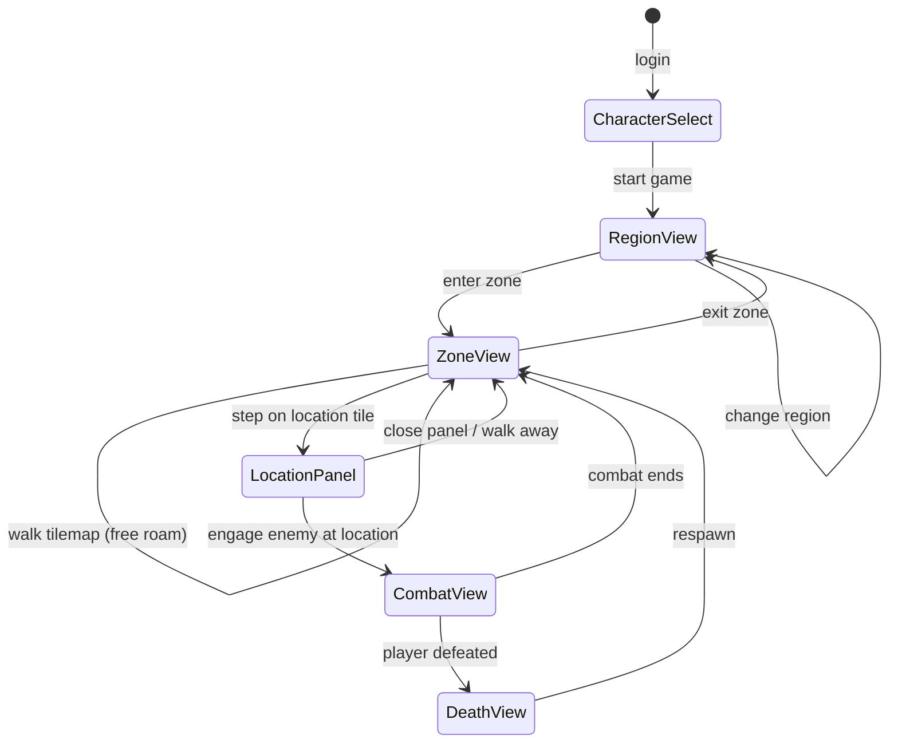

# Gameplay View Refactor — Hybrid Tilemap + Location Panel Plan

> **Date:** 2026-07-23
> **Status:** Design Phase — Revised for Hybrid Approach
> **Version:** v2.1
> **Scope:** Redesign the main game/play view to integrate tilemap exploration with location-based interactions, wire all gameplay through the Hub→MediatR bridge, and bridge the tilemap/location gap by adding tile coordinates to `ZoneLocation` and `Location` models. Includes click-to-move movement design with BFS pathfinding and walk queuing.

---

## Table of Contents

1. [Decision Record](#1-decision-record)
2. [Architecture Overview](#2-architecture-overview)
3. [Data Model Changes](#3-data-model-changes)
4. [Server-Side Changes](#4-server-side-changes)
5. [Movement Design — Click-to-Move](#5-movement-design--click-to-move)
6. [New Gameplay View Layout](#6-new-gameplay-view-layout)
7. [Engine → UI Wiring Plan](#7-engine--ui-wiring-plan)
8. [State Management Changes](#8-state-management-changes)
9. [Component Inventory](#9-component-inventory)
10. [Implementation Phases](#10-implementation-phases)
11. [Risk Assessment](#11-risk-assessment)
12. [Plan Metadata](#12-plan-metadata)

---

## 1. Decision Record

### 1.1 Primary Decision: Hybrid Approach — Tilemap Primary, Location Panel Complementary

**Decision:** The tilemap remains the primary spatial interface for zone exploration. The location panel is a complementary overlay that provides rich interaction when the player is standing on a named location tile. The two systems are bridged by adding `TileX`/`TileY` coordinates to the `ZoneLocation` (DB) and `Location` (runtime) models.

**Rationale:**
- The tilemap provides spatial context — free-roam exploration, enemy visibility, NPC placement
- The location graph provides rich interactions — descriptions, shops, inns, quest NPCs, fast travel
- Adding tile coordinates to locations bridges the gap: walk onto a location tile → discover it → location panel opens
- Once discovered, locations can be fast-traveled to via the sidebar
- This mirrors classic RPG design (Zelda, Dragon Quest, Pokémon): explore freely, interact at points of interest

### 1.2 What This Reverses from v1.0

| v1.0 Decision | v2.0 Revision |
|---------------|---------------|
| Panel-driven UI replaces tilemap | Tilemap stays — location panel is complementary overlay |
| Tilemap shelved/deferred | Tilemap kept and enhanced with location discovery |
| Location panel is primary spatial interface | Location panel is an info/interaction overlay that appears at location tiles |
| No data model changes | `ZoneLocation` and `Location` get `TileX`/`TileY` |

### 1.3 Plan Lineage

| Plan | Relationship | Status |
|------|-------------|--------|
| [`reactive-ui-pivot-plan.md`](reactive-ui-pivot-plan.md) | Location description concepts adopted for the location panel | Referenced |
| [`game-client-unification-plan.md`](game-client-unification-plan.md) | Tilemap-first decision preserved; single RCL source of truth preserved | Unchanged |
| [`map-view-refactor-plan.md`](map-view-refactor-plan.md) | 15×15 viewport still relevant — tilemap rendering unchanged | Active (unblocked) |
| This plan (v2.0) | **New** — Hybrid tilemap + location panel architecture | Active |

### 1.4 Brick-By-Brick Delivery

Each phase produces a working build. No phase leaves the codebase in a broken state. The tilemap is never removed — only enhanced.

### 1.5 Terminology

| Term | Definition |
|------|-----------|
| **World** | Top-level container — not traversable |
| **Region** | Traversable tilemap containing zone entries and region exits |
| **Zone** | Traversable tilemap containing location tiles, enemies, NPCs, and zone exits |
| **ZoneLocation** | DB entity defining a named point of interest (content definition) |
| **Location** | Runtime model hydrated from ZoneLocation — what the player actually interacts with |
| **Location Panel** | UI overlay showing location description, NPCs, services, exits — opens when standing on a location tile |
| **Connection** | Directed link between locations (walk, exit, region_exit) |

### 1.6 Movement Decision: Click-to-Move Only

**Decision:** Player movement is exclusively click-to-move. Arrow keys and WASD are removed. Clicking any tile on the tilemap triggers BFS pathfinding and a queued walk sequence.

**Rationale:**
- Browser-native interaction — clicking is the primary input mode for web applications
- Consistent feel across desktop and mobile/tablet (no keyboard dependency)
- Simplifies input handling — one code path for all movement
- The server's `MoveCharacter` already validates each step independently — no server changes needed
- Arrow keys feel unnatural in a browser context and create keyboard-focus issues

### 1.7 Player Collision Decision: No Player-Player Collision

**Decision:** Players can share tiles on region/zone tilemaps. No player-player collision anywhere. Locations are inherently multi-occupant rooms.

**Rationale:**
- Already how the server works — `MoveCharacterHubCommand` only checks tilemap collision, not player positions
- Avoids griefing (players blocking doorways, narrow corridors)
- Simplifies client-side pathfinding (BFS doesn't need to account for moving player obstacles)
- Locations are conceptual rooms, not single tiles — multiple people should always fit
- Can add PvP collision later if tactical positioning becomes important

---

## 2. Architecture Overview

### 2.1 Complete Spatial Hierarchy (Already Exists in Code)

```
World
 └─ Region (traversable tilemap)
     ├── zone_entry tiles → enter Zone
     ├── region_exit tiles → ChangeRegion (to adjacent region)
     └─ Zone (traversable tilemap)
         ├── Location tiles (NEW: discovered by TileX/TileY)
         │   └── Location Panel (overlay with description, NPCs, services, exits)
         ├── Enemy entities (on tilemap, moved by EnemyAiService)
         ├── NPC entities (on tilemap)
         └── exit tiles → ExitZone (back to region map)
```

### 2.2 How Transitions Work (All Already Handled)

| Transition | Trigger | Hub Method |
|---|---|---|
| Region → Region | Walk on region_exit tile | `MoveOnRegion` → `RegionExitTriggered` → `ChangeRegion` |
| Region → Zone | Walk on zone_entry tile | `MoveOnRegion` → `ZoneEntryTriggered` → `EnterZone` |
| Zone → Region | Walk on exit tile | `MoveCharacter` → `ExitTriggered` → `ExitZone` |
| Zone → Zone (cross) | Navigate via connection with ToZoneId | `NavigateToLocation` |
| Location → Location | Navigate via connection (walk/exit) | `NavigateToLocation` |
| **Zone → Location** | **NEW: Walk on location tile (TileX/TileY match)** | **`MoveCharacter` detects location → fires `LocationEntered`** |

### 2.3 Data Flow

```
┌─────────────────────────────────────────────────────────┐
│  Veldrath.Server                                         │
│  GameHub → MediatR.Send(command) → Handler → Result     │
│                                                         │
│  NEW: MoveCharacterHandler checks ZoneLocation table    │
│       for matching TileX/TileY → fires LocationEntered  │
│                                                         │
│  NEW: NavigateToLocationHandler updates player           │
│       TileX/TileY to match target location coordinates  │
└────────────────────┬────────────────────────────────────┘
                     │ SignalR
                     ▼
┌─────────────────────────────────────────────────────────┐
│  Veldrath.GameClient.Core (MINOR ADDITIONS)             │
│  IGameStateService — new properties for location state  │
└────────────────────┬────────────────────────────────────┘
                     │
                     ▼
┌─────────────────────────────────────────────────────────┐
│  Veldrath.GameClient.Components (RCL) — ENHANCED        │
│                                                         │
│  Game.razor           ← layout enhanced                 │
│  GameTilemap          ← KEPT: primary spatial view      │
│  ZoneLocationPanel    ← NEW: info overlay at locations  │
│  CharacterPanel       ← NEW: portrait, HP/MP, stats     │
│  GameCombat           ← KEPT: combat HUD                │
│  GameChat             ← KEPT: chat panel                │
│  GameSidebar          ← ENHANCED: known locations list  │
│  GameOverlay          ← KEPT: Inventory/Shop/Journal    │
└─────────────────────────────────────────────────────────┘
```

### 2.4 Panel State Machine



---

## 3. Data Model Changes

### 3.1 `ZoneLocation` (DB Entity) — Add TileX/TileY

**File:** [`RealmEngine.Data/Entities/Content/ZoneLocation.cs`](RealmEngine.Data/Entities/Content/ZoneLocation.cs:7)

```csharp
public class ZoneLocation : ContentBase
{
    // ... existing properties ...

    /// <summary>Tile column on the zone's tilemap where this location sits. Null if off-grid.</summary>
    public int? TileX { get; set; }

    /// <summary>Tile row on the zone's tilemap where this location sits. Null if off-grid.</summary>
    public int? TileY { get; set; }
}
```

**Migration:** Add two nullable int columns to `ZoneLocations` table. Backfill from Tiled map data if location positions are embedded in tilemap custom properties.

### 3.2 `Location` (Shared Runtime Model) — Add TileX/TileY

**File:** [`RealmEngine.Shared/Models/WorldModels.cs`](RealmEngine.Shared/Models/WorldModels.cs:6)

```csharp
public class Location
{
    // ... existing properties ...

    /// <summary>Tile column on the zone's tilemap where this location sits. Null if off-grid.</summary>
    public int? TileX { get; set; }

    /// <summary>Tile row on the zone's tilemap where this location sits. Null if off-grid.</summary>
    public int? TileY { get; set; }
}
```

### 3.3 Location Discovery Model (New — Server DB Entity)

**File:** `Veldrath.Server/Data/Entities/CharacterDiscoveredLocation.cs` (new)

```csharp
/// <summary>Records that a character has discovered a ZoneLocation, enabling fast travel.</summary>
public class CharacterDiscoveredLocation
{
    public Guid CharacterId { get; set; }
    public string LocationSlug { get; set; } = string.Empty;
    public DateTimeOffset DiscoveredAt { get; set; } = DateTimeOffset.UtcNow;
}
```

This is separate from `CharacterUnlockedLocation` (which is for hidden locations unlocked via skill checks/quests). Discovery is simpler: you walked onto the tile, you now know it exists.

---

## 4. Server-Side Changes

### 4.1 `MoveCharacterHubCommand` — Detect Location Tiles

**File:** [`Veldrath.Server/Features/Zones/MoveCharacterHubCommand.cs`](Veldrath.Server/Features/Zones/MoveCharacterHubCommand.cs:23)

**Change:** After validating and persisting the move, check if the destination tile matches any `ZoneLocation` with matching TileX/TileY in the current zone. If so:

1. Record discovery in `CharacterDiscoveredLocation`
2. Include `LocationEnteredPayload` in the result
3. Hub broadcasts `LocationEntered` to the caller

**New result fields:**
```csharp
public record MoveCharacterHubResult
{
    // ... existing fields ...
    
    /// <summary>Location entered by stepping on its tile, or null.</summary>
    public LocationEnteredPayload? LocationEntered { get; init; }
}
```

### 4.2 `NavigateToLocationHubCommand` — Update Tile Position

**File:** [`Veldrath.Server/Features/Zones/NavigateToLocationHubCommand.cs`](Veldrath.Server/Features/Zones/NavigateToLocationHubCommand.cs:19)

**Change:** When navigating to a location, update the character's `TileX`/`TileY` to match the target location's coordinates (if they exist). This ensures the tilemap reflects where the player "fast traveled" to.

### 4.3 `LocationEnteredPayload` — Add Description Field

**File:** [`Veldrath.GameClient.Core/Payloads/ZonePayloads.cs`](Veldrath.GameClient.Core/Payloads/ZonePayloads.cs)

**Change:** Add optional `Description` field:
```csharp
public sealed record LocationEnteredPayload(
    string Slug,
    string Name,
    string Type,
    string? Description,  // NEW
    int? TileX,           // NEW
    int? TileY,           // NEW
    IReadOnlyList<EnemyReference> Enemies,
    IReadOnlyList<ZoneConnectionLink> Connections);
```

---

## 5. Movement Design — Click-to-Move

### 5.1 Input Model

**Click-to-move only.** Arrow keys and WASD are removed. All player movement is driven by clicking tiles on the tilemap. This provides a consistent interaction model across desktop (mouse) and mobile/tablet (touch).

### 5.2 Pathfinding

**BFS (Breadth-First Search) on the client** using tilemap collision data from the `GetZoneTileMap` response. The server's tilemap layer data already includes walkability information per tile.

| Aspect | Detail |
|--------|--------|
| Algorithm | BFS on 2D grid |
| Movement | Manhattan only (up/down/left/right, no diagonals) |
| Blocked tiles | Walls, water, void — sourced from tilemap collision data |
| Enemy tiles | Tiles occupied by enemies are avoided (stop one tile short) |
| Player tiles | No collision — players can share tiles (Decision 1.7) |
| Max path length | No hard limit; BFS explores up to entire zone |

### 5.3 Walk Queue

When the player clicks a tile, the client:

```
1. BFS pathfind from current position to destination
2. Produce ordered list of (TileX, TileY) steps
3. Begin step queue with 100ms delay between steps:
   ┌──────────────────────────────────────────┐
   │ FOR each step in path:                    │
   │   a. Check: walk cancelled? → STOP        │
   │   b. Check: enemy at destination? → STOP  │
   │   c. Send MoveCharacter(toX, toY, dir)    │
   │   d. Await CharacterMoved broadcast       │
   │   e. Check result:                        │
   │      · LocationEntered → STOP + panel     │
   │      · ExitTriggered → STOP + transition  │
   │      · Success=false → STOP + silent      │
   │      · Success → continue                 │
   │   f. Delay 100ms before next step         │
   └──────────────────────────────────────────┘
```

### 5.4 Mid-Walk Interruption

| Trigger | Behavior |
|---------|----------|
| **Player clicks new tile** | Cancel current queue immediately, start new path from current position |
| **Enemy at destination tile** | Stop walking. Highlight enemy. Show [Attack] option in ActionBar. Does NOT auto-engage. |
| **Server rejects move** | Stop walking silently. May occur if tilemap collision changes mid-walk. |
| **LocationEntered received** | Stop walking. Open location panel. Player resumes by clicking new tile. |
| **ExitTriggered received** | Stop walking. Transition to new zone/region. |
| **CombatStarted received** | Stop walking. Switch to combat HUD. (Enemy engaged you via proximity or you chose to engage.) |
| **Player clicks [Attack] on enemy** | Cancel walk. Send `EngageEnemy`. |

### 5.5 Visual Feedback

| Element | Behavior |
|---------|----------|
| **Player position** | Updated by each `CharacterMoved` broadcast (server-authoritative) |
| **Destination indicator** | Brief pulse/highlight on the clicked tile |
| **Walk path** | Subtle dotted line or fading footsteps (future polish) |
| **Step animation** | CSS transition on player tile (instant reposition with 80ms ease) |
| **Blocked/interrupted** | Brief red flash on the blocked tile |

### 5.6 Server Impact

**None.** The `MoveCharacterHubCommand` already validates each step independently (one-tile Manhattan, collision, cooldown). The server doesn't know or care about the path — it just processes each MoveCharacter call as it arrives. The client is responsible for pathfinding, queuing steps, and respecting the 100ms cooldown.

---

## 6. New Gameplay View Layout

### 6.1 Overall Layout


```
┌──────────────────────────────────────────────────────────┐
│ GameHeader: Thalen Lv.5  ████ HP ████  ████ MP ████  ◎ Au│
├────────┬──────────────────────────────────┬──────────────┤
│SIDEBAR │        MAIN CONTENT              │    CHAT      │
│        │                                  │              │
│[Equip] │  ┌────────────────────────────┐  │  [Global]    │
│[Inven] │  │   TILEMAP (15×15 viewport) │  │  [Zone]      │
│[Abils] │  │                            │  │  [System]    │
│[Quest] │  │  ░░▓▓▒▒░░▓▓░░░░🟢░░░░░░░ │  │              │
│[Map]   │  │  ░░▓▓░░░░▒▒░░░░░░░░░░░░░ │  │  Player1:     │
│        │  │  ░░░░▒▒░░🏨▓▓░░░░░░░░░░  │  │  "Hello!"     │
│Known:  │  │  ░░░░░░▓▓▒▒░░🟠🔷░░░░░  │  │              │
│· Camp  │  │  ░░░░░░░░▒▒░░░░░░▓▓░░░  │  │              │
│· Creek │  │                            │  │              │
│· Inn   │  │  🔷 = You    🏨 = Location │  │              │
│· Woods │  │  🟠 = Enemy  🟢 = NPC     │  │              │
│        │  └────────────────────────────┘  │              │
│        │  ┌────────────────────────────┐  │              │
│ [Fast  │  │ LOCATION PANEL (overlay)   │  │              │
│ Travel]│  │ The Rusty Nail Inn         │  │              │
│        │  │ "Warm hearth..."           │  │              │
│        │  │ [Rest] [Talk] [Shop]       │  │              │
│        │  │ Exits: [Market] [Outside]  │  │              │
│        │  └────────────────────────────┘  │              │
│        │  ACTION BAR                      │              │
│        │  [1:Slash] [2:Block] [3:Heal]   │              │
├────────┴──────────────────────────────────┴──────────────┤
│ GameFooter: ● Connected  42ms  👥 3 players               │
└──────────────────────────────────────────────────────────┘
```

### 6.2 Main Content Area — Context-Sensitive

The main content area always shows the tilemap. Additional panels overlay or sit alongside:

| Game State | What's Shown |
|-----------|-------------|
| Normal exploration | Tilemap (full 15×15 viewport) |
| Standing on location tile | Tilemap + Location Panel (below or as overlay) |
| In combat | Tilemap replaced by Combat HUD |
| No zone loaded | "Enter a zone" placeholder |

### 6.3 Location Panel (NEW — Complementary Overlay)

**File:** `Veldrath.GameClient.Components/Components/Pages/ZoneLocationPanel.razor` (new)

Appears below the tilemap (or as a slide-up overlay) when the player is standing on a location tile. Shows:

```
┌─────────────────────────────────────────┐
│ 🏨 The Rusty Nail Inn                   │  ← Location name + icon
│ Type: Town Building · Discovered        │
├─────────────────────────────────────────┤
│ "The warm glow of the hearth welcomes   │  ← Description
│  you. Barnaby stands behind the bar,    │
│  polishing a copper mug."               │
├─────────────────────────────────────────┤
│ SERVICES                                │
│ [Rest (5g)]  [Buy Drink (2g)]          │  ← Context-sensitive actions
│ [Talk to Barnaby]                       │
├─────────────────────────────────────────┤
│ EXITS                                   │
│ [↗] Market Square               [Go]   │  ← Connections
│ [↘] Outside (Town Gates)        [Go]   │
├─────────────────────────────────────────┤
│ CREATURES HERE                          │
│ 🟢 Barnaby (Innkeeper)  [Talk]         │  ← NPCs at location
├─────────────────────────────────────────┤
│ OTHER PLAYERS                           │
│ 👤 Mira Shadowstep                     │  ← Other players here
└─────────────────────────────────────────┘
```

**Behavior:**
- Auto-opens when `MoveCharacter` result includes `LocationEntered`
- Closes when player walks off the location tile
- Can be pinned open (keeps showing even when walking away)
- Fast Travel button in sidebar jumps to any known location

### 6.4 Sidebar (ENHANCE)

**File:** [`GameSidebar.razor`](Veldrath.GameClient.Components/Components/Pages/GameSidebar.razor)

Current sidebar is cluttered. Simplify to:

| Section | Content |
|---------|---------|
| Quick Nav | Inventory, Abilities, Journal, Map, Settings |
| Known Locations | Scrollable list of discovered locations with [Go] fast-travel buttons |
| Zone Actions | Rest (if inn), Search, Exit Zone |
| Logout | Always at bottom |

Character stats move to a dedicated `CharacterPanel`.

### 6.5 Character Panel (NEW)

**File:** `Veldrath.GameClient.Components/Components/Pages/CharacterPanel.razor` (new)

Vertical panel between sidebar and main content:
- Character name, class icon
- HP bar (red, vertical), MP bar (blue), XP bar (green)
- STR/DEX/CON/INT/WIS/CHA values
- Unspent attribute points indicator
- Active effects (future)

### 6.6 What Gets Removed / Changed / Kept

| Component | Fate |
|-----------|------|
| `GameTilemap.razor` | **Kept** — primary spatial view |
| `Tile.razor` | **Kept** — tile rendering |
| `TileInfoCard.razor` | **Kept** — hover tooltip |
| `TileStatusBar.razor` | **Kept** — current tile description |
| `Game.razor` | **Modified** — new layout grid |
| `GameSidebar.razor` | **Simplified** — nav + known locations |
| `GameHeader.razor` | **Reduced** — breadcrumb, gold, zone badge |
| `GameFooter.razor` | **Minor** — connection status only |
| `GameCombat.razor` | **Kept** — combat HUD unchanged |
| `GameChat.razor` | **Kept** — chat panel unchanged |
| `GameOverlay.razor` | **Kept** — overlay host unchanged |
| `InventoryOverlay.razor` | **Kept** — unchanged |
| `ShopOverlay.razor` | **Kept** — unchanged |
| `JournalOverlay.razor` | **Kept** — unchanged |
| `ReconnectOverlay.razor` | **Kept** — unchanged |
| `ActionBar.razor` | **Enhanced** — context-aware modes |
| `ZoneLocationPanel.razor` | **NEW** — location info overlay |
| `CharacterPanel.razor` | **NEW** — character status |

### 6.7 What Gets Deleted

Nothing. No files are deleted. Unused components from v1.0 are not created.

---

## 7. Engine → UI Wiring Plan

### 7.1 Tilemap Movement → Location Discovery (NEW)

```
Player walks on tilemap (arrow keys or click)
  → Hub.SendAsync("MoveCharacter", new { ToX, ToY, Direction })
  → Server: MoveCharacterHandler validates, persists
  → Server: Checks ZoneLocation table for matching TileX/TileY
  → If match: records discovery, returns LocationEntered in result
  → Broadcast: "CharacterMoved" to zone group (existing)
  → Broadcast: "LocationEntered" to caller (if location tile)
  → Client: Character moves on tilemap
  → Client: LocationPanel opens with location info
```

### 7.2 Location Discovery → Fast Travel

```
Player discovers location by walking on its tile
  → Location appears in sidebar "Known Locations" list
  → Player clicks [Go] on a known location
  → Hub.SendAsync("NavigateToLocation", new { Slug })
  → Server: validates, updates TileX/TileY to location coords
  → Broadcast: "CharacterMoved" (new tile position)
  → Broadcast: "LocationEntered" (location info)
  → Client: Character teleports on tilemap to location tile
  → Client: LocationPanel shows location info
```

### 7.3 Combat Flow (Unchanged)

```
Player clicks enemy on tilemap (or in location panel)
  → Hub.SendAsync("EngageEnemy", new { EnemyId })
  → CombatStarted → tilemap replaced by Combat HUD
  → Attack/Defend/Flee/Ability → CombatTurn
  → CombatEnded → tilemap restored
```

**Enhancement opportunity (future):** Allow clicking enemies directly on the tilemap (not just in location panel).

### 7.4 Inventory/Shop/Quest Flows (Unchanged from v1.0)

All existing overlay flows (Inventory, Shop, Journal) remain unchanged. They work exactly as they do today.

### 7.5 Rest/Search/Talk Flows (Unchanged)

Rest, Search, and Talk actions are available from the Location Panel when at appropriate locations.

---

## 8. State Management Changes

### 8.1 New Properties on `IGameStateService`

| Property | Type | Purpose |
|----------|------|---------|
| `KnownLocations` | `IReadOnlyList<LocationReference>` | Locations the character has discovered |
| `CurrentLocation` | `LocationReference?` | The location the player is currently standing on |
| `IsAtLocation` | `bool` | True when player is standing on a location tile |

### 8.2 New Apply Methods

| Method | Purpose |
|--------|---------|
| `ApplyLocationDiscovered(LocationReference location)` | Add to KnownLocations |
| `ApplyLocationEntered(LocationEnteredPayload payload)` | Set CurrentLocation, update description |
| `ApplyLocationExited()` | Clear CurrentLocation when walking off tile |

### 8.3 Existing Apply Methods — Enhancements

| Method | Enhancement |
|--------|------------|
| `ApplyCharacterMoved` | Check if new position matches a known location → set IsAtLocation |
| `ApplyZoneEntered` | Load known locations for this zone |

---

## 9. Component Inventory

### 9.1 New Components

| Component | File | Purpose |
|-----------|------|---------|
| `ZoneLocationPanel` | `Components/Pages/ZoneLocationPanel.razor` | Location info overlay — description, NPCs, services, exits |
| `CharacterPanel` | `Components/Pages/CharacterPanel.razor` | Vertical character status — HP/MP/XP bars, attributes |

### 9.2 Modified Components

| Component | Changes |
|-----------|---------|
| `Game.razor` | New layout grid; tilemap stays; add ZoneLocationPanel + CharacterPanel |
| `GameSidebar.razor` | Simplify to nav + known locations list + fast travel |
| `GameHeader.razor` | Reduce to breadcrumb + gold + zone badge |
| `GameFooter.razor` | Connection status only |
| `ActionBar.razor` | Add context-aware modes (exploration vs combat vs location) |

### 9.3 Unchanged Components

`GameTilemap`, `Tile`, `TileInfoCard`, `TileStatusBar`, `GameCombat`, `GameChat`, `GameOverlay`, `InventoryOverlay`, `ShopOverlay`, `JournalOverlay`, `ReconnectOverlay`, `StatusBar`, `GamePanel`, `GameSettings`, `CharacterSelect`, `CreateCharacter`, `GameLayout`

### 9.4 Data Model Changes

| File | Change |
|------|--------|
| `RealmEngine.Data/Entities/Content/ZoneLocation.cs` | Add `TileX` (int?), `TileY` (int?) |
| `RealmEngine.Shared/Models/WorldModels.cs` | Add `TileX` (int?), `TileY` (int?) to `Location` |
| `Veldrath.Server/Data/Entities/CharacterDiscoveredLocation.cs` | **NEW** — discovery tracking |
| `Veldrath.GameClient.Core/Payloads/ZonePayloads.cs` | Add `Description`, `TileX`, `TileY` to `LocationEnteredPayload` |

### 9.5 Server-Side Changes

| File | Change |
|------|--------|
| `MoveCharacterHubCommand.cs` | Check location tiles after move; return LocationEntered if matched |
| `NavigateToLocationHubCommand.cs` | Update character TileX/TileY to location coordinates |
| `GameHub.cs` | Broadcast LocationEntered from MoveCharacter result |

---

## 10. Implementation Phases

### Phase 1: Data Model + Server Bridge

**Goal:** TileX/TileY on ZoneLocation and Location models. Server detects location tiles during movement. NavigateToLocation updates tile position. Client payload updated.

**Build:** `dotnet build RealmEngine.slnx`

**Tasks:**

1. [ ] **P1.1** — Add `TileX`/`TileY` to [`ZoneLocation`](RealmEngine.Data/Entities/Content/ZoneLocation.cs:7) entity
2. [ ] **P1.2** — Create EF Core migration for new columns
3. [ ] **P1.3** — Add `TileX`/`TileY` to [`Location`](RealmEngine.Shared/Models/WorldModels.cs:6) runtime model
4. [ ] **P1.4** — Create [`CharacterDiscoveredLocation`](Veldrath.Server/Data/Entities/) entity + migration + repository
5. [ ] **P1.5** — Update [`MoveCharacterHubCommand`](Veldrath.Server/Features/Zones/MoveCharacterHubCommand.cs:62) handler: check location tiles after move, record discovery, include `LocationEntered` in result
6. [ ] **P1.6** — Update [`NavigateToLocationHubCommand`](Veldrath.Server/Features/Zones/NavigateToLocationHubCommand.cs:62) handler: update character `TileX`/`TileY` on navigation
7. [ ] **P1.7** — Add `Description`, `TileX`, `TileY` to [`LocationEnteredPayload`](Veldrath.GameClient.Core/Payloads/ZonePayloads.cs)
8. [ ] **P1.8** — Update [`GameHub.cs`](Veldrath.Server/Hubs/GameHub.cs) to broadcast `LocationEntered` from `MoveCharacter` result
9. [ ] **P1.9** — Build and verify: `dotnet build RealmEngine.slnx`
10. [ ] **P1.10** — Run server tests

### Phase 2: Client State + ZoneLocationPanel Placeholder

**Goal:** GameState tracks location discovery. ZoneLocationPanel renders as a placeholder below the tilemap.

**Build:** `dotnet build Veldrath.Web.slnx`

**Tasks:**

1. [ ] **P2.1** — Add `KnownLocations`, `CurrentLocation`, `IsAtLocation` to [`IGameStateService`](Veldrath.GameClient.Core/Abstractions/IGameStateService.cs) and [`GameStateService`](Veldrath.GameClient.Core/Services/GameStateService.cs)
2. [ ] **P2.2** — Add `ApplyLocationDiscovered`, `ApplyLocationEntered`, `ApplyLocationExited` methods
3. [ ] **P2.3** — Create [`ZoneLocationPanel.razor`](Veldrath.GameClient.Components/Components/Pages/ZoneLocationPanel.razor) placeholder: location name, description, exit list, enemy list
4. [ ] **P2.4** — Wire location discovery in [`Game.razor`](Veldrath.GameClient.Components/Components/Pages/Game.razor): register `LocationEntered` hub handler → GameState → ZoneLocationPanel renders
5. [ ] **P2.5** — Auto-hide ZoneLocationPanel when player walks off location tile (no `LocationEntered` in move result)
6. [ ] **P2.6** — Build and verify

### Phase 3: Sidebar — Known Locations + Fast Travel

**Goal:** Sidebar shows discovered locations. Clicking one fast-travels there.

**Build:** `dotnet build Veldrath.Web.slnx`

**Tasks:**

1. [ ] **P3.1** — Add "Known Locations" section to [`GameSidebar.razor`](Veldrath.GameClient.Components/Components/Pages/GameSidebar.razor)
2. [ ] **P3.2** — Populate from `GameState.KnownLocations` (loaded on zone enter)
3. [ ] **P3.3** — Wire [Go] button: `Hub.SendAsync("NavigateToLocation", new { Slug })`
4. [ ] **P3.4** — Add "Fast Travel" header button that expands/collapses the known locations list
5. [ ] **P3.5** — Build and verify

### Phase 4: Location Panel — Full Implementation

**Goal:** ZoneLocationPanel is fully functional with all interactions.

**Build:** `dotnet build Veldrath.Web.slnx`

**Tasks:**

1. [ ] **P4.1** — Display location description from payload (or fallback generator)
2. [ ] **P4.2** — Exit list with direction icons and [Go] buttons
3. [ ] **P4.3** — NPC list with [Talk] buttons → `Hub.SendAsync("TalkToNpc")`
4. [ ] **P4.4** — Service buttons (Rest, Shop) when location has those traits
5. [ ] **P4.5** — Other players at location section
6. [ ] **P4.6** — Location description fallback generator (client-side, Phase 4 from v1.0)
7. [ ] **P4.7** — Build and verify

### Phase 5: CharacterPanel + Layout Polish

**Goal:** New CharacterPanel component. Clean header/footer. Sidebar simplified.

**Build:** `dotnet build Veldrath.Web.slnx`

**Tasks:**

1. [ ] **P5.1** — Create [`CharacterPanel.razor`](Veldrath.GameClient.Components/Components/Pages/CharacterPanel.razor) with HP/MP/XP bars and attributes
2. [ ] **P5.2** — Wire CharacterPanel to GameState properties
3. [ ] **P5.3** — Simplify [`GameHeader.razor`](Veldrath.GameClient.Components/Components/Pages/GameHeader.razor): breadcrumb, gold, zone badge
4. [ ] **P5.4** — Simplify [`GameFooter.razor`](Veldrath.GameClient.Components/Components/Pages/GameFooter.razor): connection status only
5. [ ] **P5.5** — Simplify [`GameSidebar.razor`](Veldrath.GameClient.Components/Components/Pages/GameSidebar.razor): remove character info (moved to CharacterPanel), keep nav + known locations
6. [ ] **P5.6** — New CSS grid layout in [`game.css`](Veldrath.GameClient.Components/wwwroot/css/game.css)
7. [ ] **P5.7** — Build and verify

### Phase 6: ActionBar + Hotbar + Polish

**Goal:** Context-aware ActionBar. Hotbar abilities. CSS transitions. Responsive breakpoints.

**Build:** `dotnet build Veldrath.Web.slnx`

**Tasks:**

1. [ ] **P6.1** — Expand [`ActionBar.razor`](Veldrath.GameClient.Components/Components/Shared/ActionBar.razor): context modes (Combat/Exploration/Location)
2. [ ] **P6.2** — Wire hotbar ability slots (1-0)
3. [ ] **P6.3** — CSS transitions: location panel slide-up, smooth HP/MP changes
4. [ ] **P6.4** — Responsive breakpoints (desktop → tablet → mobile)
5. [ ] **P6.5** — Keyboard shortcuts (1-0 for hotbar, I/J/M for panels)
6. [ ] **P6.6** — Final build: `dotnet build Veldrath.Web.slnx`
7. [ ] **P6.7** — Run full test suite: `dotnet test Veldrath.Web.slnx`

---

## 11. Risk Assessment

### 11.1 Risk Matrix

| # | Risk | Impact | Probability | Mitigation |
|---|------|--------|-------------|------------|
| 1 | **Zones have no location tile data** — TileX/TileY columns exist but no rows are populated | HIGH — location discovery won't fire | MEDIUM | Seed data for existing zones. Fallback: location panel still works via NavigateToLocation. |
| 2 | **Location panel disrupts tilemap flow** — panel takes too much space or auto-opens annoyingly | MEDIUM — UX friction | MEDIUM | Panel is dismissible. Can be pinned closed. Tilemap remains fully usable. |
| 3 | **Fast travel feels like cheating** — teleporting across zone removes exploration incentive | LOW | LOW | Fast travel only to discovered locations. Must walk there first. |
| 4 | **NavigateToLocation tile position update conflicts with enemy positions** | LOW | LOW | Verify EnemyAiService only moves enemies in zones with active players. Fast travel within same zone is a single tile position change. |
| 5 | **Existing tests break** — tilemap tests, combat tests, GameViewModel tests | MEDIUM | MEDIUM | Tilemap tests should still pass (tilemap unchanged). Update any test that asserts on Game.razor render output. |
| 6 | **Desktop WebView2 rendering** — new layout must render identically in WebView2 | MEDIUM | LOW | Test in both Chrome and WebView2. CSS grid is well-supported in WebView2. |

### 11.2 Fallback Path

If the location panel integration proves problematic:
1. The tilemap is unchanged — it works exactly as before
2. The `ZoneLocationPanel` can be hidden entirely (feature flag or setting)
3. The TileX/TileY data model change is additive — no existing functionality breaks
4. Navigation via sidebar/click still works (original flow)

---

## 12. Plan Metadata

### 12.1 Version

| Field | Value |
|-------|-------|
| Version | 2.1 |
| Date | 2026-07-23 |
| Status | Design Phase — Revised for Hybrid Approach |
| Replaces | v1.0 (panel-driven primary, tilemap deferred) |

### 12.2 Superseded / Modified Plans

| Plan | Relationship |
|------|-------------|
| [`reactive-ui-pivot-plan.md`](reactive-ui-pivot-plan.md) | Location description concepts adopted for ZoneLocationPanel |
| [`game-client-unification-plan.md`](game-client-unification-plan.md) | Tilemap-first decision preserved; single RCL source of truth preserved |
| [`map-view-refactor-plan.md`](map-view-refactor-plan.md) | 15×15 viewport still relevant; tilemap rendering unchanged |
| This plan (v2.0) | **Definitive** — Hybrid tilemap + location panel architecture |

### 12.3 Files Touched Per Phase

| Phase | New Files | Modified Files |
|-------|-----------|---------------|
| Phase 1 | `CharacterDiscoveredLocation.cs` (entity + migration + repo) | `ZoneLocation.cs`, `WorldModels.cs`, `MoveCharacterHubCommand.cs`, `NavigateToLocationHubCommand.cs`, `ZonePayloads.cs`, `GameHub.cs` |
| Phase 2 | `ZoneLocationPanel.razor` | `IGameStateService.cs`, `GameStateService.cs`, `Game.razor` |
| Phase 3 | — | `GameSidebar.razor` |
| Phase 4 | — | `ZoneLocationPanel.razor` |
| Phase 5 | `CharacterPanel.razor` | `GameHeader.razor`, `GameFooter.razor`, `GameSidebar.razor`, `game.css` |
| Phase 6 | — | `ActionBar.razor`, `game.css`, all components (a11y) |

### 12.4 Build Strategy Per Phase

| Phase | Build Command | Rationale |
|-------|--------------|-----------|
| 1 | `dotnet build RealmEngine.slnx` | Engine + Data + Server changes |
| 2-6 | `dotnet build Veldrath.Web.slnx` | RCL + Web + GameClient.Core changes |
| Final | `dotnet test Realm.Full.slnx` | Full test suite verification |

---

## Appendix A: Key Hub Methods and Their UI Targets

| Hub Method | Called From | UI Feedback |
|-----------|-------------|-------------|
| `MoveCharacter` | Arrow keys / tilemap click | CharacterMoved → tilemap update; LocationEntered → panel opens (if on location tile) |
| `NavigateToLocation` | Sidebar [Go] / LocationPanel exit [Go] | CharacterMoved + LocationEntered → tilemap teleport + panel update |
| `EngageEnemy` | LocationPanel enemy [Attack] / tilemap (future) | CombatStarted → combat HUD |
| `SearchArea` | ActionBar / LocationPanel | AreaSearched → system message |
| `RestAtLocation` | LocationPanel [Rest] (if inn) | CharacterRested → HP/MP bars fill |
| `TalkToNpc` | LocationPanel NPC [Talk] | NpcDialogue (future) |
| `VisitShop` | LocationPanel [Shop] / Sidebar | ShopVisited + ShopCatalog → ShopOverlay |
| `GetInventory` | Sidebar Inventory button | InventoryLoaded → InventoryOverlay |
| `GetQuestLog` | Sidebar Journal button | QuestLogReceived → JournalOverlay |
| `ExitZone` | Sidebar Exit Zone / walk on exit tile | ZoneExited → region map |

---

*End of revised architecture & implementation plan (v2.0).*
