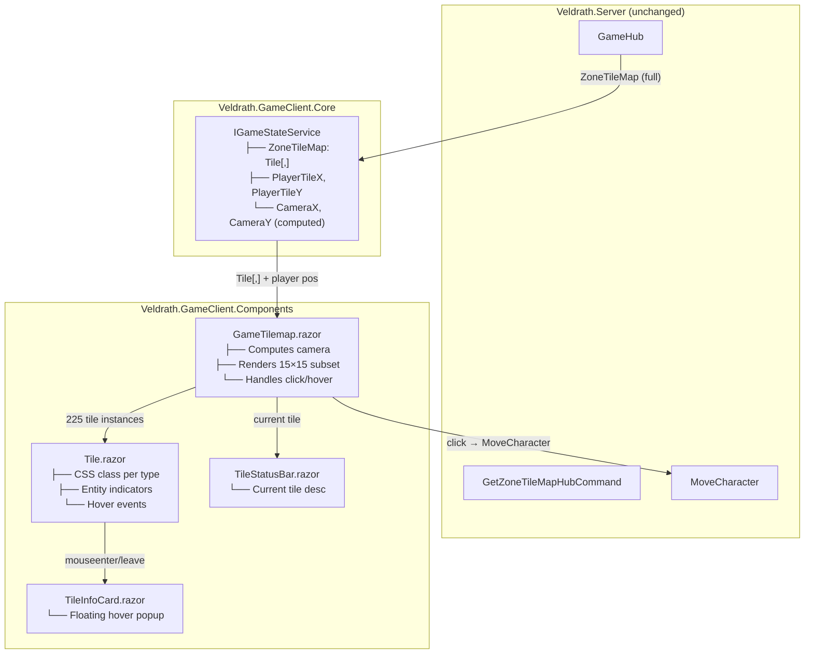

# Map View Refactor — Fixed Viewport Grid

> **Date:** 2026-07-01
> **Status:** Design Approved — Awaiting Implementation
> **Scope:** Refactor [`GameTilemap.razor`](Veldrath.GameClient.Components/Components/Pages/GameTilemap.razor) from "render all tiles" to a fixed 15×15 viewport with camera tracking, responsive tile sizes, and tile description overlays. Unified across web (Blazor) and desktop (via WebView2).

---

## 1. Design Decisions (Locked)

| # | Decision | Rationale |
|---|----------|-----------|
| 1 | **Uniform 15×15 viewport** across all breakpoints | Simple, predictable — player always at center [7,7] |
| 2 | **Tile sizes per breakpoint**: 24px (<640), 34px (640–1023), 42px (≥1024) | Largest that fits available center-panel width at each breakpoint |
| 3 | **Camera centered on player**, edge-clamped | Player at [7,7]; at map edges camera clamps and player drifts from center |
| 4 | **No fog of war** | Entire map visible; no `RevealedTiles` tracking or fog rendering needed |
| 5 | **Click-only movement** | Click any tile in viewport → `Hub.SendAsync("MoveCharacter", {TileX, TileY})` |
| 6 | **Status bar** below grid for current tile description | Preserves spatial context from the old `ZoneLocationPanelView` |
| 7 | **Hover tooltip** on any tile showing tile info | Quick-glance tile identification without clicking |
| 8 | **Platform**: [`Veldrath.GameClient.Components`](Veldrath.GameClient.Components/) RCL | Single source of truth; desktop renders via WebView2 |

### Viewport Math

```
Breakpoint       Tile Size    Grid Footprint        Fits In
───────────────  ───────────  ────────────────────  ─────────────────────
< 640px (phone)     24px      15×24 + 14×1px gap    374×374px (375px phone)
640–1023px (tablet) 34px      15×34 + 14×1px gap    524×524px (592px+ center)
≥ 1024px (desktop)  42px      15×42 + 14×1px gap    644×644px (764px+ center)
```

Camera formula:
```csharp
camX = Clamp(playerX - 7, 0, Max(0, mapWidth  - 15));
camY = Clamp(playerY - 7, 0, Max(0, mapHeight - 15));
```

---

## 2. Architecture Overview

```
┌─────────────────────────────────────────────────────────┐
│  Veldrath.Server (unchanged)                            │
│  GameHub → GetZoneTileMap, MoveCharacter                │
│  Returns full TileMapDto (all tiles, all layers)        │
└────────────────────┬────────────────────────────────────┘
                     │ SignalR
                     ▼
┌─────────────────────────────────────────────────────────┐
│  Veldrath.GameClient.Core (minor additions)             │
│  IGameStateService                                      │
│  + PlayerTileX, PlayerTileY  (already exist)            │
│  + ZoneTileMap (Tile[,])     (already exists)           │
│  + CameraX, CameraY          (NEW — computed)           │
└────────────────────┬────────────────────────────────────┘
                     │
                     ▼
┌─────────────────────────────────────────────────────────┐
│  Veldrath.GameClient.Components (RCL)                   │
│                                                         │
│  Game.razor          ← orchestrates (unchanged)         │
│  GameTilemap.razor   ← REWRITTEN: viewport render       │
│  Tile.razor          ← ENHANCED: hover tooltip, title   │
│  TileInfoCard.razor  ← NEW: hover info popup            │
│  TileStatusBar.razor ← NEW: current tile description    │
│                                                         │
│  game.css            ← UPDATED: viewport + breakpoints  │
└─────────────────────────────────────────────────────────┘
```

---

## 3. Component Design

### 3.1 [`GameTilemap.razor`](Veldrath.GameClient.Components/Components/Pages/GameTilemap.razor) — Rewrite

**Before (current):** Renders ALL tiles in map — `_gridColumns × _gridRows`

**After (new):** Renders 15×15 viewport subset only

```razor
@* Renders a fixed 15×15 viewport of the zone tilemap, centered on the player. *@
@inject IGameHubConnectionService Hub
@inject IGameStateService GameState

@if (GameState.ZoneTileMap is not null)
{
    var tiles = (Tile[,])GameState.ZoneTileMap;
    var camX = ComputeCameraX();
    var camY = ComputeCameraY();

    <div class="game-tilemap-viewport">
        @for (var vy = 0; vy < 15; vy++)
        {
            var mapY = camY + vy;
            for (var vx = 0; vx < 15; vx++)
            {
                var mapX = camX + vx;
                var tile = (mapX >= 0 && mapX < tiles.GetLength(1) &&
                            mapY >= 0 && mapY < tiles.GetLength(0))
                    ? tiles[mapY, mapX]
                    : new Tile { Type = -1 }; // void for out-of-bounds

                var isPlayer = GameState.PlayerTileX == mapX &&
                               GameState.PlayerTileY == mapY;
                var occupant = GetOccupantAt(mapX, mapY);
                var enemy = GetEnemyAt(mapX, mapY);

                <Tile TileData="tile"
                      X="mapX" Y="mapY"
                      OnClick="OnTileClick"
                      OnHover="OnTileHover"
                      IsPlayerHere="isPlayer"
                      Occupant="occupant"
                      Enemy="enemy" />
            }
        }
    </div>

    <TileStatusBar Description="_currentTileDescription" />
}
```

**Key changes:**
- `grid-template-columns` is always `repeat(15, var(--tile-size))` — never changes
- Loop iterates 225 tiles (15×15), not the full map
- Tile coordinates are *map* coordinates (`mapX, mapY`), exposed to click/hover handlers
- Out-of-bounds tiles at map edges render as void (type -1)
- New `OnHover` callback for tooltip
- `TileStatusBar` rendered below the grid

**Camera computation:**
```csharp
private int ComputeCameraX()
{
    if (GameState.ZoneTileMap is not Tile[,] tiles) return 0;
    var mapW = tiles.GetLength(1);
    return Math.Clamp(GameState.PlayerTileX - 7, 0, Math.Max(0, mapW - 15));
}
// Same for Y with GetLength(0)
```

### 3.2 [`Tile.razor`](Veldrath.GameClient.Components/Components/Shared/Tile.razor) — Enhanced

**New parameter:** `OnHover` callback for tooltip

```csharp
[Parameter] public EventCallback<(int X, int Y)> OnHover { get; set; }
```

**New behavior:** `@onmouseenter` triggers `OnHover`; `@onmouseleave` clears it. The tile `title` attribute is replaced with a proper hover card (to avoid browser-native tooltip delay).

```razor
<div class="game-tile @GetTileClass()"
     @onclick="() => OnClick.InvokeAsync((X, Y))"
     @onmouseenter="() => OnHover.InvokeAsync((X, Y))"
     @onmouseleave="() => OnHover.InvokeAsync((-1, -1))">
    @* Player/enemy/occupant indicators unchanged *@
</div>
```

### 3.3 [`TileInfoCard.razor`](Veldrath.GameClient.Components/Components/Shared/TileInfoCard.razor) — New

A floating card that appears near the hovered tile showing:
- Tile type name (Grass, Wall, Water, Path, etc.)
- Tile coordinates (map X, Y)
- Any entity at that tile (NPC name, enemy name + level)

```razor
@if (IsVisible)
{
    <div class="tile-info-card" style="left: @(Left)px; top: @(Top)px;">
        <div class="tile-info-card-type">@TileTypeName</div>
        <div class="tile-info-card-coords">(@X, @Y)</div>
        @if (EntityName is not null)
        {
            <div class="tile-info-card-entity">@EntityName</div>
        }
    </div>
}
```

Positioned via CSS `position: absolute` relative to the viewport container, offset from the hovered tile.

### 3.4 [`TileStatusBar.razor`](Veldrath.GameClient.Components/Components/Shared/TileStatusBar.razor) — New

A narrow bar below the viewport grid showing the current tile's description:

```razor
<div class="tile-status-bar">
    <span class="tile-status-bar-icon">📍</span>
    <span class="tile-status-bar-text">@Description</span>
</div>
```

Description is derived from the tile at the player's current position using the same tile type → name mapping from [`Tile.razor`](Veldrath.GameClient.Components/Components/Shared/Tile.razor:43-53).

---

## 4. CSS Changes

### 4.1 [`game.css`](Veldrath.GameClient.Components/wwwroot/css/game.css) — Tilemap Section Rewrite

```css
/* ── Tilemap Viewport ─────────────────────────────────────────────── */

/* Tile size as a CSS custom property — set per breakpoint */
:root {
    --tile-size: 24px;           /* base: phone */
}

@media (min-width: 640px) {
    :root { --tile-size: 34px; }  /* tablet */
}

@media (min-width: 1024px) {
    :root { --tile-size: 42px; }  /* desktop */
}

.game-tilemap-viewport {
    display: grid;
    grid-template-columns: repeat(15, var(--tile-size));
    grid-template-rows:    repeat(15, var(--tile-size));
    gap: 1px;
    justify-content: center;
    align-content: center;
    padding: var(--vds-space-3, 12px);
    background: var(--vds-bg-1, #14151F);
    position: relative;           /* for absolute-positioned hover card */
}

/* Tile — size now driven by grid, not explicit width/height */
.game-tile {
    border-radius: 2px;
    cursor: pointer;
    position: relative;
    display: flex;
    align-items: center;
    justify-content: center;
    border: 1px solid transparent;
    /* width/height now implicit from grid track size */
}

/* Existing tile type backgrounds (tile-grass, tile-wall, etc.) unchanged */

/* ── Hover Info Card ──────────────────────────────────────────────── */

.tile-info-card {
    position: absolute;
    z-index: 100;
    background: var(--vds-bg-2, #1E1F2E);
    border: 1px solid var(--vds-border, #2A2B3D);
    border-radius: var(--vds-radius-sm, 4px);
    padding: 6px 10px;
    font-size: 12px;
    color: var(--vds-text, #E2E0DA);
    pointer-events: none;
    white-space: nowrap;
    box-shadow: 0 4px 12px rgba(0, 0, 0, 0.4);
}

.tile-info-card-type {
    font-weight: 600;
    color: var(--vds-seal-light, #C9A84C);
}

.tile-info-card-coords {
    color: var(--vds-text-muted, #6E6860);
    font-size: 11px;
}

.tile-info-card-entity {
    margin-top: 2px;
    color: var(--vds-accent, #60A5FA);
}

/* ── Status Bar ───────────────────────────────────────────────────── */

.tile-status-bar {
    display: flex;
    align-items: center;
    gap: 8px;
    padding: 6px 16px;
    background: var(--vds-bg-2, #1E1F2E);
    border-top: 1px solid var(--vds-border, #2A2B3D);
    font-size: 13px;
    color: var(--vds-text-subtle, #B8B4A8);
    min-height: 32px;
}

.tile-status-bar-icon {
    flex-shrink: 0;
    font-size: 14px;
}

.tile-status-bar-text {
    overflow: hidden;
    text-overflow: ellipsis;
    white-space: nowrap;
}
```

### 4.2 Remove Old Styles

Remove the old `.game-tilemap` rule (which had `overflow: auto` and no viewport concept). Remove `.game-tilemap-empty` or adapt it. Keep all `.tile-*` type classes and `.tile-indicator-*` entity indicator classes — they're unchanged.

---

## 5. Data Flow

```
Server: GetZoneTileMapHubCommand
  │ Returns TileMapDto (full map: Width, Height, Layers[], ExitTiles[])
  ▼
Game.razor: Hub.On<TileMapDto>("ZoneTileMap", ...)
  │ Converts TileMapDto → Tile[,] array
  │ Stores in GameState.ZoneTileMap
  ▼
GameTilemap.razor: reads GameState.ZoneTileMap
  │ Computes camera (camX, camY) from PlayerTileX, PlayerTileY
  │ Renders tiles[camY..camY+15, camX..camX+15]
  ▼
User clicks tile (mapX, mapY)
  │ Hub.SendAsync("MoveCharacter", new { TileX = mapX, TileY = mapY })
  ▼
Server: MoveOnRegionHubCommand / MoveCharacter
  │ Validates move, updates PlayerSession.TileX/TileY
  │ Broadcasts CharacterMoved to zone group
  ▼
Game.razor: Hub.On<CharacterMovedPayload>("CharacterMoved", ...)
  │ Updates GameState.PlayerTileX, PlayerTileY
  │ GameTilemap re-renders with new camera position
```

**Server changes needed: NONE.** The server already returns the full tilemap and handles movement — the viewport is purely a client-side rendering change.

---

## 6. What Gets Removed / Changed

### Modified Files

| File | Change |
|------|--------|
| [`GameTilemap.razor`](Veldrath.GameClient.Components/Components/Pages/GameTilemap.razor) | **Full rewrite** — viewport rendering, camera tracking |
| [`Tile.razor`](Veldrath.GameClient.Components/Components/Shared/Tile.razor) | Add `OnHover` callback parameter, mouseenter/mouseleave handlers |
| [`game.css`](Veldrath.GameClient.Components/wwwroot/css/game.css) | Replace tilemap CSS block with viewport + breakpoint tiles + hover card + status bar |

### New Files

| File | Purpose |
|------|---------|
| [`TileInfoCard.razor`](Veldrath.GameClient.Components/Components/Shared/TileInfoCard.razor) | Hover tooltip popup for any tile |
| [`TileStatusBar.razor`](Veldrath.GameClient.Components/Components/Shared/TileStatusBar.razor) | Current tile description bar below viewport |

### Eventually Superseded (Desktop)

| File | Fate |
|------|------|
| [`ZoneLocationPanelView.axaml`](Veldrath.Client/Views/Game/Components/ZoneLocationPanelView.axaml) | Keep as WebView2-unavailable fallback; remove once WebView2 is universal |
| [`ZoneLocationPanelViewModel.cs`](Veldrath.Client/ViewModels/ZoneLocationPanelViewModel.cs) | Same |
| [`TileDescriptionService.cs`](Veldrath.Client/Services/TileDescriptionService.cs) | Repurpose logic for RCL's `TileStatusBar` |

### Unchanged

| File | Reason |
|------|--------|
| [`Game.razor`](Veldrath.GameClient.Components/Components/Pages/Game.razor) | Still orchestrates — just the tilemap inside changes |
| [`IGameStateService.cs`](Veldrath.GameClient.Core/Services/IGameStateService.cs) | Already has `ZoneTileMap`, `PlayerTileX`, `PlayerTileY` |
| [`GameHubConnectionService.cs`](Veldrath.GameClient.Core/Services/GameHubConnectionService.cs) | SignalR unchanged |
| Server-side (all) | No server changes — viewport is client-only |

---

## 7. Implementation Phases

### Phase 1: Viewport Core (GameTilemap rewrite)
- [ ] Rewrite `GameTilemap.razor` — 15×15 loop, camera computation, subset rendering
- [ ] Update `game.css` — replace `.game-tilemap` with `.game-tilemap-viewport`, add `--tile-size` CSS variable with breakpoints
- [ ] Verify tile click coordinates are correct map coordinates (not viewport-local)
- [ ] Handle map edge cases (out-of-bounds tiles render as void)
- [ ] Verify build: `dotnet build Veldrath.GameClient.Components`

### Phase 2: Hover Tooltip
- [ ] Add `OnHover` parameter to `Tile.razor`
- [ ] Create `TileInfoCard.razor` — floating card positioned near hovered tile
- [ ] Wire mouseenter/mouseleave events
- [ ] Add `.tile-info-card` CSS

### Phase 3: Status Bar
- [ ] Create `TileStatusBar.razor` — current tile description
- [ ] Map tile type integers to human-readable names (reuse/extract from `Tile.razor`'s `GetTileClass()` mapping)
- [ ] Add `.tile-status-bar` CSS
- [ ] Wire status bar into `GameTilemap.razor` below the grid

### Phase 4: Test Updates
- [ ] Update `Veldrath.GameClient.Components.Tests` — test viewport rendering with mock tile data
- [ ] Test camera clamping at map edges
- [ ] Test hover card visibility toggling
- [ ] Test status bar content for player's current tile
- [ ] Verify full test suite: `dotnet test Realm.Full.slnx`

### Phase 5: Desktop Fallback Cleanup (future)
- [ ] Keep `ZoneLocationPanelView` as WebView2-unavailable fallback per [game-client-unification-plan.md](game-client-unification-plan.md) §7.2
- [ ] No immediate deletion — fallback path stays until WebView2 is universal

---

## 8. Test Strategy

### Unit Tests (bUnit for RCL)

| Test | What It Verifies |
|------|-----------------|
| `GameTilemap_Renders_15x15_Grid` | Exactly 225 `<Tile>` components rendered |
| `GameTilemap_Camera_Centers_On_Player` | Player at (20, 20), map 50×50 → camera at (13, 13) |
| `GameTilemap_Camera_Clamps_At_Map_Edge` | Player at (2, 2) → camera at (0, 0), player at viewport [2,2] not [7,7] |
| `GameTilemap_OutOfBounds_Tiles_Render_Void` | Map 20×20, player at (0,0) — tiles outside map render as type -1 |
| `TileClick_Sends_Correct_Map_Coordinates` | Click tile at viewport position (3,5) with camera (10,10) → sends (13,15) |
| `TileHover_Shows_InfoCard` | Mouse enter → `TileInfoCard` visible with correct tile data |
| `TileHover_Hides_InfoCard` | Mouse leave → `TileInfoCard` hidden |
| `TileStatusBar_Shows_Current_Tile` | Player at (10, 10) on grass → status bar shows "Grass (10, 10)" |
| `TileStatusBar_Updates_On_Move` | Player moves → status bar updates to new tile description |

### Existing Tests

Existing `GameTilemap` tests and `GameViewModelCombatTests` should be reviewed — any test that relied on the old "render all tiles" behavior needs updating to expect the 15×15 viewport model.

---

## 9. Design Diagram



---

## 10. Open Items (Future)

- **Fog of war**: Can be layered on later by adding a `RevealedTiles` hash set and rendering unrevealed tiles with a fog overlay CSS class. No architectural changes needed.
- **Keyboard movement**: Can be added as a parallel input path — listen for `@onkeydown` on the viewport container.
- **Smooth scroll animation**: CSS `transition` on the grid position can animate tile shifts when the camera moves. Purely cosmetic.
- **Minimap**: A small overview of the full zone map with the viewport rectangle highlighted could be added in a corner.

---

*End of plan.*
