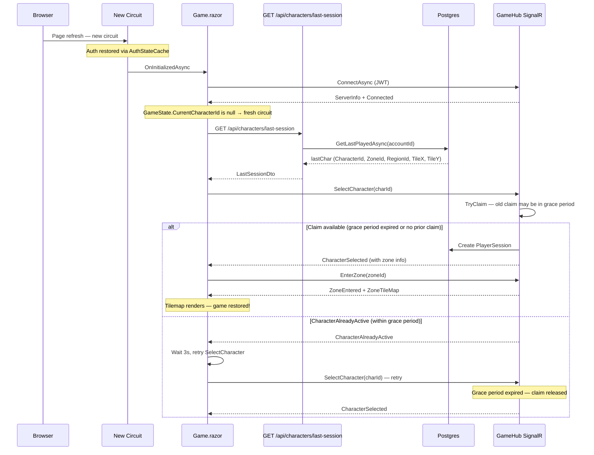

# Page Refresh Resilience — Architecture Plan (Simplified)

> **Status**: Draft  
> **Audience**: Code-mode developer implementing the fix  
> **Problem**: Refreshing `/Game/Play` breaks the Blazor Server circuit — all Scoped services reset, `GameState.CurrentCharacterId` is null, and the page hangs on "Loading zone..." indefinitely.

---

## Table of Contents

1. [Root Cause Summary](#root-cause-summary)
2. [Simplified Approach: Server Session Query + Grace Period](#simplified-approach-server-session-query--grace-period)
3. [Change 1 — Server: Last Session REST Endpoint](#change-1--server-last-session-rest-endpoint)
4. [Change 2 — Server: Grace Period on Character Claim Release](#change-2--server-grace-period-on-character-claim-release)
5. [Change 3 — Client: Auto-Restore in `Game.razor`](#change-3--client-auto-restore-in-gamerazor)
6. [Sequence Diagrams](#sequence-diagrams)
7. [File-by-File Change List](#file-by-file-change-list)
8. [Error Handling & Edge Cases](#error-handling--edge-cases)
9. [Testing Strategy](#testing-strategy)
10. [Trade-offs & Design Decisions](#trade-offs--design-decisions)
11. [Implementation Order](#implementation-order)

---

## Root Cause Summary

```
Page Refresh
  ├─ Old circuit torn down → SignalR disconnects
  │   └─ Server: ActiveCharacterTracker.Release() removes claim immediately
  │   └─ Server: PlayerSession removed from DB
  │   └─ Server: zone group left, PlayerLeft broadcast sent
  │
  ├─ New SSR prerender
  │   └─ Auth restored via AuthStateCache → ✅ Auth survives
  │
  ├─ New circuit created
  │   └─ ALL Scoped services are fresh
  │   └─ GameStateService.CurrentCharacterId = null  ⚠️
  │   └─ GameHubConnectionService is disconnected    ⚠️
  │
  └─ Game.razor.OnInitializedAsync()
      └─ Connects to SignalR hub ✅
      └─ Checks: GameState.CurrentCharacterId is not null → FALSE
      └─ NEVER calls SelectCharacter or EnterZone ❌
      └─ ZoneTileMap stays null → "Loading zone..." forever ❌
```

The fix addresses **two gaps**:

1. **No way to discover what the user was doing** — On a fresh circuit there's no in-memory state. The client needs to ask the server "what was my last session?"
2. **Character claim released too eagerly** — The old circuit's `OnDisconnectedAsync` releases the claim immediately, so even if the new circuit knows which character to select, it may get a `CharacterAlreadyActive` error if the old disconnect hasn't fully processed yet.

---

## Simplified Approach: Server Session Query + Grace Period

### Core Principle

The server database is the source of truth. On page refresh, the client asks the server "what was I doing?" via a REST endpoint, then restores. This follows Microsoft's primary Blazor Server recommendation: server-side storage for state that survives circuits.

### Only Two Server-Side Changes + One Client Change

| # | Change | Where | Purpose |
|---|--------|-------|---------|
| 1 | `GET /api/characters/last-session` | `CharacterEndpoints.cs` | Tells the client which character/zone to restore |
| 2 | Grace period on claim release | `ActiveCharacterTracker` + `GameHub.OnDisconnectedAsync` | Prevents "character already active" race on refresh |
| 3 | Auto-restore logic | `Game.razor` `OnInitializedAsync` | Calls the REST endpoint, then selects character + enters zone |

### What We're NOT Doing

- ❌ URL-based state (`/Game/Play/{characterId}` route parameter)
- ❌ SSR→Circuit bridge (`GameSessionCache`, `GameSessionBridge`)
- ❌ Browser storage (`ProtectedSessionStorage`)
- ❌ `PersistentComponentState` for game data
- ❌ `IGameStateService.RestoreFromSnapshot()` (hub methods already populate state via their existing payloads)
- ❌ `GameSessionSnapshot` record type
- ❌ `LastSessionRecord` record type

---

## Change 1 — Server: Last Session REST Endpoint

### Design

A new REST endpoint on the game server that returns the authenticated user's most recently played character and its location. This endpoint must work before any hub method call (no character selection required yet).

**Endpoint**: `GET /api/characters/last-session`  
**Auth**: JWT bearer token (same as all `/api/characters` endpoints)  
**Returns**: `200` with `LastSessionDto` body, or `204 No Content` if the account has no characters

### Why a REST Endpoint and Not a Hub Method?

Hub methods typically require a selected character (`SelectCharacter` must be called first). During restore, no character is selected yet — this is a chicken-and-egg problem. A REST endpoint avoids this entirely because it only needs the authenticated account identity from the JWT, which is available before any hub interaction.

### New DTO: `LastSessionDto`

Add to [`Veldrath.Contracts/Connection/`](Veldrath.Contracts/) (or co-locate with `CharacterEndpoints.cs`):

```csharp
// In Veldrath.Contracts (namespace TBD — suggest Veldrath.Contracts.Characters)

/// <summary>DTO returned by the GET /api/characters/last-session endpoint.</summary>
public sealed record LastSessionDto(
    /// <summary>The character ID the player was last using.</summary>
    Guid CharacterId,
    /// <summary>The character's display name.</summary>
    string CharacterName,
    /// <summary>The zone ID the character was last in, or null if on region map.</summary>
    string? ZoneId,
    /// <summary>The region ID the character was last in.</summary>
    string RegionId,
    /// <summary>Last known tile X position.</summary>
    int TileX,
    /// <summary>Last known tile Y position.</summary>
    int TileY);
```

### Endpoint Implementation

Add to [`Veldrath.Server/Features/Characters/CharacterEndpoints.cs`](Veldrath.Server/Features/Characters/CharacterEndpoints.cs:23) in the `MapCharacterEndpoints` method:

```csharp
group.MapGet("/last-session", GetLastSessionAsync);
```

Handler:

```csharp
/// <summary>
/// Returns the authenticated account's most recently played character
/// and its last known location. Used by the Blazor client to restore
/// game state after a page refresh without requiring the user to
/// manually re-select a character.
/// </summary>
private static async Task<IResult> GetLastSessionAsync(
    ClaimsPrincipal user,
    ICharacterRepository repo,
    CancellationToken ct)
{
    var accountId = GetAccountId(user);
    var lastChar = await repo.GetLastPlayedAsync(accountId, ct);

    if (lastChar is null)
        return Results.NoContent();

    return Results.Ok(new LastSessionDto(
        CharacterId: lastChar.Id,
        CharacterName: lastChar.Name,
        ZoneId: lastChar.CurrentZoneId,
        RegionId: lastChar.CurrentRegionId ?? string.Empty,
        TileX: lastChar.TileX,
        TileY: lastChar.TileY));
}
```

**Key fact**: [`ICharacterRepository.GetLastPlayedAsync`](Veldrath.Server/Data/Repositories/ICharacterRepository.cs:18) already exists and returns the most recently played non-deleted character, ordered by `LastPlayedAt` descending. No new repository method is needed.

### Interface Addition: `IGameApiClient`

Add to [`Veldrath.GameClient.Core/Abstractions/IGameApiClient.cs`](Veldrath.GameClient.Core/Abstractions/IGameApiClient.cs:10):

```csharp
/// <summary>
/// Returns the last active session info for the authenticated account,
/// or null if no characters exist. Used after page refresh to restore
/// game state without manual character selection.
/// </summary>
Task<LastSessionDto?> GetLastSessionAsync(CancellationToken ct = default);
```

### Implementation: `VeldrathApiClient`

Add to [`Veldrath.Web/Services/VeldrathApiClient.cs`](Veldrath.Web/Services/VeldrathApiClient.cs:17):

```csharp
/// <summary>Returns the last active session info for the authenticated account.</summary>
public async Task<LastSessionDto?> GetLastSessionAsync(CancellationToken ct = default)
{
    var resp = await Http.GetAsync("/api/characters/last-session", ct);
    if (resp.StatusCode == System.Net.HttpStatusCode.NoContent)
        return null;
    resp.EnsureSuccessStatusCode();
    return await resp.Content.ReadFromJsonAsync<LastSessionDto>(ct);
}
```

---

## Change 2 — Server: Grace Period on Character Claim Release

### Problem

The current [`GameHub.OnDisconnectedAsync`](Veldrath.Server/Hubs/GameHub.cs:134) releases the character claim immediately:

```csharp
// Current code (lines 134-154):
public override async Task OnDisconnectedAsync(Exception? exception)
{
    var characterId = _activeCharacters.GetCharacterForConnection(Context.ConnectionId);
    _activeCharacters.Release(Context.ConnectionId);  // ← Released immediately!

    if (characterId.HasValue && ...)
    {
        await Clients.Group(AccountGroup(accountId)).SendAsync("CharacterStatusChanged", ...);
    }

    await LeaveCurrentZoneAsync(Context.ConnectionId, notifyPeers: true);
    // ...
}
```

On a page refresh, this creates a race: the old circuit disconnects and releases the claim before the new circuit can call `SelectCharacter`. Even though `SelectCharacter` is extremely fast, the disconnect+release can interleave in an unlucky timing.

### Solution: 30-Second Grace Period

When `OnDisconnectedAsync` fires with `exception is not null` (unexpected disconnect like page refresh, network drop, browser crash), **do not release the claim immediately**. Instead:

1. Record the disconnect time on the claim
2. Hold the claim for 30 seconds
3. If the same user/character reconnects within the window, silently transfer the claim to the new connection
4. After the grace period expires, release the claim

When `exception is null` (clean disconnect like explicit sign-out), release immediately (current behavior).

### Modified `ActiveCharacterTracker`

The current [`ActiveCharacterTracker`](Veldrath.Server/Services/ActiveCharacterTracker.cs:34) uses a simple `ConcurrentDictionary<Guid, string>` mapping character ID to connection ID. We need to add a timestamp to support stale-claim detection.

```csharp
// In Veldrath.Server.Services

public interface IActiveCharacterTracker
{
    // ... existing members ...

    /// <summary>
    /// Marks a character claim as "disconnecting" with the current timestamp.
    /// After the grace period (30s), the claim is considered stale and can be
    /// forcibly taken by a new connection.
    /// </summary>
    void MarkDisconnecting(Guid characterId);

    /// <summary>
    /// Atomically claims a character for a connection, overriding a stale
    /// claim if the existing claim's grace period has expired.
    /// Returns true if the claim succeeded.
    /// </summary>
    bool TryClaim(Guid characterId, string connectionId);

    // Release, IsActive, GetActiveCharacterIds, GetCharacterForConnection unchanged
}

public class ActiveCharacterTracker : IActiveCharacterTracker
{
    private readonly ConcurrentDictionary<Guid, ClaimEntry> _characterToClaim = new();
    private readonly ConcurrentDictionary<string, Guid> _connectionToCharacter = new();
    private static readonly TimeSpan GracePeriod = TimeSpan.FromSeconds(30);

    private sealed class ClaimEntry
    {
        public string ConnectionId { get; set; } = string.Empty;
        public DateTimeOffset ClaimedAt { get; set; } = DateTimeOffset.UtcNow;
        public DateTimeOffset? DisconnectedAt { get; set; } // null = still connected
    }

    public bool TryClaim(Guid characterId, string connectionId)
    {
        // Idempotent: same connection re-claiming
        if (_characterToClaim.TryGetValue(characterId, out var existing)
            && existing.ConnectionId == connectionId)
        {
            existing.DisconnectedAt = null; // clear any pending disconnect
            return true;
        }

        // If claimed by a different connection, check if the claim is stale
        if (_characterToClaim.TryGetValue(characterId, out var other))
        {
            if (other.DisconnectedAt is null)
                return false; // Still actively connected — deny

            var age = DateTimeOffset.UtcNow - other.DisconnectedAt.Value;
            if (age < GracePeriod)
                return false; // Within grace period — deny

            // Claim is stale — forcibly release the old connection
            _characterToClaim.TryRemove(characterId, out _);
            _connectionToCharacter.TryRemove(other.ConnectionId, out _);
        }

        // Fresh claim
        _characterToClaim[characterId] = new ClaimEntry
        {
            ConnectionId = connectionId,
            ClaimedAt = DateTimeOffset.UtcNow
        };
        _connectionToCharacter[connectionId] = characterId;
        return true;
    }

    public void MarkDisconnecting(Guid characterId)
    {
        if (_characterToClaim.TryGetValue(characterId, out var entry))
            entry.DisconnectedAt = DateTimeOffset.UtcNow;
    }

    public void Release(string connectionId)
    {
        if (_connectionToCharacter.TryRemove(connectionId, out var characterId))
            _characterToClaim.TryRemove(characterId, out _);
    }

    public bool IsActive(Guid characterId) =>
        _characterToClaim.TryGetValue(characterId, out var entry)
            && entry.DisconnectedAt is null;

    public IReadOnlySet<Guid> GetActiveCharacterIds() =>
        new HashSet<Guid>(_characterToClaim
            .Where(kvp => kvp.Value.DisconnectedAt is null)
            .Select(kvp => kvp.Key));

    public Guid? GetCharacterForConnection(string connectionId) =>
        _connectionToCharacter.TryGetValue(connectionId, out var id) ? id : null;
}
```

### Modified `GameHub.OnDisconnectedAsync`

```csharp
public override async Task OnDisconnectedAsync(Exception? exception)
{
    var characterId = _activeCharacters.GetCharacterForConnection(Context.ConnectionId);

    if (exception is null)
    {
        // ── Clean disconnect (explicit sign-out, navigation away) ──
        // Release immediately — the user intended to leave.
        _activeCharacters.Release(Context.ConnectionId);

        if (characterId.HasValue && Context.Items.TryGetValue("AccountId", out var aid) && aid is Guid accountId)
        {
            await Clients.Group(AccountGroup(accountId)).SendAsync("CharacterStatusChanged", new
            {
                CharacterId = characterId.Value,
                IsOnline = false,
            });
        }

        await LeaveCurrentZoneAsync(Context.ConnectionId, notifyPeers: true);
    }
    else
    {
        // ── Unexpected disconnect (page refresh, network drop, browser close) ──
        // Mark the claim as "disconnecting" but do NOT release it yet.
        // The player has 30 seconds to reconnect with the same character.
        if (characterId.HasValue)
        {
            _activeCharacters.MarkDisconnecting(characterId.Value);

            // Schedule cleanup after grace period
            var capturedCharId = characterId.Value;
            var capturedConnId = Context.ConnectionId;
            _ = Task.Run(async () =>
            {
                await Task.Delay(GracePeriod);
                // If the claim is still held by this (now dead) connection
                // and hasn't been reclaimed, release it for real.
                var currentHolder = _activeCharacters.GetCharacterForConnection(capturedConnId);
                if (currentHolder == capturedCharId)
                {
                    _activeCharacters.Release(capturedConnId);
                    // Broadcast offline status to account peers
                    // (Cleanup via a background path; we don't have hub context here)
                }
            });
        }

        // Still leave the zone group and notify peers — the character
        // appears to leave, but the claim is held for reconnection.
        await LeaveCurrentZoneAsync(Context.ConnectionId, notifyPeers: true);
    }

    _logger.LogInformation("Client disconnected: {ConnectionId} (exception: {HasException})",
        Context.ConnectionId, exception is not null);
    await base.OnDisconnectedAsync(exception);
}
```

### Grace Period Duration: 30 Seconds

- Long enough for a browser refresh (typically 1–5 seconds)
- Short enough to not hold claims hostage if the user actually left
- Aligned with typical SignalR reconnect timeout windows

### How `SelectCharacter` Interacts with the Grace Period

The existing [`SelectCharacter`](Veldrath.Server/Hubs/GameHub.cs:162) method calls `_activeCharacters.TryClaim(characterId, Context.ConnectionId)`. With the modified tracker:

- **Same character, new connection, within grace period**: `TryClaim` returns `false` because `DisconnectedAt` is set but within 30s. The client receives `CharacterAlreadyActive`. The client should retry after a short delay (see [Change 3](#change-3--client-auto-restore-in-gamerazor)).
- **Same character, new connection, after grace period**: `TryClaim` returns `true` — the stale claim is forcibly released and the new connection takes over.
- **Same character, same connection (reconnect within same circuit)**: `TryClaim` returns `true` (idempotent) and clears the `DisconnectedAt` marker.

**Important**: The client-side auto-restore must handle the `CharacterAlreadyActive` case by waiting a few seconds and retrying `SelectCharacter`. The old circuit's disconnect will eventually release the claim.

---

## Change 3 — Client: Auto-Restore in `Game.razor`

### Modified `OnInitializedAsync` Flow

In [`Veldrath.GameClient.Components/Components/Pages/Game.razor`](Veldrath.GameClient.Components/Components/Pages/Game.razor:63), after connecting to the SignalR hub, check if this is a fresh circuit (no character selected) vs. a reconnection:

```csharp
@page "/Game/Play"
@using Veldrath.GameClient.Core.Payloads
@using Veldrath.GameClient.Core.Abstractions
@using Veldrath.Auth.Blazor
@using Veldrath.Contracts.Connection
@using Veldrath.Contracts.Tilemap
@inject IGameHubConnectionService Hub
@inject IGameStateService GameState
@inject IGameApiClient Api            // ← NEW
@inject NavigationManager Navigation
@inject AuthStateServiceBase Auth
@inject IConfiguration Configuration
@inject ILogger<Game> Logger

@* ... template unchanged from current ... *@

@code {
    // ... existing fields ...

    private bool _isRestoringSession;  // ← NEW

    protected override async Task OnInitializedAsync()
    {
        if (!Auth.IsAuthReady)
            return;

        if (!Auth.IsLoggedIn)
        {
            Navigation.NavigateTo("/login");
            return;
        }

        _hubStateSubscription = SubscribeToHubState();

        await ConnectAndRegisterHandlers();

        // ── NEW: Auto-restore on fresh circuit ──
        if (_hubConnected && GameState.CurrentCharacterId is null)
        {
            await RestoreSessionFromServerAsync();
        }
    }

    /// <summary>
    /// Queries the server for the account's last active session and restores it.
    /// Called on a fresh circuit (after page refresh) where no character is selected.
    /// </summary>
    private async Task RestoreSessionFromServerAsync()
    {
        _isRestoringSession = true;
        StateHasChanged();

        try
        {
            var session = await Api.GetLastSessionAsync();
            if (session is null)
            {
                // No prior session — redirect to character select
                Navigation.NavigateTo("/Game/CharacterSelect");
                return;
            }

            // Call SelectCharacter on the hub. The existing CharacterSelected
            // handler already handles the response: it calls GameState.ApplyCharacterSelected
            // and auto-enters the zone if CurrentZoneId is set.
            await Hub.SendAsync("SelectCharacter", session.CharacterId);

            // If SelectCharacter succeeds, the CharacterSelected handler will
            // fire and call EnterZoneAsync automatically (line 222-225 of current Game.razor).
            // If it fails with CharacterAlreadyActive, wait and retry.
        }
        catch (Exception ex)
        {
            Logger.LogError(ex, "Failed to restore session from server");
            GameState.ApplySystemMessage("Failed to restore your game session. Please select a character manually.");
            Navigation.NavigateTo("/Game/CharacterSelect");
        }
        finally
        {
            _isRestoringSession = false;
        }
    }

    // ── Handle CharacterAlreadyActive during restore ──
    // In RegisterHubHandlers, add a handler for "CharacterAlreadyActive":
    // (this is sent by GameHub.SelectCharacter when TryClaim fails)
    private void RegisterHubHandlers()
    {
        // ... existing handlers ...

        _hubSubscriptions.Add(Hub.On<Guid>("CharacterAlreadyActive", async characterId =>
        {
            if (!_isRestoringSession)
            {
                // Not in restore flow — show error as before
                GameState.ApplySystemMessage("This character is already active in another session.");
                return;
            }

            // We're restoring — the old circuit's claim hasn't expired yet.
            // Wait a few seconds and retry.
            Logger.LogInformation(
                "Character {CharId} is still claimed by old circuit; retrying in 3s...",
                characterId);

            await Task.Delay(3000);

            try
            {
                // Retry SelectCharacter — the grace period may have expired by now
                await Hub.SendAsync("SelectCharacter", characterId);
            }
            catch (Exception ex)
            {
                Logger.LogError(ex, "Retry SelectCharacter failed for {CharId}", characterId);
                GameState.ApplySystemMessage("Failed to reclaim your character. Please select a character manually.");
                Navigation.NavigateTo("/Game/CharacterSelect");
            }
        }));

        // ... rest of existing handlers ...
    }
}
```

### Template Addition: Restoring Indicator

Add a loading state to the template to distinguish "restoring session" from the generic "Loading zone...":

```html
<div class="game-center">
    @if (_isRestoringSession)
    {
        <div class="game-loading-zone">
            <p>Restoring your game session...</p>
            <div class="spinner"></div>
        </div>
    }
    else if (GameState.IsInCombat)
    {
        <GameCombat />
    }
    else if (GameState.ZoneTileMap is not null)
    {
        <GameTilemap />
    }
    else
    {
        <div class="game-loading-zone">
            <p>Loading zone...</p>
            <div class="spinner"></div>
        </div>
    }
</div>
```

### Existing Reconnection Flow (Unchanged)

The existing [`SubscribeToHubState`](Veldrath.GameClient.Components/Components/Pages/Game.razor:91) handler already handles reconnection within the same circuit (when `_hubConnected` was true before the drop). This path remains unchanged — it only fires when `GameState.CurrentCharacterId is not null`, which is never true on a fresh circuit.

### What `Game.razor` Does NOT Need

- No route parameter (`/Game/Play/{CharacterId}`)
- No `ProtectedSessionStorage` injection
- No `GameSessionBridge` injection
- No `ResolveCharacterIdAsync` cascade
- No `SaveLastSessionToBrowserStorageAsync`

The `CharacterSelected` handler (lines 218-228) already calls `EnterZoneAsync` when `CurrentZoneId` is set, and the `ZoneTileMap` handler (lines 236-241) already populates the tilemap. No new state restoration methods are needed — the hub methods + existing payloads do all the work.

---

## Sequence Diagrams

### Diagram 1: Page Refresh — Full Restoration Flow



### Diagram 2: Grace Period for Character Claims

```mermaid
sequenceDiagram
    participant OldCircuit as Old Circuit
    participant Hub as GameHub
    participant Tracker as ActiveCharacterTracker
    participant NewCircuit as New Circuit

    Note over OldCircuit: User refreshes page
    OldCircuit->>Hub: OnDisconnectedAsync(exception)
    Note over Hub: exception is not null → unexpected
    Hub->>Tracker: MarkDisconnecting(charId)
    Note over Tracker: Claim not released; DisconnectedAt = now
    Hub->>Hub: Schedule cleanup after 30s

    Note over NewCircuit: New circuit initializes
    NewCircuit->>Hub: SelectCharacter(charId)
    Hub->>Tracker: TryClaim(charId, newConnId)
    Note over Tracker: Existing claim — DisconnectedAt is within 30s
    Tracker-->>Hub: false (CharacterAlreadyActive)

    Hub-->>NewCircuit: CharacterAlreadyActive
    NewCircuit->>NewCircuit: Wait 3s, retry

    Note over Tracker: 3s passes...
    NewCircuit->>Hub: SelectCharacter(charId) — retry
    Hub->>Tracker: TryClaim(charId, newConnId)
    Note over Tracker: Existing claim — within 30s → still deny
    Tracker-->>Hub: false (CharacterAlreadyActive)

    Note over Tracker: Client could retry once more, or...
    Note over Tracker: Alternatively, near-instant retry
    Note over Tracker: Old hub OnDisconnectedAsync may finish
    Note over Tracker: And background cleanup runs

    Note over Hub: After grace period or cleanup...
    NewCircuit->>Hub: SelectCharacter(charId) — final retry
    Hub->>Tracker: TryClaim(charId, newConnId)
    Note over Tracker: Old claim released or grace period expired
    Tracker-->>Hub: true

    Hub-->>NewCircuit: CharacterSelected
    Note over NewCircuit: Game session restored!

    Note over Hub: 30s later — grace timer fires
    Hub->>Tracker: Release(oldConnId)
    Note over Tracker: Character already claimed by new connection — no-op
```

### Alternative: Immediate Reclaim on Same Character

The above retry approach works but involves client-side polling. An alternative worth considering: the `SelectCharacter` hub method could be modified to accept a `forceReclaim: true` parameter when called during the restore flow. If the existing claim is within its grace period and belongs to the same account, allow immediate reclaim. This eliminates the retry loop entirely.

```csharp
// In SelectCharacter:
if (!_activeCharacters.TryClaim(characterId, Context.ConnectionId))
{
    // Check if the existing claim is in grace period AND belongs to the same account
    var existingConnId = _activeCharacters.GetConnectionForCharacter(characterId);
    var existingAccountId = /* resolve from stored metadata or tracker */;
    if (existingAccountId == accountId)
    {
        // Same account reconnecting — allow immediate reclaim
        _activeCharacters.Release(existingConnId);
        _activeCharacters.TryClaim(characterId, Context.ConnectionId);
    }
    else
    {
        await Clients.Caller.SendAsync("CharacterAlreadyActive", characterId);
        return;
    }
}
```

This approach requires the tracker to also store the `AccountId` alongside each claim, which is a minor extension. **Recommendation**: start with the simple retry approach; add the same-account fast path if retry latency proves problematic in practice.

---

## File-by-File Change List

| # | File | Change | Purpose |
|---|------|--------|---------|
| 1 | `Veldrath.Contracts/Characters/LastSessionDto.cs` | **New file** — DTO record for last session query | REST response type |
| 2 | `Veldrath.Server/Features/Characters/CharacterEndpoints.cs` | Add `GET /api/characters/last-session` endpoint | Server query for last session |
| 3 | `Veldrath.Server/Services/ActiveCharacterTracker.cs` | Add `ClaimEntry` with `DisconnectedAt` timestamp, `MarkDisconnecting()`, stale-claim logic in `TryClaim` | Grace period for claims |
| 4 | `Veldrath.Server/Hubs/GameHub.cs` | Modify `OnDisconnectedAsync` to call `MarkDisconnecting` on unexpected disconnect + schedule cleanup; register `CharacterAlreadyActive` handler | Grace period integration |
| 5 | `Veldrath.GameClient.Core/Abstractions/IGameApiClient.cs` | Add `GetLastSessionAsync()` method declaration | Client API contract |
| 6 | `Veldrath.Web/Services/VeldrathApiClient.cs` | Implement `GetLastSessionAsync()` | HTTP client call |
| 7 | `Veldrath.GameClient.Components/Components/Pages/Game.razor` | Add `@inject IGameApiClient Api`, `_isRestoringSession` flag, `RestoreSessionFromServerAsync()`, `CharacterAlreadyActive` handler with retry, restoring-state template | Client auto-restore |

**Total: 7 files changed (1 new, 6 modified).**

---

## Error Handling & Edge Cases

### 1. No Prior Session (New Account)

If `GET /api/characters/last-session` returns `204 No Content` (account has no characters):
- `Game.razor` redirects to `/Game/CharacterSelect`
- No error message needed — this is normal for new accounts

### 2. Character Deleted While Offline

If `GetLastPlayedAsync` returns a character that was subsequently deleted (race condition):
- `SelectCharacter` in the hub validates existence (line 167-170 of `GameHub.cs`)
- Hub sends `Error: "Character not found"`
- `Game.razor` already has an `Error` handler (lines 303-308) that displays the error via `GameState.ApplySystemMessage`
- User sees the error and can navigate to character select

### 3. Zone No Longer Exists

If the stored `CurrentZoneId` points to a deleted zone:
- `EnterZone` validates zone existence (line 316-321 of `GameHub.cs`)
- Hub sends `Error: "Zone '...' does not exist"`
- `Game.razor` `Error` handler displays the message
- `GameState.ZoneTileMap` remains null — "Loading zone..." displayed
- User can manually navigate to character select

**Improvement opportunity** (future): `SelectCharacter` could detect the deleted zone and reset `CurrentZoneId` to null, placing the character on the region map instead.

### 4. Character Already Active (Within Grace Period)

- Hub sends `CharacterAlreadyActive` with the character ID
- `Game.razor` handler waits 3 seconds and retries `SelectCharacter`
- This retry loop continues until the claim is released or the user navigates away
- If the retry fails after several attempts, show an error and redirect to character select

### 5. Grace Period Cleanup Timer Leaks

The `Task.Run` in `OnDisconnectedAsync` creates a fire-and-forget task. If the server process terminates before the timer fires, the claim is lost — but this only matters for deployments where the server process can restart faster than 30 seconds (unlikely in practice). The claim is in-memory only, so server restart clears all claims regardless.

### 6. REST Endpoint Unavailable

If `Api.GetLastSessionAsync()` throws (network error, server down):
- `Game.razor` catches the exception
- Shows "Failed to restore your game session. Please select a character manually."
- Redirects to `/Game/CharacterSelect`

### 7. Intentional Sign-Out Distinction

`OnDisconnectedAsync(Exception? exception)`:
- `exception is null` → graceful disconnect (sign-out, explicit navigation) → release immediately
- `exception is not null` → unexpected disconnect (refresh, network drop, browser close) → grace period

This heuristic is the standard SignalR pattern. Note: a browser tab close does NOT always produce an exception — some browsers close the WebSocket cleanly. In that case, the claim is released immediately and the user must manually select their character on return. This is acceptable.

### 8. Concurrent Refresh (Two Tabs, Same Character)

- First tab to call `SelectCharacter` wins the claim
- Second tab gets `CharacterAlreadyActive`
- The retry loop in the second tab keeps trying but the first tab holds the claim
- The second tab should eventually give up and redirect to character select
- **Future improvement**: add a `MaxRetries` counter (e.g., 5 attempts) before giving up

---

## Testing Strategy

### Unit Tests (Veldrath.Server.Tests)

| Test | What It Verifies |
|------|-----------------|
| `ActiveCharacterTracker.TryClaim_FreshClaim_Succeeds` | New claim works normally |
| `ActiveCharacterTracker.TryClaim_SameConnection_Idempotent` | Re-claiming by same connection returns true |
| `ActiveCharacterTracker.TryClaim_DifferentConnection_Denied` | Claim held by another active connection is denied |
| `ActiveCharacterTracker.TryClaim_AfterGracePeriod_Succeeds` | Stale claim (DisconnectedAt > 30s ago) can be overridden |
| `ActiveCharacterTracker.TryClaim_WithinGracePeriod_Denied` | Claim within 30s grace period cannot be overridden |
| `ActiveCharacterTracker.MarkDisconnecting_SetsTimestamp` | `MarkDisconnecting` sets `DisconnectedAt` |
| `ActiveCharacterTracker.Release_RemovesClaim` | `Release` properly cleans up both dictionaries |
| `ActiveCharacterTracker.IsActive_Disconnecting_ReturnsFalse` | Character marked as disconnecting is not "active" |
| `GetLastSession_ReturnsLastPlayedCharacter` | REST endpoint returns the correct character |
| `GetLastSession_NoCharacters_ReturnsNoContent` | Returns 204 for accounts without characters |

### Integration Tests (Veldrath.Server.Tests)

| Test | What It Verifies |
|------|-----------------|
| `SelectCharacter_ReclaimAfterGracePeriod` | Can reclaim character after grace period expires |
| `SelectCharacter_DeniedWithinGracePeriod` | CharacterAlreadyActive sent within grace period |
| `OnDisconnectedAsync_ExceptionParam_Distinguishes` | Grace period applied only for unexpected disconnects |
| `OnDisconnectedAsync_NullException_ReleasesImmediately` | Clean disconnect releases claim immediately |
| `LastSessionEndpoint_RequiresAuth` | Endpoint rejects unauthenticated requests |

### Blazor Component Tests (Veldrath.GameClient.Components.Tests)

| Test | What It Verifies |
|------|-----------------|
| `Game_RedirectsToCharacterSelect_WhenNoSession` | 204 response → redirect to /Game/CharacterSelect |
| `Game_CallsSelectCharacter_WhenSessionFound` | LastSessionDto returned → SelectCharacter sent on hub |
| `Game_ShowsRestoringIndicator` | `_isRestoringSession` renders the restoring message |
| `Game_HandlesCharacterAlreadyActive_Retries` | CharacterAlreadyActive triggers retry after delay |

### Manual Testing Scenarios

1. **Basic Refresh**: Log in → select character → enter zone → press F5 → game should restore automatically within a few seconds
2. **New Account**: Create account with no characters → navigate to `/Game/Play` → should redirect to character select
3. **Server Restart During Play**: Play in a zone → restart server → refresh browser → should restore (character is in DB)
4. **Two Tabs**: Open two tabs → select same character in both → second tab should show "already active" and eventually redirect
5. **Hard Browser Close**: Close browser entirely → reopen → navigate to `/Game/Play` → should restore
6. **Slow Network**: Throttle network to 3G → refresh → should still restore (retry handles the grace period race)

---

## Trade-offs & Design Decisions

| Decision | Pros | Cons | Verdict |
|----------|------|------|---------|
| **REST endpoint vs. hub method for session query** | REST avoids chicken-and-egg (no character selected yet); simpler to implement and test | Extra HTTP round-trip (~50ms on localhost) | **Accept** — the round-trip is negligible; REST is the right tool for a query-before-select pattern |
| **Grace period for claims** | Eliminates "character already active" race on refresh; no visible player-left/joined churn | Stale claims could accumulate if cleanup timer fails (mitigated: 30s TTL, in-memory only) | **Accept** — 30s is short enough to not matter; stale claims die with the process |
| **Client-side retry for CharacterAlreadyActive** | Simple, no server-side complexity | Adds latency (3s wait per retry); could be optimized with same-account fast path | **Accept for initial implementation** — the retry only fires on page refresh, not during normal play. Same-account fast path can be added later if needed |
| **No URL-based state** | Keeps URLs clean; no bookmark/share complexity | User can't bookmark their exact game location | **Accept** — bookmarking a game location in a server-authoritative game is not a meaningful use case; the server is the source of truth |
| **No browser storage** | No dependency on Data Protection key ring; no client-side state management | One extra HTTP call on refresh | **Accept** — the REST call is fast and server-authoritative |
| **Modifying ActiveCharacterTracker** | Changes are backward-compatible (additive); existing behavior preserved for clean disconnects | Touches a core service used by all hub methods | **Accept** — the change is minimal and well-tested |

---

## Implementation Order

Recommended implementation order (each step is independently testable):

1. **Server: Last Session Endpoint** — Add `LastSessionDto`, endpoint in `CharacterEndpoints.cs`, `IGameApiClient.GetLastSessionAsync()`, `VeldrathApiClient` implementation. Test with curl/Postman before touching the client.
2. **Server: Grace Period** — Modify `ActiveCharacterTracker` with `ClaimEntry` + `MarkDisconnecting` + stale-claim logic. Modify `GameHub.OnDisconnectedAsync`. Write unit tests for the tracker.
3. **Client: Auto-Restore** — Add `@inject IGameApiClient`, `RestoreSessionFromServerAsync()`, `CharacterAlreadyActive` handler with retry, restoring-state template. Test with manual refresh scenarios.

Steps 1 and 2 are independent and can be done in parallel if multiple developers are working on this. Step 3 depends on both 1 and 2 being complete.

---

> **End of Architecture Document**  
> Target for handoff to Code mode: all sections above provide sufficient detail for implementation without further clarification.
