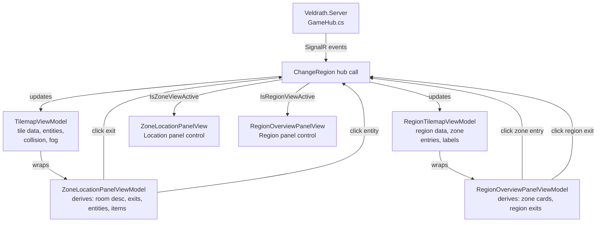
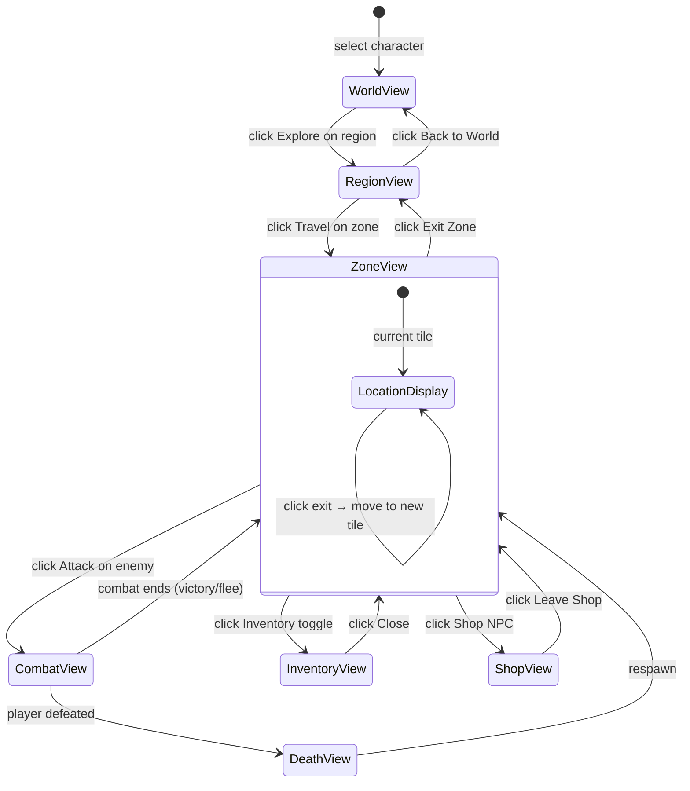

# Pure Reactive UI Pivot Plan

> Replace 2D tilemap rendering (sprite/ASCII) with a full panel-driven reactive UI.
> Keep the tilemap data model — render as structured text, tables, and clickable lists.

---

## Vision

The game client becomes a **panel-driven reactive UI** — no visual map/scene rendering. All game state is displayed through rich Avalonia panels with clickable lists, text descriptions, and contextual action buttons. Movement is point-and-click (click an exit to move), interaction is point-and-click (click an entity to interact).

The tilemap data model (`TileMapDto`, `RegionMapDto`, collision masks, fog masks, exit tiles, entity positions) stays intact server-side and in the client ViewModels — but it drives structured text displays rather than a 2D grid.

---

## Architecture Overview

```
Server (unchanged)
  │ SignalR (unchanged events & payloads)
  ▼
GameViewModel (mostly unchanged — orchestrates state, routes commands)
  │ Observable properties / ReactiveCommand
  ▼
New Panel Components (replace TilemapControl / RegionTilemapControl)
  ├── ZoneLocationPanelView        ← room desc, entity list, exit list, items
  ├── ZoneLocationPanelViewModel   ← derives display data from TilemapViewModel
  ├── RegionOverviewPanelView      ← zone cards, region exits, labels
  └── RegionOverviewPanelViewModel ← derives from RegionTilemapViewModel
  │
  ▼
Existing Panels (unchanged or minor tweaks)
  ├── GameHeaderView          (name, HP/MP bars, breadcrumb)
  ├── GameLeftPanelView       (stats, equipment)
  ├── GameRightPanelView      (online players, chat, action log)
  ├── GameFooterView          (combat buttons, hotbar, inventory toggle)
  ├── GameZonePanelView       (enemy roster, combat HUD, death overlay)
  ├── GameRegionPanelView     (zone cards with Travel)
  ├── GameWorldPanelView      (region cards with Explore)
  └── All overlays            (inventory, shop, journal, attr allocation)
```

## What Changes

### ❌ Remove (delete)

| File | Reason |
|------|--------|
| `Veldrath.Client/Rendering/IMapRenderer.cs` | No more render strategy interface |
| `Veldrath.Client/Rendering/RenderState.cs` | No more frame-snapshot struct |
| `Veldrath.Client/Rendering/SpriteMapRenderer.cs` | Sprite-based 2D rendering — gone |
| `Veldrath.Client/Rendering/AsciiMapRenderer.cs` | ASCII-based grid rendering — gone |
| `Veldrath.Client/Rendering/MapRendererResolver.cs` | No more renderer switching |
| `Veldrath.Client/Rendering/TileTextureCache.cs` | Spritesheet bitmap cache — unused |
| `Veldrath.Client/Rendering/EntityTextureCache.cs` | Entity sprite cache — unused |
| `Veldrath.Client/Rendering/AsciiPalette.cs` | ASCII color palette — unused |
| `Veldrath.Client/Rendering/TileRegistry.cs` | TileIndex→TileDescriptor lookup — unused |
| `Veldrath.Client/Rendering/TileDescriptor.cs` | Record struct — unused |
| `Veldrath.Client/Rendering/TileCategory.cs` | Enum — unused |
| `Veldrath.Client/Rendering/EntityAppearanceRegistry.cs` | ASCII entity lookup — unused |
| `Veldrath.Client/Rendering/EntityAppearance.cs` | Record struct — unused |
| `Veldrath.Client/Controls/TilemapControl.cs` | 30fps render loop control — replaced |
| `Veldrath.Client/Controls/RegionTilemapControl.cs` | Region render loop control — replaced |
| `Veldrath.Client/ClientSettings.cs` — `RendererMode` property + `RendererMode` enum | No more renderer mode |
| `Veldrath.Assets/Manifest/EntitySpriteAssets.cs` | Entity spritesheet manifest — unused by client |
| `Veldrath.Assets/Manifest/TilemapAssets.cs` | Tilemap spritesheet manifest — unused by client |

Total: **17 files deleted**, 2 files modified.

### ✏️ Modify

| File | Change |
|------|--------|
| `Veldrath.Client/ClientSettings.cs` | Remove `RendererMode` property, remove `RendererMode` enum |
| `Veldrath.Client/Views/Game/Components/GameCenterPanelView.axaml` | Replace `<controls:TilemapControl>` and `<controls:RegionTilemapControl>` with new panel controls |
| `Veldrath.Client/Views/Game/Components/GameCenterPanelView.axaml.cs` | Update code-behind binding logic |
| `Veldrath.Client/ViewModels/GameViewModel.cs` | Update zone/region view resolution (`IsZoneViewActive`, `IsRegionViewActive`), remove tilemap control references |
| `Veldrath.Client/ViewModels/TilemapViewModel.cs` | Repurpose as data provider for `ZoneLocationPanelViewModel` — keep tile data, expose derived properties |
| `Veldrath.Client/ViewModels/RegionTilemapViewModel.cs` | Repurpose as data provider for `RegionOverviewPanelViewModel` — keep region data, expose derived properties |
| `.github/agent-memory/engine-codebase.md` | Add note about the pivot |
| `plans/rendering-extraction-plan.md` | Mark as superseded |

### ➕ Add (new)

| File | Purpose |
|------|---------|
| `Veldrath.Client/ViewModels/ZoneLocationPanelViewModel.cs` | Derives room description, exit list, entity list, item list from tile data. Exposes click-to-move, click-to-interact commands |
| `Veldrath.Client/Views/Game/Components/ZoneLocationPanelView.axaml` | Panel showing location info, exits, entities, items as reactive lists |
| `Veldrath.Client/Views/Game/Components/ZoneLocationPanelView.axaml.cs` | Code-behind for ZoneLocationPanelView |
| `Veldrath.Client/ViewModels/RegionOverviewPanelViewModel.cs` | Derives zone cards, region exits, labels from region data |
| `Veldrath.Client/Views/Game/Components/RegionOverviewPanelView.axaml` | Panel showing region zones, exits, labels as reactive lists |
| `Veldrath.Client/Views/Game/Components/RegionOverviewPanelView.axaml.cs` | Code-behind for RegionOverviewPanelView |

---

## Phase 1: Remove Rendering Layer

**Step 1.1** — Delete all 14 files under `Veldrath.Client/Rendering/` (listed above).

**Step 1.2** — Delete `TilemapControl.cs` and `RegionTilemapControl.cs`.

**Step 1.3** — Remove `RendererMode` enum and `RendererMode` property from `ClientSettings.cs`. Update `appsettings.json` if it references the setting.

**Step 1.4** — Remove sprite/tilemap asset manifest references from client DI registration. Check `Veldrath.Client` service registration to ensure no dead references.

**Step 1.5** — Update `Veldrath.Client.csproj` if any package was only needed for sprite rendering (likely none — Avalonia is the only dependency and it stays).

**Step 1.6** — Build & verify no compilation errors.

---

## Phase 2: Create New Panel Components

### ZoneLocationPanelView + ViewModel

**Data sources** (`TilemapViewModel` already holds this):
- `TileMapData` — `TileMapDto` with layers, collision mask, exit tiles
- `Entities` — `ObservableCollection<TileEntityState>` with positioned entities
- `RevealedTiles` — `HashSet<string>` of visible tiles
- `SelfEntityId` — player's entity ID
- Camera position

**New ViewModel derives**:
- `CurrentLocationDescription` — text representation of current tile (needs tile description data)
- `VisibleExits` — list of exit tiles with direction + destination, clickable
- `VisibleEntities` — entities at current tile or nearby, with type + action options
- `ItemsOnGround` — items at current location (if item drop system exists)
- `ContextActions` — contextual action buttons based on selection

**Interaction commands**:
- `MoveToExitCommand(exitTileX, exitTileY)` → calls `RequestMoveCommand`
- `InteractWithEntityCommand(entityId)` → shows action options / triggers default action
- `PickupItemCommand(itemId)` → if item system supports it

**Panel layout (AXAML)**:
```
┌────────────────────────────────────┐
│ Location Header                    │  ← Zone name + tile name
│ Description Text                   │  ← Tile/room description
├────────────────────────────────────┤
│ Exits (horizontal button bar)      │  ← Clickable exit buttons
│  [N] Market St  [S] Town Square    │
├────────────────────────────────────┤
│ Entities                           │  ← ListBox with styled items
│  [Elena] NPC  Talk                 │
│  [Goblin] Enemy  Attack            │
├────────────────────────────────────┤
│ Items on Ground                    │  ← ListBox (if items present)
│  [Rusty Sword]  Pick up            │
└────────────────────────────────────┘
```

### RegionOverviewPanelView + ViewModel

**Data sources** (`RegionTilemapViewModel` already holds this):
- `RegionMapData` — `RegionMapDto` with zone entries, region exits, labels, paths
- `Entities` — player entities on region map
- `Labels` — zone labels

**New ViewModel derives**:
- `RegionName`, `RegionDescription` — from region metadata
- `ZoneEntryCards` — list of zone entry objects with Travel command
- `RegionExits` — list of region exit objects with Travel command
- `RegionLabels` — zone location labels

**Panel layout**:
```
┌────────────────────────────────────┐
│ Region Header                      │  ← Name, type, level range
│ Description Text                   │
├────────────────────────────────────┤
│ Zones                              │  ← Card list with Travel buttons
│  [Fenwick Crossing]  Lv 1-3       │
│  [Darkwood Thicket] Lv 3-5        │
├────────────────────────────────────┤
│ Exits to Other Regions             │  ← Clickable
│  [N] Northern Reaches              │
└────────────────────────────────────┘
```

---

## Phase 3: Wire Into GameViewModel

**Step 3.1** — In `GameCenterPanelView.axaml`, replace:
```xml
<!-- OLD -->
<controls:TilemapControl ViewModel="{Binding Tilemap}" 
                          IsVisible="{Binding IsZoneViewActive}" />
<controls:RegionTilemapControl ViewModel="{Binding RegionTilemap}" 
                                IsVisible="{Binding IsRegionViewActive}" />
```
With:
```xml
<!-- NEW -->
<views:ZoneLocationPanelView ViewModel="{Binding ZoneLocationPanel}" 
                              IsVisible="{Binding IsZoneViewActive}" />
<views:RegionOverviewPanelView ViewModel="{Binding RegionOverviewPanel}" 
                                IsVisible="{Binding IsRegionViewActive}" />
```

**Step 3.2** — In `GameViewModel`, add:
- `ZoneLocationPanel` property (new `ZoneLocationPanelViewModel`)
- `RegionOverviewPanel` property (new `RegionOverviewPanelViewModel`)
- Wire creation in constructor (alongside existing `Tilemap`/`RegionTilemap`)
- Wire hub event handlers to update the new ViewModels

**Step 3.3** — Remove any direct keyboard-input handling that was in the controls (`OnKeyDown` handlers). Movement is now click-driven through the panel commands.

**Step 3.4** — Keep `TilemapViewModel` and `RegionTilemapViewModel` as the underlying data stores — they hold the raw tile data, collision masks, entity tracking. The new panel VMs wrap them.

---

## Phase 4: Tile Description System

The current data pipeline has **no tile descriptions**. For a location-based UI, each tile (or at least significant tiles) needs a description.

**Option A: Tiled custom property** (recommended)
- Add a `"description"` custom property to tile definitions in Tiled
- This flows through `TiledTileDefinition.Properties` (list of `TiledProperty`)
- Server exposes descriptions via a new field on `ExitTileDto` or a new `TileDescriptionDto`
- Client adds a lookup service or extends the DTO

**Option B: Client-side lookup table**
- Add a `Dictionary<TileIndex, string>` in the client
- Simpler but not extensible

**Option C: Server-side service**
- New engine query: `GetTileDescriptionQuery(tileIndex, zoneId)` → string
- Returns generated or looked-up description

**Recommendation**: Start with **Option A** — add description as a Tiled custom property. This keeps descriptions data-driven and editable in the tilemap editor. If per-tile descriptions are too granular, group by tile class/type.

---

## Phase 5: Update Existing Panels

The remaining panels are already reactive and mostly need **visual style updates** to match the new UI paradigm:

| Panel | Change |
|-------|--------|
| `GameHeaderView` | Minor — ensure location breadcrumb updates from new panel VMs |
| `GameLeftPanelView` | No changes needed |
| `GameRightPanelView` | No changes needed |
| `GameFooterView` | No changes needed — combat buttons, hotbar stay |
| `GameZonePanelView` | Continue to show enemy roster, combat HUD, death overlay. May need layout adjustments |
| `GameRegionPanelView` | Already shows zone cards — may become the primary region view instead of having a separate center panel |
| `GameWorldPanelView` | No changes needed |
| Overlays | No changes needed |

---

## Phase 6: Update Tests

### Files to update/remove:

| Test File | Action |
|-----------|--------|
| `Veldrath.Client.Tests/ViewModels/GameViewModelTilemapTests.cs` | Update — references tilemap VM interactions |
| `Veldrath.Client.Tests/ViewModels/GameViewModelRegionTests.cs` | Update — references region VM interactions |
| `Veldrath.Client.Tests/ViewModels/GameViewModelCombatTests.cs` | Likely unchanged — combat is separate |
| `Veldrath.Client.Tests/ViewModels/GameViewModelChatTests.cs` | Unchanged |
| `Veldrath.Client.Tests/ViewModels/TilemapViewModelTests.cs` | Update or remove — ViewModel repurposed |
| `Veldrath.Client.Tests/ViewModels/RegionTilemapViewModelTests.cs` | Update or remove — ViewModel repurposed |
| `Veldrath.Client.Tests/ViewModels/MapViewModelTests.cs` | Check if still relevant |
| `Veldrath.Client.Tests/ViewConstructionTests.cs` | Update — references old controls |
| `Veldrath.Client.Tests/ViewDataBindingTests.cs` | Update — references old bindings |

### New tests needed:

| Test | What it covers |
|------|---------------|
| `ZoneLocationPanelViewModelTests.cs` | Derives correct exit list, entity list from tile data |
| `RegionOverviewPanelViewModelTests.cs` | Derives correct zone cards from region data |
| Updated `GameViewModelTilemapTests.cs` | Hub events populate new panel VMs correctly |
| Updated `GameViewModelRegionTests.cs` | Region navigation works through new panel |

---

## Phase 7: Clean Up

- [ ] Remove `Veldrath.Assets/Manifest/TilemapAssets.cs` if only used by client rendering
- [ ] Remove `Veldrath.Assets/Manifest/EntitySpriteAssets.cs` if only used by client rendering
- [ ] Update `.github/agent-memory/engine-codebase.md` with pivot note
- [ ] Update `plans/ascii-tile-entity-system.md` — mark as superseded
- [ ] Update `plans/rendering-extraction-plan.md` — mark as superseded
- [ ] Update `AGENTS.md` if any project instructions reference rendering

---

## Migration Order

```
Phase 1: Remove rendering layer (clean slate)
    │
    ▼
Phase 2: Create new panel components (new UI)
    │
    ▼
Phase 3: Wire into GameViewModel (integration)
    │
    ▼
Phase 4: Tile description system (data enrichment)
    │
    ▼
Phase 5: Update existing panels (polish)
    │
    ▼
Phase 6: Update tests (quality)
    │
    ▼
Phase 7: Clean up (documentation, dead code)
```

Each phase is independently buildable and testable. Phase 1 will break the build until Phase 2 is complete, so they should be done in a single coding session or sequentially with careful coordination.

---

## Data Flow Diagram



---

## Panel State Diagram



---

## File Change Summary

| Category | Files | Action |
|----------|-------|--------|
| Rendering layer | 14 files in `Veldrath.Client/Rendering/` | DELETE |
| Controls | `TilemapControl.cs`, `RegionTilemapControl.cs` | DELETE |
| Client settings | `ClientSettings.cs` (partial) | MODIFY |
| Asset manifests | `EntitySpriteAssets.cs`, `TilemapAssets.cs` | DELETE (if unused elsewhere) |
| New panels | 6 files (3 views + 3 VMs) | CREATE |
| Center panel | `GameCenterPanelView.axaml` + `.cs` | MODIFY |
| GameViewModel | `GameViewModel.cs` | MODIFY |
| Tilemap ViewModels | `TilemapViewModel.cs`, `RegionTilemapViewModel.cs` | MODIFY (repurpose) |
| Tests | ~8-10 test files | UPDATE |
| Docs | 3 plan files + 1 memory file | UPDATE |

---

## Design Decisions (Approved)

The following decisions have been confirmed:

1. **Tile descriptions**: **Option A — Tiled custom property**. Add a `"description"` custom property to tile definitions in Tiled. This flows through the existing `TiledTileDefinition.Properties` pipeline.
2. **Region center panel**: **No center panel for region mode**. The existing `GameRegionPanelView` (side panel with zone cards) is the primary region view. Remove `RegionTilemapControl` entirely.
3. **Keyboard movement**: **Fully removed**. No WASD/arrow key movement. Pure mouse-driven point-and-click.
4. **Zone center panel**: New `ZoneLocationPanelView` goes in the center, replacing `TilemapControl`. `GameZonePanelView` (enemy roster, combat) works alongside it.
5. **Movement feedback**: Location header + description text + exit list provides spatial awareness. No mini-map in this pass.
