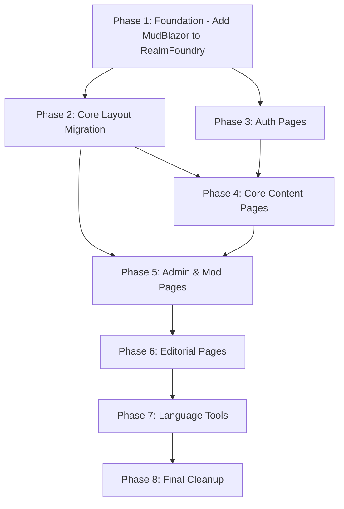

# RealmFoundry + Veldrath.Web CSS/Razor Audit — MudBlazor Consistency

> **Date:** 2026-07-22  
> **Scope:** [`RealmFoundry/wwwroot/app.css`](RealmFoundry/wwwroot/app.css) (1077 lines), 39 Razor components, and cross-project sync with [`Veldrath.Web`](Veldrath.Web/)  
> **Reference:** Previous audit [`plans/css-audit-game-client-components.md`](plans/css-audit-game-client-components.md), MudBlazor v9.7.0, VDS Design System ([`docs/design-system.md`](docs/design-system.md))  
> **Status:** Audit & Recommendations — no changes made

---

## Executive Summary

**Critical finding: RealmFoundry has zero MudBlazor integration.** It relies exclusively on 1,077 lines of custom CSS for every UI element — layout, buttons, badges, alerts, forms, tables, pagination, typography. In contrast, [`Veldrath.Web`](Veldrath.Web/) is fully MudBlazor with a shared theme ([`Veldrath.Web/Themes/VeldrathTheme.cs`](Veldrath.Web/Themes/VeldrathTheme.cs)), MudBlazor layout components, and only 182 lines of supplemental CSS.

The audit identifies:

- **~800 lines (74%) of [`RealmFoundry/wwwroot/app.css`](RealmFoundry/wwwroot/app.css)** can be eliminated by adopting MudBlazor components and theme
- **98 `.btn` usages** across 25+ Razor components — all must migrate to [`<MudButton>`](https://mudblazor.com/components/button)
- **34 `.badge` usages** — migrate to [`<MudChip>`](https://mudblazor.com/components/chip) or [`<MudBadge>`](https://mudblazor.com/components/badge)
- **15 `.alert` usages** — migrate to [`<MudAlert>`](https://mudblazor.com/components/alert)
- **A duplicated `:root` token block** (lines 5–112) that is fully redundant — [`tokens.css`](Veldrath.GameClient.Components/wwwroot/css/tokens.css) from the RCL loads immediately after and provides the canonical token set
- **No shared theme** — RealmFoundry must adopt [`VeldrathTheme`](Veldrath.Web/Themes/VeldrathTheme.cs) (currently Veldrath.Web-only)
- **Custom layout, table, pagination, form, toast, and typography CSS** — all replaceable by MudBlazor equivalents
- **`#blazor-error-ui`** is inconsistent with canonical version
- **Reconnect modal HTML** is duplicated identically from Veldrath.Web

The migration is substantial but straightforward: RealmFoundry's UI patterns map cleanly to MudBlazor components. The primary effort is Razor markup migration across 39 components, not CSS complexity.

---

## Section 1: RealmFoundry app.css Audit

### 1.1 CSS Loading Order — Critical Structural Issue

**Current RealmFoundry [`App.razor`](RealmFoundry/App.razor) (lines 7–9):**
```html
<link rel="stylesheet" href="app.css" />
<link rel="stylesheet" href="_content/Veldrath.GameClient.Components/css/tokens.css" />
<link rel="stylesheet" href="_content/Veldrath.GameClient.Components/css/reconnect.css" />
```

**Problems:**
1. **No MudBlazor CSS.** `MudBlazor.min.css` is missing entirely. This means MudBlazor components cannot render correctly even if added to Razor files.
2. **`app.css` loads before `tokens.css`.** The duplicate `:root` block in `app.css` (lines 5–112) is immediately overridden by the canonical tokens from the RCL. The `:root` block in `app.css` is **100% dead code** — it has no effect on the computed styles.
3. **`reconnect.css` is loaded but the reconnect HTML in [`App.razor`](RealmFoundry/App.razor) already uses the classes it styles.** This is correct but `reconnect.css` styling overlaps with patterns also defined in `tokens.css`.

**Target loading order (matching [`Veldrath.Web/App.razor`](Veldrath.Web/App.razor)):**
```html
<link rel="stylesheet" href="app.css" />
<link rel="stylesheet" href="_content/MudBlazor/MudBlazor.min.css" />
<link rel="stylesheet" href="_content/Veldrath.GameClient.Components/css/tokens.css" />
<link rel="stylesheet" href="_content/Veldrath.GameClient.Components/css/game.css" />
<link rel="stylesheet" href="_content/Veldrath.GameClient.Components/css/reconnect.css" />
```

And add after `</body>`:
```html
<script src="_content/MudBlazor/MudBlazor.min.js"></script>
```

### 1.2 What Can Be Deleted Entirely

| Lines | Section | Reason | Replacement |
|-------|---------|--------|-------------|
| 5–112 | `:root` block (duplicate VDS tokens + legacy aliases) | Fully overridden by [`tokens.css`](Veldrath.GameClient.Components/wwwroot/css/tokens.css) (loads at line 8). Every `--vds-*` token is defined canonically in the RCL. Legacy `--color-*` aliases are deprecated. | Delete entire block. Rely on `tokens.css` from RCL. |
| 114–121 | `body` defaults | MudBlazor theme provider sets body background/color/font via `--mud-palette-*` tokens. The font-family is set by [`VeldrathTheme`](Veldrath.Web/Themes/VeldrathTheme.cs) typography. | Delete. Let MudBlazor theme handle it. |
| 123–124 | `a` link defaults | MudBlazor sets `--mud-palette-primary-lighten` for link colors. The hover underline behavior is MudBlazor's default. | Delete. |
| 126–197 | **Layout** (`.layout`, `.sidebar`, `.brand`, `.nav-links`, `.nav-item`, `.content`, `.top-bar`, `.page-body`) | Replaced by [`<MudLayout>`](https://mudblazor.com/components/layout), [`<MudAppBar>`](https://mudblazor.com/components/appbar), [`<MudNavMenu>`](https://mudblazor.com/components/navmenu), [`<MudMainContent>`](https://mudblazor.com/components/layout). Navigation links become [`<MudNavLink>`](https://mudblazor.com/components/navmenu). | Delete all layout CSS. See §2.2 for MainLayout migration. |
| 199–207 | **Typography** (`h1`–`h3`, `p.lead`) | MudBlazor [`<MudText Typo="Typo.h1">`](https://mudblazor.com/components/text) handles headings. Typography is configured in [`VeldrathTheme`](Veldrath.Web/Themes/VeldrathTheme.cs). | Delete. Use `<MudText>` components. |
| 209–237 | **Cards** (`.card`, `.card-elevated`, `.card-accent`, `.feature-cards`) | [`<MudPaper>`](https://mudblazor.com/components/paper) with `Outlined`, `Elevation` parameters. Grid layout via `mud-grid` or [`<MudGrid>`](https://mudblazor.com/components/grid). | Delete all card CSS. |
| 239–268 | **Buttons** (`.btn`, `.btn-primary`, `.btn-secondary`, `.btn-ghost`, `.btn-danger`) | [`<MudButton Variant="Variant.Filled" Color="Color.Primary">`](https://mudblazor.com/components/button). OAuth buttons use `Color="Color.Inherit"` + CSS class overrides (pattern from [`Veldrath.Web/wwwroot/app.css`](Veldrath.Web/wwwroot/app.css) lines 152–165). | Delete all `.btn` CSS. OAuth button overrides move to `app.css` (see §1.4). |
| 352–370 | **Data tables** (`.data-table`) | [`<MudTable>`](https://mudblazor.com/components/table) with `Hover`, `Striped`, `Dense` parameters. Table styling is configured in [`VeldrathTheme`](Veldrath.Web/Themes/VeldrathTheme.cs) `PaletteDark`. | Delete `.data-table` CSS. |
| 372–391 | **Badges** (`.badge`, `.badge-*`) | [`<MudChip Size="Size.Small" Color="Color.Success">`](https://mudblazor.com/components/chip) for status badges. The VDS semantic colors map to MudBlazor palette colors via [`VeldrathTheme`](Veldrath.Web/Themes/VeldrathTheme.cs). | Delete all `.badge` CSS. |
| 393–399 | **Action buttons** (`.btn-red`, `.btn-orange`, `.btn-warn`) | [`<MudButton Color="Color.Error">`](https://mudblazor.com/components/button), [`<MudButton Color="Color.Warning">`](https://mudblazor.com/components/button). | Delete. |
| 401–411 | **Toasts + alerts** (`.toast`, `.toast-ok`, `.toast-err`, `.alert`, `.alert-success`, `.alert-error`) | [`<MudAlert Severity="Severity.Success">`](https://mudblazor.com/components/alert) for alerts, [`<MudSnackbar>`](https://mudblazor.com/components/snackbar) for toasts via `ISnackbar`. | Delete all `.toast` and `.alert` CSS. |
| 465–500 | **Auth card / OAuth buttons** (`.auth-card`, `.oauth-buttons`) | [`<MudPaper Outlined="true">`](https://mudblazor.com/components/paper) + [`<MudContainer MaxWidth="MaxWidth.ExtraSmall">`](https://mudblazor.com/components/container). OAuth buttons are `<MudButton>` with `Color="Color.Inherit"` and CSS overrides. | Delete `.auth-card` and `.oauth-buttons` CSS. Keep OAuth button overrides in `app.css` (see §1.4). |
| 502–535 | **Forms** (`.form-group`, `.form-group label`, `.form-group input/select/textarea`) | [`<MudTextField>`](https://mudblazor.com/components/textfield), [`<MudSelect>`](https://mudblazor.com/components/select), [`<MudForm>`](https://mudblazor.com/components/form). | Delete all `.form-group` CSS. |
| 537–543 | **Utilities** (`.muted`, `.error`, `.feedback`, `.loading`, `.empty`) | [`<MudText Color="Color.Secondary">`](https://mudblazor.com/components/text) for muted text, [`<MudText Color="Color.Error">`](https://mudblazor.com/components/text) for error text. | Delete `.muted`, `.error`. Keep `.loading` and `.empty` as thin wrappers or delete if unused after migration. |
| 706–728 | **Pagination** (`.pagination`) | [`<MudTablePager>`](https://mudblazor.com/components/table) (bundled with [`<MudTable>`](https://mudblazor.com/components/table) server-side data) or standalone [`<MudPagination>`](https://mudblazor.com/components/pagination). | Delete `.pagination` CSS. |
| 766 | `.btn-sm` | [`<MudButton Size="Size.Small">`](https://mudblazor.com/components/button). | Delete. |
| 875–886 | `.btn-primary`/`.btn-secondary` (duplicate definitions near form actions) | Already covered by main `.btn` deletion. | Delete. |
| 888–902 | **VDS text utilities** (`.text-title`, `.text-hero`, `.text-subtitle`, `.text-muted`, `.text-caption`, `.text-accent`, `.text-lore`, `.text-mono`, `.text-success`, `.text-danger`, `.text-warning`, `.text-info`) | [`<MudText Typo="Typo.h4">`](https://mudblazor.com/components/text) for headings, [`<MudText Color="Color.Error">`](https://mudblazor.com/components/text) for semantic colors. `.text-lore` and `.text-mono` are VDS-specific font stack utilities — **keep these two**. | Delete `.text-title`, `.text-title-large`, `.text-hero`, `.text-subtitle`, `.text-muted`, `.text-caption`, `.text-accent`, `.text-success`, `.text-danger`, `.text-warning`, `.text-info`. Keep `.text-lore` and `.text-mono`. |
| 904–1077 | **Mobile-first responsive overrides** (~174 lines, all media queries) | MudBlazor handles responsiveness natively via its own CSS breakpoints and component-level responsive behavior (e.g., [`<MudGrid>`](https://mudblazor.com/components/grid) with `xs`, `sm`, `md`, `lg` breakpoints, [`<MudHidden>`](https://mudblazor.com/components/hidden)). | Delete all media query blocks. Responsive behavior is handled by MudBlazor components. |

**Total deletable: ~800 lines (74% of app.css).**

### 1.3 What Should Stay as Custom CSS

| Category | Classes / Selectors | Justification |
|----------|---------------------|---------------|
| **Scrollbar styling** | `::-webkit-scrollbar-*` | MudBlazor does not provide dark-theme scrollbar styling. Keep (match [`Veldrath.Web/wwwroot/app.css`](Veldrath.Web/wwwroot/app.css) lines 67–81). |
| **Selection color** | `::selection` | Brand-specific selection highlight. Keep (match Veldrath.Web pattern). |
| **OAuth button overrides** | `.mud-button-filled.btn-oauth-discord`, `.mud-button-filled.btn-oauth-google`, `.mud-button-filled.btn-oauth-microsoft` | Provider brand colors use `!important` to override MudBlazor's filled button background. Exact pattern from [`Veldrath.Web/wwwroot/app.css`](Veldrath.Web/wwwroot/app.css) lines 152–165. |
| **OAuth divider** | `.oauth-divider`, `.oauth-divider-line` | Custom "or continue with" divider. Minimal (2 classes). Keep. |
| **`#blazor-error-ui`** | Framework-managed error UI | Must match canonical version from [`tokens.css`](Veldrath.GameClient.Components/wwwroot/css/tokens.css) lines 143–148. Currently diverges significantly (see §1.5). |
| **VDS text: `.text-lore`, `.text-mono`** | Font stack + line-height utilities | These are uniquely VDS — no MudBlazor equivalent for custom reading/monospace font stacks. Keep both. |
| **`.paper-danger`** | `background-color: var(--vds-danger-muted); border: 1px solid var(--mud-palette-error)` | VDS-specific paper variant. Keep if used in error displays. |
| **`.paper-code`** | Code block styling | Custom `<pre>` alternative for JSON/markdown display. Keep. |
| **`.stack-trace`** | Error detail formatting | Thin utility for error pages. Keep. |
| **Submission detail specific** (lines 413–463) | `.submission-header`, `.vote-bar`, `.vote-score`, `.payload`, `.review-panel` | These are content-type-specific layouts that don't have a clean 1:1 MudBlazor mapping. The flex/gap parts can move to MudBlazor utilities, but the semantic classes should stay. |
| **Content browser split-pane** (lines 545–704, 730–808) | `.content-browser`, `.browser-header`, `.content-type-grid`, `.content-type-card`, `.content-detail-shell`, `.content-list-pane`, `.list-header`, `.list-scroll`, `.content-list-table`, `.content-detail-pane`, `.detail-header`, `.detail-meta`, `.detail-group`, `.field-list`, `.json-block` | This is a custom split-pane layout with a selectable list on the left and detail card on the right. It's the most complex UI pattern in RealmFoundry and will require careful component-level redesign (see §2.9). The grid/flex portions can use MudBlazor utilities, but the semantic structure should be preserved. |
| **Submission form** (lines 810–873) | `.submission-form-shell`, `.schema-form`, `.field-group`, `.field-hint`, `.required`, `.optional`, `.form-check`, `.checkbox-label`, `.form-actions` | Schema-driven form with collapsible field groups. The form controls themselves migrate to [`<MudTextField>`](https://mudblazor.com/components/textfield), [`<MudSelect>`](https://mudblazor.com/components/select), [`<MudCheckBox>`](https://mudblazor.com/components/checkbox), but the layout shell is form-specific. |

### 1.4 Migration Mapping: Custom CSS → MudBlazor

| Custom CSS Class | MudBlazor Equivalent | Notes |
|------------------|---------------------|-------|
| `.btn` | `<MudButton Variant="Variant.Filled">` | Default button |
| `.btn-primary` | `<MudButton Variant="Variant.Filled" Color="Color.Primary">` | Seal accent |
| `.btn-secondary` | `<MudButton Variant="Variant.Outlined">` | Bordered ghost |
| `.btn-ghost` | `<MudButton Variant="Variant.Text">` | Text-only button |
| `.btn-danger` | `<MudButton Variant="Variant.Filled" Color="Color.Error">` | Danger actions |
| `.btn-sm` | `<MudButton Size="Size.Small">` | Smaller button |
| `.btn-red` | `<MudButton Color="Color.Error">` | Destructive action |
| `.btn-orange` / `.btn-warn` | `<MudButton Color="Color.Warning">` | Warning action |
| `.btn-green` | `<MudButton Color="Color.Success">` | Approval/positive action |
| `.btn-discord` | `<MudButton Variant="Variant.Filled" Color="Color.Inherit" Class="btn-oauth-discord">` | OAuth provider |
| `.btn-google` | `<MudButton Variant="Variant.Filled" Color="Color.Inherit" Class="btn-oauth-google">` | OAuth provider |
| `.btn-microsoft` | `<MudButton Variant="Variant.Filled" Color="Color.Inherit" Class="btn-oauth-microsoft">` | OAuth provider |
| `.badge` | `<MudChip Size="Size.Small">` | Default chip |
| `.badge-green` / `.badge-success` | `<MudChip Size="Size.Small" Color="Color.Success">` | Success state |
| `.badge-red` / `.badge-danger` | `<MudChip Size="Size.Small" Color="Color.Error">` | Error state |
| `.badge-yellow` / `.badge-warning` / `.badge-orange` | `<MudChip Size="Size.Small" Color="Color.Warning">` | Warning state |
| `.badge-blue` / `.badge-info` | `<MudChip Size="Size.Small" Color="Color.Info">` | Info state |
| `.badge-accent` | `<MudChip Size="Size.Small" Color="Color.Primary">` | Seal accent |
| `.badge-grey` | `<MudChip Size="Size.Small" Variant="Variant.Outlined">` | Neutral |
| `.badge-off` | `<MudChip Size="Size.Small" Disabled="true">` | Disabled/off state |
| `.badge-action` | `<MudChip Size="Size.Small" Color="Color.Dark">` | Audit action chip |
| `.alert` | `<MudAlert>` | Base alert |
| `.alert-success` | `<MudAlert Severity="Severity.Success">` | Success banner |
| `.alert-error` | `<MudAlert Severity="Severity.Error">` | Error banner |
| `.alert-info` | `<MudAlert Severity="Severity.Info">` | Info banner |
| `.toast` / `.toast-ok` / `.toast-err` | `ISnackbar.Add("message", Severity.Success)` | Toast notifications |
| `.card` | `<MudPaper Outlined="true" Class="pa-6">` | Basic card |
| `.card-elevated` | `<MudPaper Elevation="3" Class="pa-6">` | Elevated card |
| `.card-accent` | `<MudPaper Outlined="true" Class="pa-6" Style="border-left: 2px solid var(--mud-palette-primary)">` | Accent-bordered card |
| `.feature-cards` | `<MudGrid>` with `<MudItem xs="12" sm="6" md="4">` | Responsive card grid |
| `.data-table` | `<MudTable Items="_items" Hover="true" Striped="true" Dense="true">` | Data table |
| `.content-list-table` | `<MudTable Items="_items" Hover="true" Dense="true" FixedHeader="true">` | List pane table with sticky header |
| `.pagination` | `<MudTablePager>` (bundled with MudTable) or standalone `<MudPagination>` | Pagination |
| `.form-group` | `<MudTextField>`, `<MudSelect>`, etc. within `<MudForm>` | Form inputs |
| `.field-group` | `<MudPaper Outlined="true" Class="pa-4">` wrapping form controls | Field group container |
| `.form-actions` | `<MudStack Row="true" Spacing="2" Class="mt-4 pt-4" Style="border-top: 1px solid var(--mud-palette-lines-default)">` | Form action buttons row |
| `.layout` | `<MudLayout>` | Root layout |
| `.sidebar` | `<MudDrawer Variant="DrawerVariant.Persistent" Open="true">` or `<MudNavMenu>` inside a flex sidebar | Navigation sidebar |
| `.content` | `<MudMainContent>` | Main content area |
| `.top-bar` | `<MudAppBar Elevation="0">` or `<MudPaper Class="px-6 py-3">` | Top status bar |
| `.page-body` | `<MudContainer MaxWidth="MaxWidth.Medium" Class="pa-8">` | Page content wrapper |
| `.page-header` | `<MudStack Row="true" Justify="Justify.SpaceBetween" Align="Align.Center">` | Page title + actions row |
| `.filters` | `<MudStack Row="true" Spacing="2" Class="mb-4">` | Filter bar |
| `.nav-links` | `<MudNavMenu>` | Navigation menu |
| `.nav-item` | `<MudNavLink Href="..." Match="NavLinkMatch.All">` | Nav link |
| `.nav-item.active` | Automatic via `<MudNavLink>` `Match` parameter | Active state styling |
| `.nav-spacer` | `<MudSpacer>` | Flex spacer |
| `.nav-username` | `<MudText Typo="Typo.body2" Color="Color.Secondary">` | Username display |
| `.nav-logout` | `<MudButton Variant="Variant.Text" Color="Color.Error" Size="Size.Small">` | Logout button |
| `h1` | `<MudText Typo="Typo.h1" GutterBottom="true">` | Page heading |
| `h2` | `<MudText Typo="Typo.h2" GutterBottom="true">` | Section heading |
| `h3` | `<MudText Typo="Typo.h3" GutterBottom="true">` | Subsection heading |
| `p.lead` | `<MudText Typo="Typo.subtitle1" Color="Color.Secondary">` | Lead paragraph |
| `.muted` | `<MudText Color="Color.Secondary" Typo="Typo.body2">` | Muted text |
| `.error` | `<MudText Color="Color.Error">` | Error text |
| `.loading` | `<MudProgressCircular Indeterminate="true" Size="Size.Small" Class="my-4">` or `<MudText Color="Color.Secondary">` | Loading state |
| `.empty` | `<MudText Color="Color.Secondary" Align="Align.Center" Class="my-8">` | Empty state |
| `.brand a` | `<MudText Typo="Typo.h6" Color="Color.Primary">` inside appbar/nav | Brand name |
| `.auth-card` | `<MudContainer MaxWidth="MaxWidth.ExtraSmall" Class="mt-16">` + `<MudPaper Outlined="true" Class="pa-8">` | Auth card |
| `.page-body:has(.content-detail-shell)` | Remove — this breaks out of page-body for the split pane. The split pane should be its own layout. | See §2.9 |

### 1.5 Critical Bug: `#blazor-error-ui` Inconsistency

**RealmFoundry [`MainLayout.razor`](RealmFoundry/Components/Layout/MainLayout.razor) (lines 26–30):**
```html
<div id="blazor-error-ui">
    An unhandled error has occurred.
    <a href="" class="reload">Reload</a>
    <span class="dismiss">✕</span>
</div>
```

**RealmFoundry [`app.css`](RealmFoundry/wwwroot/app.css) (lines 272–286):**
```css
#blazor-error-ui {
    background: var(--vds-danger-muted);
    border: 1px solid var(--color-border);
    border-radius: 6px;
    bottom: 1rem;
    right: 1rem;
    /* fixed, z-index, padding, display:none, etc. */
}
```

**Canonical [`tokens.css`](Veldrath.GameClient.Components/wwwroot/css/tokens.css) (lines 143–148):**
```css
#blazor-error-ui {
    background: var(--vds-danger-muted);
    bottom: 0;
    box-shadow: 0 -1px 2px rgba(0,0,0,.2);
    display: none;
    left: 0;
    padding: .6rem 1.25rem .7rem;
    position: fixed;
    width: 100%;
    z-index: 1000;
    border-top: 1px solid var(--mud-palette-error);
    color: var(--mud-palette-error);
}
```

**Differences:**
| Property | RealmFoundry app.css | Canonical tokens.css |
|----------|---------------------|---------------------|
| Position | Fixed, bottom-right corner (like a toast) | Fixed, full-width bottom bar |
| Border | `1px solid var(--color-border)` all sides | `border-top: 1px solid var(--mud-palette-error)` |
| Border radius | `6px` | None (full-width bar) |
| Location | `bottom:1rem; right:1rem` | `bottom:0; left:0; width:100%` |
| Color token | `--color-text` (legacy alias) | `--mud-palette-error` (MudBlazor palette) |
| Shadow | None | `0 -1px 2px rgba(0,0,0,.2)` |
| `.dismiss` | `float:right; margin-left:1rem` | `position:absolute; right:.75rem; top:.5rem` |

**Action:** Delete the `#blazor-error-ui` rule from RealmFoundry `app.css`. The canonical version from `tokens.css` will apply since both stylesheets load. The HTML in [`MainLayout.razor`](RealmFoundry/Components/Layout/MainLayout.razor) (lines 26–30) matches the structure expected by `tokens.css` (`.reload` link, `.dismiss` span).

### 1.6 Reconnect Modal Duplication

Both [`RealmFoundry/App.razor`](RealmFoundry/App.razor) (lines 19–50) and [`Veldrath.Web/App.razor`](Veldrath.Web/App.razor) (lines 33–64) contain **identical** reconnect modal HTML. The CSS for these classes (`reconnect-modal-*`) is provided by `reconnect.css` from the RCL.

**Action:** No change needed. The duplication is acceptable since both apps must include the `#components-reconnect-modal` in their own `App.razor`. However, confirm that `reconnect.css` is loaded (it is, at line 9 of RealmFoundry [`App.razor`](RealmFoundry/App.razor)).

### 1.7 Login.razor Inline `<style>` Block Issues

[`RealmFoundry/Components/Pages/Login.razor`](RealmFoundry/Components/Pages/Login.razor) (lines 65–79) has a component-scoped `<style>` block that:

1. **Duplicates CSS from app.css**: `.auth-card`, `.lead`, `.btn-primary`, `.alert`, `.divider`
2. **Uses non-existent tokens**: `--vds-accent` (line 72 — exists in canonical tokens.css but NOT in the duplicate :root in app.css), `--vds-info-bg` (line 78 — does NOT exist in either tokens.css), `--vds-danger-bg` (line 79 — does NOT exist in either tokens.css)
3. **Defines its own `.field-label` and `.field-input`** classes instead of using `.form-group`
4. **Uses hardcoded fallbacks**: `#e8f4fd` (light blue — wrong for dark theme), `#1a6fa3`, `#fde8e8` (light red — wrong for dark theme), `#c53030`

**Action:** The entire `<style>` block in [`Login.razor`](RealmFoundry/Components/Pages/Login.razor) should be deleted once the component migrates to MudBlazor (see §2.4). The same applies to [`Register.razor`](RealmFoundry/Components/Pages/Register.razor) which has a similar `<style>` block.

---

## Section 2: RealmFoundry Razor Components Audit

### 2.1 Component Inventory & Priority

**Priority Tiers:**
- **P0 — Foundation**: Must do first; everything depends on these
- **P1 — High Impact**: User-facing pages with the most custom CSS usage
- **P2 — Medium**: Admin/moderation pages, less frequently visited
- **P3 — Low**: Simple pages that need minimal changes

| Priority | Component | `.btn` Uses | `.badge` Uses | `.alert` Uses | Effort | Notes |
|----------|-----------|-------------|---------------|---------------|--------|-------|
| **P0** | [`App.razor`](RealmFoundry/App.razor) | 0 | 0 | 0 | Medium | Add MudBlazor CSS/JS + `<MudThemeProvider>`. Fundamental prerequisite. |
| **P0** | [`MainLayout.razor`](RealmFoundry/Components/Layout/MainLayout.razor) | 0 | 0 | 0 | High | Migrate to `<MudLayout>`, `<MudAppBar>`, `<MudMainContent>`. Auth logic preserved. |
| **P0** | [`NavMenu.razor`](RealmFoundry/Components/Layout/NavMenu.razor) | 1 (`.nav-logout`) | 1 (`.badge-red`) | 0 | Medium | Migrate to `<MudNavMenu>`, `<MudNavLink>`, `<MudButton>`. |
| **P1** | [`Login.razor`](RealmFoundry/Components/Pages/Login.razor) | 4 (`.btn-primary`, `.btn-discord`, `.btn-google`, `.btn-microsoft`) | 0 | 2 (`.alert-info`, `.alert-error`) | Medium | Has inline `<style>` block. Match Veldrath.Web pattern. |
| **P1** | [`Register.razor`](RealmFoundry/Components/Pages/Register.razor) | 4 (`.btn-primary`, `.btn-discord`, `.btn-google`, `.btn-microsoft`) | 0 | 2 (`.alert-success`, `.alert-error`) | Medium | Has inline `<style>` block. Match Veldrath.Web pattern. |
| **P1** | [`Home.razor`](RealmFoundry/Components/Pages/Home.razor) | 3 (`.btn`) | 0 | 0 | Low | Simple 3-card grid. |
| **P1** | [`Submissions.razor`](RealmFoundry/Components/Pages/Submissions.razor) | 5 (`.btn`, `.btn-sm`) | 1 (`.badge`) | 0 | High | Table + pagination + filters migration. |
| **P1** | [`SubmissionDetail.razor`](RealmFoundry/Components/Pages/SubmissionDetail.razor) | 6 (`.btn-sm`, `.btn-green`, `.btn-red`) | 2 (`.badge`, `.badge-blue`) | 0 | Medium | Vote bar + review panel. |
| **P1** | [`ContentBrowser.razor`](RealmFoundry/Components/Pages/ContentBrowser.razor) | 0 | 0 | 0 | Low | Simple grid of content type cards. |
| **P1** | [`ContentDetail.razor`](RealmFoundry/Components/Pages/ContentDetail.razor) | 1 (`.btn-sm.btn-primary`) | 4 (`.badge`) | 0 | High | Complex split-pane layout. |
| **P1** | [`NewSubmission.razor`](RealmFoundry/Components/Pages/NewSubmission.razor) | 2 (`.btn-primary`, `.btn-secondary`) | 0 | 0 | High | Schema-driven form. |
| **P1** | [`PlayerProfile.razor`](RealmFoundry/Components/Pages/PlayerProfile.razor) | 0 | 0 | 0 | Low | Simple profile display. |
| **P1** | [`Notifications.razor`](RealmFoundry/Components/Pages/Notifications.razor) | 2 (`.btn-sm`) | 0 | 0 | Low | List with dismiss buttons. |
| **P2** | [`ConfirmEmail.razor`](RealmFoundry/Components/Pages/ConfirmEmail.razor) | 1 (`.btn`) | 0 | 0 | Low | Simple status page. |
| **P2** | [`ForgotPassword.razor`](RealmFoundry/Components/Pages/ForgotPassword.razor) | 1 (`.btn`) | 0 | 0 | Low | Simple form. |
| **P2** | [`ResetPassword.razor`](RealmFoundry/Components/Pages/ResetPassword.razor) | 1 (`.btn`) | 0 | 0 | Low | Simple form. |
| **P2** | [`Error.razor`](RealmFoundry/Components/Pages/Error.razor) | 0 | 0 | 0 | Low | Error display. |
| **P2** | [`LanguageBrowser.razor`](RealmFoundry/Components/Pages/LanguageBrowser.razor) | 1 (`.btn-primary`) | 0 | 0 | Low | Simple display. |
| **P2** | [`LanguageBuilder.razor`](RealmFoundry/Components/Pages/LanguageBuilder.razor) | 18 (`.btn-sm`, `.btn-danger`, `.btn-secondary`, `.btn-primary`) | 0 | 0 | High | Wizard-style form with complex add/remove patterns. |
| **P2** | [`Admin/AdminDashboard.razor`](RealmFoundry/Components/Pages/Admin/AdminDashboard.razor) | 0 | 0 | 0 | Low | Dashboard with stats. |
| **P2** | [`Admin/UserManagement.razor`](RealmFoundry/Components/Pages/Admin/UserManagement.razor) | 9 (`.btn`, `.btn-secondary`, `.btn-sm`, `.btn-warn`) | 4 (`.badge-blue`, `.badge-red`, `.badge-orange`, `.badge-green`) | 1 (`.alert`) | High | Complex table + search + action buttons. |
| **P2** | [`Admin/UserDetail.razor`](RealmFoundry/Components/Pages/Admin/UserDetail.razor) | 12 (`.btn-sm`, `.btn-danger`, `.btn`, `.btn-warn`, `.btn-warning`, `.btn-secondary`) | 6 (`.badge-blue`, `.badge-green`, `.badge-grey`, `.badge-off`, `.badge-orange`, `.badge-red`) | 0 | High | Complex user management with roles, permissions, moderation actions. |
| **P2** | [`Admin/RoleManagement.razor`](RealmFoundry/Components/Pages/Admin/RoleManagement.razor) | 0 | 1 (`.badge-blue`) | 0 | Low | Role/permission display. |
| **P2** | [`Admin/ActiveSessions.razor`](RealmFoundry/Components/Pages/Admin/ActiveSessions.razor) | 4 (`.btn`, `.btn-secondary`, `.btn-sm`) | 0 | 0 | Medium | Table + filter + action buttons. |
| **P2** | [`Admin/AuditLog.razor`](RealmFoundry/Components/Pages/Admin/AuditLog.razor) | 4 (`.btn`, `.btn-secondary`, `.btn-sm`) | 1 (`.badge-action`) | 0 | Medium | Table + filter + pagination. |
| **P2** | [`Admin/PlayerReports.razor`](RealmFoundry/Components/Pages/Admin/PlayerReports.razor) | 4 (`.btn-secondary`, `.btn-sm`) | 2 (`.badge-green`, `.badge-orange`) | 1 (`.alert`) | Medium | Table + filter + resolve actions. |
| **P2** | [`Admin/ServerStatus.razor`](RealmFoundry/Components/Pages/Admin/ServerStatus.razor) | 1 (`.btn-sm`) | 1 (`.badge`) | 0 | Low | Health check display. |
| **P2** | [`Admin/ServerCommands.razor`](RealmFoundry/Components/Pages/Admin/ServerCommands.razor) | 1 (`.btn`) | 0 | 0 | Low | Command input form. |
| **P2** | [`Mod/ModDashboard.razor`](RealmFoundry/Components/Pages/Mod/ModDashboard.razor) | 0 | 0 | 0 | Low | Dashboard. |
| **P2** | [`Mod/ModReports.razor`](RealmFoundry/Components/Pages/Mod/ModReports.razor) | 4 (`.btn-secondary`, `.btn-sm`, `.btn-green`) | 2 (`.badge-green`, `.badge-orange`) | 1 (`.alert`) | Medium | Similar to Admin/PlayerReports. |
| **P2** | [`Mod/ModUserSearch.razor`](RealmFoundry/Components/Pages/Mod/ModUserSearch.razor) | 4 (`.btn`, `.btn-secondary`, `.btn-sm`) | 3 (`.badge-red`, `.badge-orange`, `.badge-green`) | 0 | Medium | Table + search + pagination. |
| **P2** | [`Mod/ModUserDetail.razor`](RealmFoundry/Components/Pages/Mod/ModUserDetail.razor) | 8 (`.btn-secondary`, `.btn-sm`, `.btn-orange`, `.btn-red`, `.btn`) | 3 (`.badge-red`, `.badge-orange`, `.badge-green`) | 1 (`.alert`) | Medium | Moderation actions panel. |
| **P3** | [`Editorial/Announcements.razor`](RealmFoundry/Components/Pages/Editorial/Announcements.razor) | 5 (`.btn`, `.btn-sm`, `.btn-warn`) | 2 (`.badge-green`, `.badge`) | 1 (`.alert`) | Medium | Table + actions. |
| **P3** | [`Editorial/AnnouncementDetail.razor`](RealmFoundry/Components/Pages/Editorial/AnnouncementDetail.razor) | 4 (`.btn-secondary`, `.btn-warn`, `.btn-primary`) | 1 (`.badge-green`) | 1 (`.alert`) | Medium | Edit form. |
| **P3** | [`Editorial/LoreArticles.razor`](RealmFoundry/Components/Pages/Editorial/LoreArticles.razor) | 5 (`.btn`, `.btn-sm`, `.btn-warn`) | 2 (`.badge-green`, `.badge`) | 1 (`.alert`) | Medium | Same pattern as Announcements. |
| **P3** | [`Editorial/LoreArticleDetail.razor`](RealmFoundry/Components/Pages/Editorial/LoreArticleDetail.razor) | 4 (`.btn-secondary`, `.btn-warn`, `.btn-primary`) | 1 (`.badge-green`) | 1 (`.alert`) | Medium | Same pattern as AnnouncementDetail. |
| **P3** | [`Editorial/PatchNotes.razor`](RealmFoundry/Components/Pages/Editorial/PatchNotes.razor) | 5 (`.btn`, `.btn-sm`, `.btn-warn`) | 2 (`.badge-green`, `.badge`) | 1 (`.alert`) | Medium | Same pattern as Announcements. |
| **P3** | [`Editorial/PatchNoteDetail.razor`](RealmFoundry/Components/Pages/Editorial/PatchNoteDetail.razor) | 4 (`.btn-secondary`, `.btn-warn`, `.btn-primary`) | 1 (`.badge-green`) | 1 (`.alert`) | Medium | Same pattern as AnnouncementDetail. |

### 2.2 MainLayout Migration: Custom → MudLayout

**Current ([`MainLayout.razor`](RealmFoundry/Components/Layout/MainLayout.razor)):**
```html
<div class="layout">
    <nav class="sidebar">
        <div class="brand"><a href="">RealmFoundry</a></div>
        <NavMenu />
    </nav>
    <main class="content">
        <div class="top-bar"><span>Community Content for Veldrath</span></div>
        <article class="page-body">@Body</article>
    </main>
</div>
```

**Target (matching [`Veldrath.Web/Components/Layout/MainLayout.razor`](Veldrath.Web/Components/Layout/MainLayout.razor) pattern):**
```html
<MudThemeProvider Theme="VeldrathTheme.Default" IsDarkMode="true" />
<MudLayout Class="d-flex flex-column" Style="min-height: 100vh">
    <MudAppBar Elevation="1">
        <MudText Typo="Typo.h6" Color="Color.Primary">RealmFoundry</MudText>
        <MudSpacer />
        <NavMenu />
    </MudAppBar>
    <MudMainContent Class="flex-grow-1" Style="overflow-y: auto; min-height: 0">
        <MudContainer MaxWidth="MaxWidth.Medium" Class="pa-8">
            @Body
        </MudContainer>
    </MudMainContent>
</MudLayout>
```

**Key decisions:**
- **Sidebar vs. AppBar:** The current RealmFoundry layout uses a left sidebar with vertical nav. MudBlazor supports this via [`<MudDrawer>`](https://mudblazor.com/components/drawer) + [`<MudLayout>`](https://mudblazor.com/components/layout). However, [`Veldrath.Web`](Veldrath.Web/Components/Layout/MainLayout.razor) uses a horizontal top [`<MudAppBar>`](https://mudblazor.com/components/appbar) with [`<MudButtonGroup>`](https://mudblazor.com/components/buttongroup) for navigation. **Recommendation: Align with Veldrath.Web's AppBar pattern for consistency.** If a sidebar is preferred for RealmFoundry (more navigation items), use [`<MudDrawer>`](https://mudblazor.com/components/drawer) with `Variant="DrawerVariant.Persistent"`.
- **Auth token renewal logic:** Preserved in `@code` block — no changes needed to the C# logic.
- **`#blazor-error-ui`:** Keep the HTML div in MainLayout; the canonical CSS from `tokens.css` will style it.

### 2.3 NavMenu Migration

**Current ([`NavMenu.razor`](RealmFoundry/Components/Layout/NavMenu.razor)):**
Uses `<nav class="nav-links">` with `<NavLink class="nav-item">` elements, a spacer, conditional role-based links, notification badge, and `<button class="nav-item nav-logout">`.

**Target (if using AppBar pattern — recommended):**
```html
<MudStack Row="true" Spacing="0">
    <MudButton Href="/" Variant="Variant.Text">Home</MudButton>
    <MudButton Href="/content" Variant="Variant.Text">Content</MudButton>
    <MudButton Href="/languages" Variant="Variant.Text">Languages</MudButton>
    <MudButton Href="/submissions" Variant="Variant.Text">Submissions</MudButton>
    @* Role-based links using AuthState *@
    @if (AuthState.IsLoggedIn) {
        <MudButton Href="/notifications" Variant="Variant.Text" StartIcon="@Icons.Material.Filled.Notifications">
            Notifications
            @if (_unreadCount > 0) { <MudBadge Content="@_unreadCount" Color="Color.Error" /> }
        </MudButton>
        <MudButton OnClick="LogOutAsync" Variant="Variant.Text" Color="Color.Error">Sign out</MudButton>
        <MudButton Href="@_accountProfileUrl" Variant="Variant.Text">My Account</MudButton>
    } else {
        <MudButton Href="/login" Variant="Variant.Text">Sign in</MudButton>
    }
</MudStack>
```

**Target (if using Drawer pattern — alternative):**
```html
<MudNavMenu>
    <MudNavLink Href="/" Match="NavLinkMatch.All">Home</MudNavLink>
    <MudNavLink Href="/content">Content</MudNavLink>
    <MudNavLink Href="/languages">Languages</MudNavLink>
    <MudNavLink Href="/submissions">Submissions</MudNavLink>
    <MudDivider Class="my-2" />
    @* Auth-dependent links follow same pattern *@
</MudNavMenu>
```

### 2.4 Login Page Migration

**Current ([`Login.razor`](RealmFoundry/Components/Pages/Login.razor)):** Custom `<div class="auth-card">` with inline `<style>` block, custom form controls, custom OAuth buttons.

**Target:** Clone the pattern from [`Veldrath.Web/Components/Pages/Login.razor`](Veldrath.Web/Components/Pages/Login.razor) which is fully MudBlazor:
- `<MudContainer MaxWidth="MaxWidth.ExtraSmall" Class="mt-16">`
- `<MudPaper Outlined="true" Class="pa-8">`
- `<MudText Typo="Typo.h4" Align="Align.Center">`
- `<MudAlert Severity="Severity.Info">` / `<MudAlert Severity="Severity.Error">`
- `<EditForm>` with `<MudTextField>`, `<MudButton ButtonType="ButtonType.Submit">`
- `<MudLink>` for register/forgot password
- `<MudStack Spacing="2">` for OAuth buttons
- `<MudButton Variant="Variant.Filled" Color="Color.Inherit" Class="btn-oauth-*">`

Same approach for [`Register.razor`](RealmFoundry/Components/Pages/Register.razor), [`ForgotPassword.razor`](RealmFoundry/Components/Pages/ForgotPassword.razor), [`ResetPassword.razor`](RealmFoundry/Components/Pages/ResetPassword.razor), [`ConfirmEmail.razor`](RealmFoundry/Components/Pages/ConfirmEmail.razor).

### 2.5 Home Page Migration

**Current ([`Home.razor`](RealmFoundry/Components/Pages/Home.razor)):**
```html
<h1>RealmFoundry</h1>
<p class="lead">...</p>
<div class="feature-cards">
    <div class="card"><h3>Browse</h3><p>...</p><a class="btn">View Submissions</a></div>
    ...
</div>
```

**Target:**
```html
<MudText Typo="Typo.h3" GutterBottom="true">RealmFoundry</MudText>
<MudText Typo="Typo.subtitle1" Color="Color.Secondary" Class="mb-8">...</MudText>
<MudGrid>
    <MudItem xs="12" sm="6" md="4">
        <MudPaper Outlined="true" Class="pa-6">
            <MudText Typo="Typo.h6">Browse</MudText>
            <MudText Color="Color.Secondary" Class="my-2">Explore items and more created by the community.</MudText>
            <MudButton Href="/submissions" Variant="Variant.Filled" Color="Color.Primary" Size="Size.Small">View Submissions</MudButton>
        </MudPaper>
    </MudItem>
    @* ... other cards *@
</MudGrid>
```

### 2.6 Submissions Page Migration

**Current ([`Submissions.razor`](RealmFoundry/Components/Pages/Submissions.razor)):** Custom `.page-header`, `.filters` with plain `<input>`/`<select>`, `<table class="data-table">`, `.pagination`.

**Target:**
- **Filters:** `<MudStack Row="true" Spacing="2" Class="mb-4">` + `<MudTextField>`, `<MudSelect>`, `<MudButton>`
- **Table:** `<MudTable Items="_result.Items" Hover="true" Striped="true" Dense="true" ServerData="LoadData">` with `<MudTh>`, `<MudTd>`, `<MudTablePager>`
- **Status badges:** `<MudChip Size="Size.Small" Color="@BadgeColor(s.Status)">`
- **Pagination:** Built-in `<MudTablePager>` from server data pattern

Note: This requires refactoring the data-fetching pattern to support MudBlazor's `ServerData` callback.

### 2.7 Admin/Mod Page Patterns

All admin and mod pages follow the same three patterns:

1. **List pages** (UserManagement, ActiveSessions, AuditLog, PlayerReports, ModReports, ModUserSearch, Announcements, LoreArticles, PatchNotes):
   - `.page-header` → `<MudStack Row="true">` with `<MudText Typo="Typo.h4">` + `<MudButton>`
   - `.filters` → `<MudStack Row="true" Spacing="2">` with `<MudTextField>`, `<MudSelect>`, `<MudButton>`
   - `.data-table` → `<MudTable>` with `<MudTablePager>`
   - `.badge-*` → `<MudChip>`
   - `.btn-sm` action buttons → `<MudButton Size="Size.Small">`

2. **Detail/edit pages** (UserDetail, ModUserDetail, AnnouncementDetail, LoreArticleDetail, PatchNoteDetail):
   - `.page-header` → `<MudStack Row="true">` with back button + title
   - `.alert` → `<MudAlert>`
   - `.form-group` / `.field-group` → `<MudTextField>`, `<MudSelect>`, `<MudCheckBox>`, `<MudSwitch>`
   - Action sections → `<MudPaper Outlined="true">` groupings
   - Action buttons → `<MudButton>` with appropriate `Color` and `Size`

3. **Dashboard pages** (AdminDashboard, ModDashboard, ServerStatus):
   - Cards/panels → `<MudPaper>` in `<MudGrid>`
   - Status badges → `<MudChip>`

### 2.8 LanguageBuilder — Special Considerations

[`LanguageBuilder.razor`](RealmFoundry/Components/Pages/LanguageBuilder.razor) is a multi-step wizard form with 18 `.btn` usages (`.btn-sm`, `.btn-danger`, `.btn-secondary`, `.btn-primary`). It uses:

- **Inline tables** for phoneme inventories → Each row has edit fields + delete button
- **Add buttons** for consonants, vowels, syllable patterns, clusters, junction rules, prefixes, suffixes, roots, registers
- **Wizard navigation** with Previous/Next/Submit buttons

**Migration approach:**
- Each inline table → `<MudTable>` with inline editing or simple `<MudStack>` rows
- Add buttons → `<MudButton Variant="Variant.Outlined" StartIcon="@Icons.Material.Filled.Add">`
- Delete buttons → `<MudIconButton Icon="@Icons.Material.Filled.Delete" Color="Color.Error" Size="Size.Small">`
- Wizard nav → `<MudStack Row="true" Justify="Justify.SpaceBetween">` with `<MudButton>` elements
- Wizard steps → Could use [`<MudStepper>`](https://mudblazor.com/components/stepper) for the multi-step flow

### 2.9 ContentDetail Split-Pane — Architectural Decision

The [`ContentDetail.razor`](RealmFoundry/Components/Pages/ContentDetail.razor) split-pane layout (lines 583–601, 605–808 of [`app.css`](RealmFoundry/wwwroot/app.css)) is the most complex custom UI in RealmFoundry:

```
┌──────────────────────────────┬──────────────────┐
│ Content List Pane            │ Detail Card Pane  │
│ ┌────────────────────────┐   │                  │
│ │ List Header + Search   │   │ Detail Header    │
│ ├────────────────────────┤   │ Detail Meta      │
│ │ Table (scrollable)     │   │ Detail Groups    │
│ │ • Row 1                │   │ Field Lists      │
│ │ • Row 2 (selected)     │   │ JSON Blocks      │
│ │ • Row 3                │   │                  │
│ ├────────────────────────┤   │                  │
│ │ Pagination             │   │                  │
│ └────────────────────────┘   │                  │
└──────────────────────────────┴──────────────────┘
```

**MudBlazor equivalents:**
- The split layout itself → CSS Grid with `grid-template-columns: 1fr 420px` (no MudBlazor equivalent — keep custom grid)
- List pane → `<MudPaper>` with `<MudTable>` (server data, fixed header, single-select row)
- Detail pane → `<MudPaper>` with stacked sections
- Detail header → `<MudText>` + `<MudChip>` for type/rarity badges
- Field lists → `<MudGrid>` with `<MudItem xs="4">` label + `<MudItem xs="8">` value
- JSON blocks → `<MudPaper Class="pa-2 paper-code">` with `<pre>`

**Recommendation:** Keep the CSS Grid split-pane shell but replace all interior components with MudBlazor equivalents. The grid itself needs custom CSS since MudBlazor doesn't provide a master-detail split layout component. This is a case where custom CSS is genuinely necessary.

---

## Section 3: Veldrath.Web Final Sweep

### 3.1 Current State Assessment

[`Veldrath.Web`](Veldrath.Web/) is already in excellent shape. The search for `.btn` class usage returned **zero results** across all Veldrath.Web Razor components — every button uses [`<MudButton>`](https://mudblazor.com/components/button).

### 3.2 Component-by-Component Verification

| Component | Status | Notes |
|-----------|--------|-------|
| [`App.razor`](Veldrath.Web/App.razor) | ✅ Clean | MudBlazor CSS/JS loaded, `<MudThemeProvider>`, correct loading order |
| [`MainLayout.razor`](Veldrath.Web/Components/Layout/MainLayout.razor) | ✅ Clean | `<MudLayout>`, `<MudAppBar>`, `<MudMainContent>`, `<MudAlert>` announcements |
| [`NavMenu.razor`](Veldrath.Web/Components/Layout/NavMenu.razor) | ✅ Clean | `<MudButtonGroup>` with `<MudButton>` elements |
| [`Footer.razor`](Veldrath.Web/Components/Footer.razor) | ✅ Clean | Uses `.fat-footer` CSS classes (genuine custom footer styling) |
| [`Login.razor`](Veldrath.Web/Components/Pages/Login.razor) | ✅ Clean | Fully MudBlazor — `<MudContainer>`, `<MudPaper>`, `<MudTextField>`, `<MudButton>`, `<MudAlert>`, `<MudLink>`, `<MudStack>` |
| `Register.razor` | ✅ Clean | Same pattern as Login |
| `ConfirmEmail.razor` | ✅ Clean | MudBlazor alert + link |
| `ForgotPassword.razor` | ✅ Clean | MudBlazor form |
| `ResetPassword.razor` | ✅ Clean | MudBlazor form |
| `Error.razor` | ✅ Clean | MudBlazor alert |
| `Profile.razor` | ✅ Clean | MudBlazor layout |
| `Index.razor` | ✅ Clean | Hero section with landing content |
| `Community.razor` | ✅ Clean | Community page |
| `Lore/Index.razor` | ✅ Clean | Lore listing |
| `Lore/Detail.razor` | ✅ Clean | Lore article detail |
| `PatchNotes/Index.razor` | ✅ Clean | Patch notes listing |
| `PatchNotes/Detail.razor` | ✅ Clean | Patch note detail |

### 3.3 app.css Audit

[`Veldrath.Web/wwwroot/app.css`](Veldrath.Web/wwwroot/app.css) (182 lines) is well-organized and follows the MudBlazor-first pattern:

| Lines | Section | Verdict |
|-------|---------|---------|
| 1–6 | Box-sizing reset | ✅ Keep. Universal reset needed. |
| 9–16 | Body defaults (MudBlazor palette) | ✅ Keep. References MudBlazor palette tokens correctly. |
| 18–24 | Link defaults (MudBlazor palette) | ✅ Keep. |
| 28–63 | Announcement bar + fat footer | ✅ Keep. These are project-specific layout sections. |
| 65–81 | Scrollbar styling | ✅ Keep. Dark theme scrollbar. |
| 83–87 | Selection color | ✅ Keep. Brand-specific. |
| 89–109 | `#blazor-error-ui` | ✅ Keep. Matches canonical tokens.css version. |
| 111–117 | `.text-lore` | ✅ Keep. VDS-specific font utility. |
| 119–146 | `.paper-danger`, `.paper-code`, `.stack-trace`, `.icon-3x`, `.select-narrow` | ✅ Keep. VDS-specific utilities not covered by MudBlazor. |
| 150–165 | OAuth button overrides | ✅ Keep. Required for provider brand colors. |
| 167–176 | OAuth divider | ✅ Keep. Minimal custom divider. |
| 178–181 | `.min-w-100` | ⚠️ Consider replacing with `mud-width-*` utility or inline style. Low priority. |

**Verdict: Veldrath.Web app.css requires no changes.** The `.min-w-100` utility class is the only minor item (could use `min-width:100px` inline).

---

## Section 4: Cross-Project Synchronization

### 4.1 Theme Unification

**Current state:**
- [`VeldrathTheme.Default`](Veldrath.Web/Themes/VeldrathTheme.cs) is defined in [`Veldrath.Web/Themes/VeldrathTheme.cs`](Veldrath.Web/Themes/VeldrathTheme.cs) — it is **not in a shared library**.
- RealmFoundry has **no theme at all** — just raw VDS CSS tokens from [`tokens.css`](Veldrath.GameClient.Components/wwwroot/css/tokens.css).

**Required action:** Move [`VeldrathTheme`](Veldrath.Web/Themes/VeldrathTheme.cs) to a shared location so both [`Veldrath.Web`](Veldrath.Web/) and [`RealmFoundry`](RealmFoundry/) can reference it. Options:

1. **Move to [`Veldrath.GameClient.Components`](Veldrath.GameClient.Components/)** — The RCL already hosts shared tokens, CSS, and components. Adding the theme there makes it available to all consumers.
2. **Move to a new [`Veldrath.Themes`](Veldrath.Themes/) project** — Cleaner separation but adds project overhead.
3. **Duplicate the theme** — Not recommended; violates DRY principle and risks divergence.

**Recommendation: Move [`VeldrathTheme`](Veldrath.Web/Themes/VeldrathTheme.cs) to [`Veldrath.GameClient.Components`](Veldrath.GameClient.Components/)** in a `Themes/` namespace. This is the simplest option and aligns with the principle that the RCL is the shared UI foundation. Update [`Veldrath.Web/App.razor`](Veldrath.Web/App.razor) to reference the new namespace.

**Note:** The namespace change from `Veldrath.Web.Themes` to `Veldrath.GameClient.Components.Themes` is a compile-time change. Update:
- [`Veldrath.Web/App.razor`](Veldrath.Web/App.razor) line 1: `@using Veldrath.Web.Themes` → `@using Veldrath.GameClient.Components.Themes`
- All `@using` directives referencing the old namespace

### 4.2 Token Unification

**Current state:**
- Canonical [`tokens.css`](Veldrath.GameClient.Components/wwwroot/css/tokens.css) has 106 lines covering all VDS tokens (bg layers, brand colors, text, borders, semantic, hover states, OAuth, fonts, type scale, spacing, radii, layout, plus `--vds-gold-muted`, `--vds-accent`, `--vds-rarity-*`, `--vds-tile-*`, `--vds-indicator-*`, `--vds-pink`)
- [`RealmFoundry/wwwroot/app.css`](RealmFoundry/wwwroot/app.css) has a 108-line duplicate `:root` block (lines 5–112) that is:
  - Missing `--vds-gold-muted`, `--vds-accent`, `--vds-rarity-*`, `--vds-tile-*`, `--vds-indicator-*`, `--vds-pink`
  - Has incorrect `--vds-oauth-microsoft` value (`#00A4EF` vs canonical `#0078D4`)
  - Includes deprecated `--color-*` legacy aliases (lines 103–111)
  - Includes breakpoint tokens (lines 97–101) that are not in canonical tokens.css

**Action:** Delete the entire `:root` block from RealmFoundry `app.css`. All tokens come from the RCL's [`tokens.css`](Veldrath.GameClient.Components/wwwroot/css/tokens.css).

**Token divergence to be aware of during migration:**
| Token | RealmFoundry app.css | Canonical tokens.css | Action |
|-------|---------------------|---------------------|--------|
| `--vds-oauth-microsoft` | `#00A4EF` | `#0078D4` | Use canonical. Update if Microsoft rebranded. |
| `--color-accent` (legacy alias → `--vds-seal`) | Used in Login.razor inline style as `--vds-accent` | `--vds-accent: #60A5FA` (blue, not seal!) | ⚠️ **Bug risk.** `--vds-accent` in tokens.css is blue (`#60A5FA`), not seal red. RealmFoundry Login.razor uses `--vds-accent` expecting it to be seal-colored. This will change button appearance. Use `--mud-palette-primary` or `--vds-seal` explicitly. |

### 4.3 Shared Component Patterns

The following components should follow the **exact same MudBlazor patterns** across both projects:

| Component | Pattern | Reference |
|-----------|---------|-----------|
| Login page | `<MudContainer MaxWidth="MaxWidth.ExtraSmall">` + `<MudPaper Outlined="true">` + `<MudTextField>` + `<MudButton>` + `<MudLink>` | [`Veldrath.Web/Components/Pages/Login.razor`](Veldrath.Web/Components/Pages/Login.razor) |
| Register page | Same as Login, with additional fields | [`Veldrath.Web/Components/Pages/Login.razor`](Veldrath.Web/Components/Pages/Login.razor) (pattern reference) |
| Error page | `<MudAlert Severity="Severity.Error">` with request ID | [`Veldrath.Web/Components/Pages/Error.razor`](Veldrath.Web/Components/Pages/Error.razor) |
| Navigation | AppBar horizontal nav (primary) or Drawer sidebar (alternative) | [`Veldrath.Web/Components/Layout/MainLayout.razor`](Veldrath.Web/Components/Layout/MainLayout.razor) |
| Footer | Content-rich fat footer | [`Veldrath.Web/Components/Footer.razor`](Veldrath.Web/Components/Footer.razor) |
| OAuth buttons | `<MudButton Variant="Variant.Filled" Color="Color.Inherit" Class="btn-oauth-*">` | [`Veldrath.Web/wwwroot/app.css`](Veldrath.Web/wwwroot/app.css) lines 152–165 |
| Page title + action | `<MudStack Row="true" Justify="Justify.SpaceBetween" Align="Align.Center">` | Standard pattern throughout Veldrath.Web |
| Filter bar | `<MudStack Row="true" Spacing="2" Class="mb-4">` + `<MudTextField>` / `<MudSelect>` / `<MudButton>` | Standard pattern |
| Status badge | `<MudChip Size="Size.Small" Color="Color.Success">` | Standard pattern |
| Loading state | `<MudProgressCircular Indeterminate="true" Size="Size.Small">` or `<MudSkeleton>` | MudBlazor standard |
| Empty state | `<MudText Color="Color.Secondary" Align="Align.Center" Class="my-8">` | MudBlazor standard |

### 4.4 VDS Text Utilities — Cross-Project Consistency

Both projects should keep these minimal VDS-specific text utilities (already present in both):

| Class | Purpose | Status |
|-------|---------|--------|
| `.text-lore` | Reading font (Lora) with 1.7 line-height for lore articles | ✅ In both |
| `.text-mono` | Monospace font for code/technical content | ✅ In RealmFoundry, not in Veldrath.Web (Veldrath.Web uses `.stack-trace` for errors) |

The other VDS text utility classes (`.text-title`, `.text-hero`, `.text-subtitle`, `.text-muted`, `.text-caption`, `.text-accent`, `.text-success`, `.text-danger`, `.text-warning`, `.text-info`) should be **removed from RealmFoundry** and replaced with [`<MudText>`](https://mudblazor.com/components/text) `Typo` and `Color` parameters.

### 4.5 CSS File Inventory — Target State

**After full migration, RealmFoundry's CSS should look like this:**

```
RealmFoundry/wwwroot/app.css (~200 lines, down from 1077)
├── Box-sizing reset
├── Body defaults (MudBlazor palette tokens)
├── Link defaults
├── Scrollbar styling (webkit)
├── Selection color
├── #blazor-error-ui (canonical, from tokens.css)
├── OAuth button overrides (.btn-oauth-discord, .btn-oauth-google, .btn-oauth-microsoft)
├── OAuth divider (.oauth-divider, .oauth-divider-line)
├── VDS text utilities (.text-lore, .text-mono)
├── Utility classes (.paper-danger, .paper-code, .stack-trace)
└── Content detail split-pane layout (.content-detail-shell, .content-list-pane, .content-detail-pane)
    Note: This is the only genuinely custom layout remaining
```

---

## Section 5: Migration Strategy

### 5.1 Phase 1 — Foundation (Low Risk, Blocks Everything)

**Goal:** Get MudBlazor working in RealmFoundry without changing any Razor components.

| Step | File(s) | Action |
|------|---------|--------|
| 1.1 | [`RealmFoundry/RealmFoundry.csproj`](RealmFoundry/RealmFoundry.csproj) | Add `PackageReference` for `MudBlazor` (version 9.7.0, same as Veldrath.Web) |
| 1.2 | [`RealmFoundry/Program.cs`](RealmFoundry/Program.cs) | Add `builder.Services.AddMudServices()` |
| 1.3 | [`RealmFoundry/App.razor`](RealmFoundry/App.razor) | Add `<link rel="stylesheet" href="_content/MudBlazor/MudBlazor.min.css" />` after `app.css` |
| 1.4 | [`RealmFoundry/App.razor`](RealmFoundry/App.razor) | Add `<script src="_content/MudBlazor/MudBlazor.min.js"></script>` before `</body>` |
| 1.5 | [`RealmFoundry/App.razor`](RealmFoundry/App.razor) | Add `<MudThemeProvider Theme="VeldrathTheme.Default" IsDarkMode="true" />` (requires moving theme — see §4.1) |
| 1.6 | [`Veldrath.Web/Themes/VeldrathTheme.cs`](Veldrath.Web/Themes/VeldrathTheme.cs) → [`Veldrath.GameClient.Components/Themes/VeldrathTheme.cs`](Veldrath.GameClient.Components/Themes/) | Move theme to RCL. Update namespaces in both projects. |
| 1.7 | [`RealmFoundry/wwwroot/app.css`](RealmFoundry/wwwroot/app.css) | Delete `:root` block (lines 5–112). All tokens come from RCL [`tokens.css`](Veldrath.GameClient.Components/wwwroot/css/tokens.css). |
| 1.8 | [`RealmFoundry/wwwroot/app.css`](RealmFoundry/wwwroot/app.css) | Delete `#blazor-error-ui` rule (lines 272–286). Canonical version from [`tokens.css`](Veldrath.GameClient.Components/wwwroot/css/tokens.css) applies. |
| 1.9 | [`RealmFoundry/Components/Layout/MainLayout.razor`](RealmFoundry/Components/Layout/MainLayout.razor) | Delete the `<div id="blazor-error-ui">` from MainLayout? **No** — keep it. The canonical CSS will style it correctly. |
| 1.10 | Build & verify | `dotnet build RealmFoundry.slnx` — ensure MudBlazor compiles, no CSS token breakage |

### 5.2 Phase 2 — Core Layout Migration (Medium Risk)

**Goal:** MainLayout and NavMenu use MudBlazor. All other pages continue using custom CSS (temporarily).

| Step | File(s) | Action |
|------|---------|--------|
| 2.1 | [`MainLayout.razor`](RealmFoundry/Components/Layout/MainLayout.razor) | Migrate to `<MudLayout>`, `<MudAppBar>`, `<MudMainContent>`. Keep auth logic in `@code`. |
| 2.2 | [`NavMenu.razor`](RealmFoundry/Components/Layout/NavMenu.razor) | Migrate to `<MudStack Row="true">` + `<MudButton>` pattern or `<MudNavMenu>`. Keep C# logic. |
| 2.3 | [`app.css`](RealmFoundry/wwwroot/app.css) | Delete layout CSS (lines 126–197): `.layout`, `.sidebar`, `.brand`, `.nav-links`, `.nav-item`, `.content`, `.top-bar`, `.page-body` |
| 2.4 | [`app.css`](RealmFoundry/wwwroot/app.css) | Delete nav-specific CSS: `.nav-spacer`, `.nav-username`, `.nav-logout` |
| 2.5 | [`app.css`](RealmFoundry/wwwroot/app.css) | Delete mobile responsive layout overrides (lines 906–942, 962–1038) |
| 2.6 | Build & visual check | `dotnet build RealmFoundry.slnx` && run — verify layout renders correctly |

### 5.3 Phase 3 — Auth Pages (Medium Risk, High Visibility)

**Goal:** Login, Register, ConfirmEmail, ForgotPassword, ResetPassword use MudBlazor.

| Step | File(s) | Action |
|------|---------|--------|
| 3.1 | [`Login.razor`](RealmFoundry/Components/Pages/Login.razor) | Migrate to MudBlazor pattern (clone from Veldrath.Web). Delete inline `<style>` block. |
| 3.2 | [`Register.razor`](RealmFoundry/Components/Pages/Register.razor) | Migrate to MudBlazor pattern. Delete inline `<style>` block. |
| 3.3 | [`ConfirmEmail.razor`](RealmFoundry/Components/Pages/ConfirmEmail.razor) | Migrate to `<MudAlert>` + `<MudButton>`. |
| 3.4 | [`ForgotPassword.razor`](RealmFoundry/Components/Pages/ForgotPassword.razor) | Migrate to `<MudForm>` + `<MudButton>`. |
| 3.5 | [`ResetPassword.razor`](RealmFoundry/Components/Pages/ResetPassword.razor) | Migrate to `<MudForm>` + `<MudButton>`. |
| 3.6 | [`Error.razor`](RealmFoundry/Components/Pages/Error.razor) | Migrate to `<MudAlert>`. |
| 3.7 | [`app.css`](RealmFoundry/wwwroot/app.css) | Delete `.auth-card`, `.oauth-buttons`, `.form-group`, `.divider` CSS. Add OAuth button overrides (copy from Veldrath.Web). |
| 3.8 | Build & test auth flow | Full OAuth + email/password login flow verification |

### 5.4 Phase 4 — Core Content Pages (Higher Effort)

**Goal:** Home, Submissions, SubmissionDetail, ContentBrowser, ContentDetail, NewSubmission, Notifications, PlayerProfile.

| Step | File(s) | Action |
|------|---------|--------|
| 4.1 | [`Home.razor`](RealmFoundry/Components/Pages/Home.razor) | Migrate to `<MudGrid>` + `<MudPaper>` + `<MudButton>`. |
| 4.2 | [`Submissions.razor`](RealmFoundry/Components/Pages/Submissions.razor) | Migrate to `<MudTable>` with server data, `<MudChip>` badges, MudBlazor filters. |
| 4.3 | [`SubmissionDetail.razor`](RealmFoundry/Components/Pages/SubmissionDetail.razor) | Migrate vote bar to `<MudStack>`, review panel to `<MudPaper>`, badges to `<MudChip>`. |
| 4.4 | [`ContentBrowser.razor`](RealmFoundry/Components/Pages/ContentBrowser.razor) | Migrate type grid to `<MudGrid>` with `<MudPaper>` cards. |
| 4.5 | [`ContentDetail.razor`](RealmFoundry/Components/Pages/ContentDetail.razor) | Keep split-pane grid CSS, migrate interior to `<MudTable>`, `<MudChip>`, `<MudPaper>`. |
| 4.6 | [`NewSubmission.razor`](RealmFoundry/Components/Pages/NewSubmission.razor) | Migrate form to `<MudForm>` + `<MudTextField>` + `<MudSelect>` + `<MudCheckBox>`. |
| 4.7 | [`Notifications.razor`](RealmFoundry/Components/Pages/Notifications.razor) | Migrate to `<MudList>` + `<MudButton>`. |
| 4.8 | [`PlayerProfile.razor`](RealmFoundry/Components/Pages/PlayerProfile.razor) | Migrate to `<MudPaper>` + `<MudText>`. |
| 4.9 | [`app.css`](RealmFoundry/wwwroot/app.css) | Delete `.card`, `.feature-cards`, `.badge-*`, `.btn-*`, `.data-table`, `.pagination`, `.page-header`, `.filters`, `.muted`, `.error`, `.loading`, `.empty`, `.alert-*`, `.toast-*` |
| 4.10 | [`app.css`](RealmFoundry/wwwroot/app.css) | Delete VDS text utilities not needed: `.text-title`, `.text-hero`, `.text-subtitle`, `.text-muted`, `.text-caption`, `.text-accent`, `.text-success`, `.text-danger`, `.text-warning`, `.text-info` |

### 5.5 Phase 5 — Admin & Mod Pages (Higher Effort, Lower Visibility)

**Goal:** All `/admin/*` and `/mod/*` pages migrated.

Each page type follows a repeatable pattern (see §2.7). Work through them in this order:

1. Simple dashboard pages first (easiest): `AdminDashboard`, `ModDashboard`, `ServerStatus`
2. List pages: `UserManagement`, `ActiveSessions`, `AuditLog`, `PlayerReports`, `ModReports`, `ModUserSearch`
3. Detail pages: `UserDetail`, `ModUserDetail`
4. Special pages: `RoleManagement`, `ServerCommands`

**Note:** ServerStatus page references `.badge-action` which maps to audit log actions — this class doesn't exist in app.css. It will need a dedicated `<MudChip>` color.

### 5.6 Phase 6 — Editorial Pages (Medium Effort)

**Goal:** All `/editorial/*` pages migrated.

These follow identical patterns to admin list/detail pages. Can be migrated by following the same templates.

### 5.7 Phase 7 — Language Tools (Special Handling)

**Goal:** [`LanguageBrowser.razor`](RealmFoundry/Components/Pages/LanguageBrowser.razor) and [`LanguageBuilder.razor`](RealmFoundry/Components/Pages/LanguageBuilder.razor) migrated.

[`LanguageBuilder`](RealmFoundry/Components/Pages/LanguageBuilder.razor) is the most complex single component migration due to its wizard pattern and 18 button usages. Consider using [`<MudStepper>`](https://mudblazor.com/components/stepper) for the wizard steps and [`<MudTable>`](https://mudblazor.com/components/table) for the inline phoneme/grapheme tables.

### 5.8 Phase 8 — Final Cleanup

| Step | Action |
|------|--------|
| 8.1 | Delete all remaining CSS not in the "keep" list from §1.3 |
| 8.2 | Delete `body` defaults (MudBlazor theme handles) |
| 8.3 | Delete `a` link defaults (MudBlazor handles) |
| 8.4 | Delete `h1`–`h3`, `p.lead` typography rules (MudBlazor typography handles) |
| 8.5 | Delete redundant `.btn-primary`/`.btn-secondary` near form actions (lines 875–886) |
| 8.6 | Verify no dead CSS remains by searching for each class in all `.razor` files |
| 8.7 | Run full test suite: `dotnet test RealmFoundry.Tests` |
| 8.8 | Visual QA: run RealmFoundry and test every page |

### 5.9 Dependency Graph



Phase 1 is the gating dependency — all other phases require MudBlazor to be operational. Phases 2 and 3 can proceed in parallel after Phase 1. Phases 4–7 are sequential but individually independent (you can migrate admin pages before content pages, etc.).

---

## Appendix A: Identified Bugs & Inconsistencies

| # | Location | Issue | Impact | Fix |
|---|----------|-------|--------|-----|
| 1 | [`Login.razor`](RealmFoundry/Components/Pages/Login.razor) line 72 | `--vds-accent` used as seal color but tokens.css defines it as blue (`#60A5FA`) | Login button would be blue, not seal red, if tokens.css loads first. Currently `app.css` loads first so the token may be undefined, falling through to browser default. | Use `--mud-palette-primary` (MudBlazor theme) or `--vds-seal` explicitly. |
| 2 | [`Login.razor`](RealmFoundry/Components/Pages/Login.razor) line 78 | `--vds-info-bg` does not exist in any CSS file | Falls through to hardcoded `#e8f4fd` (light blue — wrong for dark theme) | Use `<MudAlert Severity="Severity.Info">` after migration. |
| 3 | [`Login.razor`](RealmFoundry/Components/Pages/Login.razor) line 79 | `--vds-danger-bg` does not exist in any CSS file | Falls through to hardcoded `#fde8e8` (light red — wrong for dark theme) | Use `<MudAlert Severity="Severity.Error">` after migration. |
| 4 | [`app.css`](RealmFoundry/wwwroot/app.css) line 110 | `--vds-oauth-microsoft: #00A4EF` but canonical tokens.css uses `#0078D4` | Microsoft brand color mismatch between apps | Use canonical `#0078D4` (matching Veldrath.Web). |
| 5 | [`app.css`](RealmFoundry/wwwroot/app.css) lines 5–112 | Entire `:root` block is dead code — overridden by tokens.css | No visual impact but confusing maintenance | Delete. |
| 6 | [`app.css`](RealmFoundry/wwwroot/app.css) lines 272–286 | `#blazor-error-ui` is different from canonical — uses toast-style positioning instead of full-width bar | Inconsistency with Veldrath.Web error UI | Delete; canonical version from tokens.css applies. |
| 7 | [`app.css`](RealmFoundry/wwwroot/app.css) line 274 | `--color-border` legacy alias referenced in `#blazor-error-ui` | Works because alias is defined on line 106, but fragile | N/A — entire block will be deleted. |
| 8 | `ServerStatus.razor` | Uses `.badge-action` class that isn't defined in app.css | No visual styling applied to action chips | Add `<MudChip Color="Color.Dark">` after migration. |

## Appendix B: RealmFoundry app.css Line Inventory

| Lines | Section | Action |
|-------|---------|--------|
| 1–3 | Header comment + box-sizing | Keep box-sizing (line 3) |
| 5–112 | `:root` block (duplicate tokens + legacy aliases) | **DELETE** |
| 114–121 | `body` defaults | **DELETE** (MudBlazor handles) |
| 123–124 | `a` defaults | **DELETE** (MudBlazor handles) |
| 126–197 | Layout (`.layout`, `.sidebar`, `.brand`, `.nav-links`, `.nav-item`, `.content`, `.top-bar`, `.page-body`) | **DELETE** |
| 199–207 | Typography (`h1`–`h3`, `p.lead`) | **DELETE** |
| 209–237 | Cards (`.feature-cards`, `.card`, `.card-elevated`, `.card-accent`) | **DELETE** |
| 239–268 | Buttons (`.btn`, `.btn-primary`, `.btn-secondary`, `.btn-ghost`, `.btn-danger`) | **DELETE** (move OAuth overrides to keep section) |
| 270–286 | `#blazor-error-ui` | **DELETE** (canonical in tokens.css) |
| 288–309 | Nav auth (`.nav-spacer`, `.nav-username`, `.nav-logout`) | **DELETE** |
| 313–341 | Page header / filters (`.page-header`, `.filters`, `.filters select/input`) | **DELETE** |
| 343–370 | Data table (`.data-table`) | **DELETE** |
| 372–391 | Badges (`.badge`, `.badge-*`) | **DELETE** |
| 393–399 | Action buttons (`.btn-red`, `.btn-orange`, `.btn-warn`) | **DELETE** |
| 401–411 | Toasts / alerts (`.toast`, `.toast-*`, `.alert`, `.alert-*`) | **DELETE** |
| 413–463 | Submission detail (`.submission-header`, `.vote-bar`, `.vote-score`, `.payload`, `.review-panel`) | **KEEP** (content-specific layouts) |
| 465–500 | Auth card / OAuth (`.auth-card`, `.oauth-buttons`) | **DELETE** (move OAuth button overrides) |
| 502–535 | Forms (`.form-group`) | **DELETE** |
| 537–543 | Utilities (`.muted`, `.error`, `.feedback`, `.loading`, `.empty`) | **DELETE** |
| 545–580 | Content browser (`.content-browser`, `.browser-header`, `.content-type-grid`, `.content-type-card`) | **KEEP** (structural layout, simplify with utilities) |
| 581–601 | Content detail shell (`.page-body:has(...)`, `.content:has(...)`, `.content-detail-shell`) | **KEEP** (split-pane grid) |
| 603–648 | List pane (`.content-list-pane`, `.list-header`, `.back-link`, `.search-bar`) | **KEEP** (split-pane structure) |
| 650–703 | List table (`.content-list-table`, `.list-scroll`) | Migrate to MudTable but **keep** structural CSS |
| 706–728 | Pagination (`.pagination`) | **DELETE** |
| 730–808 | Detail pane (`.content-detail-pane`, `.detail-*`, `.field-list`, `.json-block`, `.bool-*`) | **KEEP** (structural, simplify with utilities) |
| 810–873 | Submission form (`.submission-form-shell`, `.schema-form`, `.field-group`, `.form-actions`) | **KEEP** (form-specific layout) |
| 875–886 | Duplicate `.btn-primary`/`.btn-secondary` | **DELETE** |
| 888–902 | VDS text utilities | **KEEP** `.text-lore`, `.text-mono`. **DELETE** rest. |
| 904–1077 | Mobile-first responsive overrides | **DELETE** (MudBlazor handles) |

**Summary:**
- **KEEP:** ~280 lines (submission detail, content browser split-pane, submission form, VDS text utilities `.text-lore`/`.text-mono`)
- **ADD:** ~60 lines (scrollbar, selection, OAuth overrides, OAuth divider, utility classes)
- **DELETE:** ~800 lines
- **Target final size:** ~280 lines (kept) + ~60 lines (new) = ~340 lines (from current 1077)

---

## Appendix C: MudBlazor Component Reference for Migration

| RealmFoundry Pattern | MudBlazor Component | Key Parameters |
|---------------------|---------------------|----------------|
| Custom `.btn` | [`<MudButton>`](https://mudblazor.com/components/button) | `Variant`, `Color`, `Size`, `FullWidth`, `Disabled`, `Href`, `StartIcon`, `EndIcon` |
| Custom `.badge` | [`<MudChip>`](https://mudblazor.com/components/chip) | `Size="Size.Small"`, `Color`, `Variant`, `Disabled` |
| Custom `.alert` | [`<MudAlert>`](https://mudblazor.com/components/alert) | `Severity`, `Variant`, `Class` |
| Custom `.toast` | [`ISnackbar`](https://mudblazor.com/components/snackbar) (injected service) | `Add(message, severity, action, config)` |
| Custom `.card` | [`<MudPaper>`](https://mudblazor.com/components/paper) | `Outlined`, `Elevation`, `Class="pa-6"` |
| Custom `.data-table` | [`<MudTable>`](https://mudblazor.com/components/table) | `Items`, `Hover`, `Striped`, `Dense`, `FixedHeader`, `ServerData`, `MultiSelection` |
| Custom `.pagination` | [`<MudTablePager>`](https://mudblazor.com/components/table) or [`<MudPagination>`](https://mudblazor.com/components/pagination) | `Count`, `Selected`, `Size` |
| Custom `.layout` | [`<MudLayout>`](https://mudblazor.com/components/layout) | With `<MudAppBar>`, `<MudDrawer>`, `<MudMainContent>` |
| Custom `.sidebar` | [`<MudDrawer>`](https://mudblazor.com/components/drawer) or [`<MudNavMenu>`](https://mudblazor.com/components/navmenu) | `Variant`, `Open`, `Anchor` |
| Custom `.nav-links` | [`<MudNavMenu>`](https://mudblazor.com/components/navmenu) | With `<MudNavLink>` children |
| Custom `.nav-item` | [`<MudNavLink>`](https://mudblazor.com/components/navmenu) | `Href`, `Match`, `Icon` |
| Custom `.form-group` | [`<MudForm>`](https://mudblazor.com/components/form) + [`<MudTextField>`](https://mudblazor.com/components/textfield) / [`<MudSelect>`](https://mudblazor.com/components/select) | `Label`, `Variant`, `Margin`, `Placeholder` |
| Custom `h1`–`h3` | [`<MudText Typo="Typo.h1">`](https://mudblazor.com/components/text) | `Typo`, `Color`, `Align`, `GutterBottom` |
| Custom `.lead` | [`<MudText Typo="Typo.subtitle1" Color="Color.Secondary">`](https://mudblazor.com/components/text) | `Typo`, `Color` |
| Custom `.muted` | [`<MudText Color="Color.Secondary" Typo="Typo.body2">`](https://mudblazor.com/components/text) | `Color`, `Typo` |
| Custom `.error` | [`<MudText Color="Color.Error">`](https://mudblazor.com/components/text) | `Color` |
| Custom `.loading` | [`<MudProgressCircular Indeterminate="true">`](https://mudblazor.com/components/progress) | `Size`, `Color`, `Indeterminate` |
| Custom flex/gap | MudBlazor CSS utilities: `d-flex`, `flex-column`, `align-center`, `gap-{n}`, `justify-space-between` | Applied via `Class` parameter |
| Inline `<select>` | [`<MudSelect>`](https://mudblazor.com/components/select) | `Label`, `Variant`, `AnchorOrigin`, `Dense` |
| Inline `<input type="checkbox">` | [`<MudCheckBox>`](https://mudblazor.com/components/checkbox) | `Label`, `Color`, `Dense` |
| Inline `<input type="number">` | [`<MudTextField InputType="InputType.Number">`](https://mudblazor.com/components/textfield) | `InputType`, `Variant`, `Margin` |
| Custom wizard | [`<MudStepper>`](https://mudblazor.com/components/stepper) | With `<MudStep>` children |
| Custom divider | [`<MudDivider>`](https://mudblazor.com/components/divider) | `Class="my-4"` |
