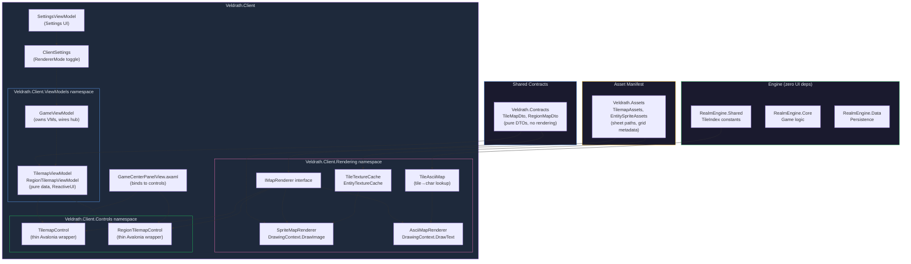

# Map Rendering Extraction + ASCII/Graphical Toggle — Architectural Plan

> **Status**: Draft — for review and approval  
> **Date**: 2026-06-29 (revised 2026-06-29)  
> **Context**: Extract zone/region tilemap rendering from the inline drawing logic in [`Veldrath.Client`](Veldrath.Client/) into a dedicated `Veldrath.Client.Rendering` namespace, define a renderer abstraction, and implement a user-toggleable ASCII rendering mode.

---

## 1. Current State Summary

### 1.1 What Renders What

| Class | Location | Renders | Rendering Surface | Dependencies |
|---|---|---|---|---|
| [`TilemapControl`](Veldrath.Client/Controls/TilemapControl.cs) | `Veldrath.Client.Controls` | Zone tile layers (z-sorted around entities), entity sprites, exit highlights, fog of war, minimap | `Control.Render(DrawingContext)` @ ~30fps via `DispatcherTimer` | `TileTextureCache`, `EntityTextureCache`, `TileMapDto`, `TilemapViewModel` |
| [`RegionTilemapControl`](Veldrath.Client/Controls/RegionTilemapControl.cs) | `Veldrath.Client.Controls` | Region tile layers, zone-entry highlights, region-exit highlights, player dots, zone labels, minimap | `Control.Render(DrawingContext)` @ ~30fps via `DispatcherTimer` | `TileTextureCache`, `RegionMapDto`, `RegionTilemapViewModel` |

### 1.2 What Is Already Rendering-Agnostic

These artifacts contain **zero rendering logic** and should stay in their current projects:

| Artifact | Location | Content |
|---|---|---|
| [`TilemapViewModel`](Veldrath.Client/ViewModels/TilemapViewModel.cs) | `Veldrath.Client.ViewModels` | `TileMapDto`, camera XY, `ObservableCollection<TileEntityState>`, `RevealedTiles`, `RequestMoveCommand`. Pure ReactiveUI — no `DrawingContext`, no `Bitmap`. |
| [`RegionTilemapViewModel`](Veldrath.Client/ViewModels/RegionTilemapViewModel.cs) | `Veldrath.Client.ViewModels` | `RegionMapDto`, camera XY, entities, `ConfirmContextActionCommand`. Same clean pattern. |
| [`TileEntityState` record](Veldrath.Client/ViewModels/TilemapViewModel.cs:16) | `Veldrath.Client.ViewModels` | `(Guid EntityId, string EntityType, string SpriteKey, int TileX, int TileY, string Direction)` — pure data. |
| [`TileMapDto` / `RegionMapDto` / etc.](Veldrath.Contracts/Tilemap/TilemapContracts.cs) | `Veldrath.Contracts.Tilemap` | All DTOs are plain positional records with no rendering types. **Zero changes needed.** |
| [`TileIndex` constants](RealmEngine.Shared/Models/TileIndex.cs) | `RealmEngine.Shared.Models` | Compile-time tile index constants for the `onebit_packed` spritesheet. **Already the canonical source for tile→character mapping.** |

### 1.3 How Controls Are Wired Today

```
GameViewModel (ctor)
  ├── new TilemapViewModel(onMove → hub)
  └── new RegionTilemapViewModel(onMove, onConfirm → hub)

GameCenterPanelView.axaml
  ├── <TilemapControl ViewModel="{Binding Tilemap}" IsVisible="{Binding IsZoneViewActive}" />
  └── <RegionTilemapControl ViewModel="{Binding RegionTilemap}" IsVisible="{Binding IsRegionViewActive}" />
```

The controls and view models are created manually in [`GameViewModel`](Veldrath.Client/ViewModels/GameViewModel.cs:999-1021). The AXAML binds directly to the concrete control types via the `controls:` namespace alias.

---

## 2. Proposed Architecture

### 2.1 Namespace Approach: `Veldrath.Client.Rendering` (Within Existing Project)

**Decision**: Instead of creating a separate `Veldrath.Rendering` class library, all rendering abstractions and implementations live inside a `Rendering/` subdirectory of [`Veldrath.Client`](Veldrath.Client/) under the namespace `Veldrath.Client.Rendering`.

**Rationale for namespace over separate project**:
- Both renderers (sprite and ASCII) are **Avalonia-bound** — they use `DrawingContext`, `Bitmap`, `FormattedText`, and Avalonia brushes/pens. They cannot exist without Avalonia.
- There is exactly **one consumer**: `Veldrath.Client`. No other project in the monorepo renders tilemaps.
- A separate project would introduce a `.csproj`, version props file, solution entries across multiple `.slnx` files, and an inter-project dependency — all ceremony with no practical benefit.
- The namespace approach keeps the same architectural boundaries (abstraction, separation of concerns, testability) while eliminating the overhead of a new project.
- If a non-Avalonia renderer is ever needed (e.g., a Godot or Blazor/WASM renderer), those would necessarily be in their own platform-specific projects — extracting to a shared project now would be premature.

### 2.2 Directory Layout Within `Veldrath.Client`

```
Veldrath.Client/
├── Rendering/                          (new namespace: Veldrath.Client.Rendering)
│   ├── IMapRenderer.cs                 ← NEW: interface for all rendering strategies
│   ├── RenderState.cs                  ← NEW: frame snapshot struct + sub-records
│   ├── TileAsciiMap.cs                 ← NEW: tile index → ASCII character lookup table
│   ├── SpriteMapRenderer.cs            ← NEW: extracted sprite-blitting logic
│   ├── AsciiMapRenderer.cs             ← NEW: DrawText-based ASCII renderer
│   ├── TileTextureCache.cs             ← MOVED from Veldrath.Client/Services/
│   └── EntityTextureCache.cs           ← MOVED from Veldrath.Client/Services/
├── Controls/
│   ├── TilemapControl.cs               ← REFACTORED in place: delegates to IMapRenderer
│   └── RegionTilemapControl.cs         ← REFACTORED in place: delegates to IMapRenderer
├── ViewModels/
│   ├── TilemapViewModel.cs             ← UNCHANGED (already data-only)
│   └── RegionTilemapViewModel.cs       ← UNCHANGED (already data-only)
├── Services/
│   ├── TileTextureCache.cs             ← REMOVED (moved to Rendering/)
│   ├── EntityTextureCache.cs           ← REMOVED (moved to Rendering/)
│   └── ... (all other services unchanged)
└── ...
```

### 2.3 What Moves vs. What Stays

| Artifact | Action | Rationale |
|---|---|---|
| [`TilemapControl.cs`](Veldrath.Client/Controls/TilemapControl.cs) | **Stay** in `Veldrath.Client/Controls/` — refactored in place | It's still an Avalonia `Control` owned by the client; only the rendering logic is extracted |
| [`RegionTilemapControl.cs`](Veldrath.Client/Controls/RegionTilemapControl.cs) | **Stay** in `Veldrath.Client/Controls/` — refactored in place | Same |
| [`TileTextureCache.cs`](Veldrath.Client/Services/TileTextureCache.cs) | **Move** to `Veldrath.Client/Rendering/` | Rendering support — only used by renderers; namespace becomes `Veldrath.Client.Rendering` |
| [`EntityTextureCache.cs`](Veldrath.Client/Services/EntityTextureCache.cs) | **Move** to `Veldrath.Client/Rendering/` | Same |
| [`TilemapViewModel.cs`](Veldrath.Client/ViewModels/TilemapViewModel.cs) | **Stay** in `Veldrath.Client.ViewModels` | Pure data/ReactiveUI — no rendering dependency |
| [`RegionTilemapViewModel.cs`](Veldrath.Client/ViewModels/RegionTilemapViewModel.cs) | **Stay** in `Veldrath.Client.ViewModels` | Same |
| [`TileEntityState` record](Veldrath.Client/ViewModels/TilemapViewModel.cs:16) | **Stay** in `Veldrath.Client.ViewModels` | It's part of the VM's public API — controls import it |
| [`GameViewModel`](Veldrath.Client/ViewModels/GameViewModel.cs) | **Stay** in `Veldrath.Client.ViewModels` | Owns VM creation, hub wiring — client orchestration |
| [`GameCenterPanelView.axaml`](Veldrath.Client/Views/Game/Components/GameCenterPanelView.axaml) | **Stay** in `Veldrath.Client.Views` | AXAML unchanged (controls namespace alias still points to `Veldrath.Client.Controls`) |
| [`ClientSettings`](Veldrath.Client/ClientSettings.cs) | **Stay** in `Veldrath.Client` | Adds `RendererMode` property — same as before |
| [`SettingsViewModel` / `SettingsView`](Veldrath.Client/ViewModels/SettingsViewModel.cs) | **Stay** in `Veldrath.Client` | Adds renderer toggle UI — same as before |
| [`SettingsData` / `SettingsPersistenceService`](Veldrath.Client/Services/SettingsPersistenceService.cs) | **Stay** in `Veldrath.Client` | Adds `RendererMode` to the persisted snapshot — same as before |

---

## 3. Renderer Abstraction Design

### 3.1 Interface: `IMapRenderer`

```csharp
// Veldrath.Client/Rendering/IMapRenderer.cs

namespace Veldrath.Client.Rendering;

/// <summary>
/// Rendering strategy for a tilemap. Implementations draw tile layers, entities,
/// overlays, and minimap using their own visual style (sprites, ASCII, etc.).
/// </summary>
public interface IMapRenderer
{
    /// <summary>Fixed display size of a single tile in device pixels.</summary>
    int DisplayTileSize { get; }

    /// <summary>
    /// Renders one complete frame of the tilemap into <paramref name="context"/>.
    /// Called at ~30 fps by the hosting <see cref="Avalonia.Controls.Control"/>.
    /// </summary>
    /// <param name="context">The Avalonia drawing context for the current frame.</param>
    /// <param name="state">Snapshot of all data the renderer needs for this frame.</param>
    void Render(DrawingContext context, RenderState state);
}
```

### 3.2 Data Transfer Object: `RenderState`

This is a **frame-snapshot struct/record** passed into `Render()`. It contains everything a renderer needs — no back-references to the ViewModel. The control populates it from the VM each frame.

```csharp
// Veldrath.Client/Rendering/RenderState.cs

namespace Veldrath.Client.Rendering;

/// <summary>Complete render-state snapshot for a single frame.</summary>
/// <param name="Bounds">Pixel size of the control's drawable area.</param>
/// <param name="CameraX">Tile column of the viewport top-left corner.</param>
/// <param name="CameraY">Tile row of the viewport top-left corner.</param>
/// <param name="ViewportWidthTiles">Number of tile columns visible in the viewport.</param>
/// <param name="ViewportHeightTiles">Number of tile rows visible in the viewport.</param>
/// <param name="MapWidth">Total map width in tiles.</param>
/// <param name="MapHeight">Total map height in tiles.</param>
/// <param name="Layers">All tile layers, each with a flat Data array and ZIndex.</param>
/// <param name="CollisionMask">Flat Width×Height array: true = blocked.</param>
/// <param name="FogMask">Flat Width×Height array: true = fogged. May be empty (all false).</param>
/// <param name="RevealedTiles">Set of "x:y" keys for fog-revealed tiles.</param>
/// <param name="ExitHighlights">Exit tile positions to highlight (zone maps).</param>
/// <param name="ZoneEntryHighlights">Zone-entry positions to highlight (region maps).</param>
/// <param name="RegionExitHighlights">Region-exit positions to highlight (region maps).</param>
/// <param name="Entities">Live entity positions to draw.</param>
/// <param name="SelfEntityId">Local player's entity ID for distinct rendering.</param>
/// <param name="Labels">Zone labels (region maps only).</param>
/// <param name="IsMiniMapOpen">Whether the minimap overlay is active.</param>
/// <param name="TilesetKey">Spritesheet key (e.g. "onebit_packed"). Used by sprite renderer.</param>
/// <param name="MapType">Discriminator: "zone" or "region".</param>
public readonly record struct RenderState(
    Size Bounds,
    int CameraX, int CameraY,
    int ViewportWidthTiles, int ViewportHeightTiles,
    int MapWidth, int MapHeight,
    IReadOnlyList<TileLayerDto> Layers,
    bool[] CollisionMask,
    bool[] FogMask,
    IReadOnlySet<string> RevealedTiles,
    IReadOnlyList<(int X, int Y)> ExitHighlights,
    IReadOnlyList<(int X, int Y)> ZoneEntryHighlights,
    IReadOnlyList<(int X, int Y)> RegionExitHighlights,
    IReadOnlyList<RenderEntity> Entities,
    Guid? SelfEntityId,
    IReadOnlyList<RenderLabel> Labels,
    bool IsMiniMapOpen,
    string TilesetKey,
    string MapType);

/// <summary>Lightweight entity snapshot for the renderer (avoids VM coupling).</summary>
public readonly record struct RenderEntity(
    Guid EntityId, string EntityType, string SpriteKey,
    int TileX, int TileY, string Direction);

/// <summary>Lightweight map label for the renderer.</summary>
public readonly record struct RenderLabel(
    int TileX, int TileY, string Text, bool IsHidden);
```

**Design rationale for `RenderState` as a struct/record**:
- The control builds it from the VM each frame (cheap — no allocations besides the collections)
- The renderer receives everything it needs as a single argument
- The renderer has **zero knowledge of ViewModels** — only DTOs and primitives
- If we later want to render a tilemap in a completely different context (e.g., a web canvas or a Godot node), we only need to reimplement `IMapRenderer` for that platform

### 3.3 Control Refactoring Pattern

Both [`TilemapControl`](Veldrath.Client/Controls/TilemapControl.cs) and [`RegionTilemapControl`](Veldrath.Client/Controls/RegionTilemapControl.cs) are refactored in place to:

1. Accept an `IMapRenderer` via constructor injection (or a setter)
2. Keep all Avalonia lifecycle code: `OnAttachedToVisualTree`, `OnDetachedFromVisualTree`, `OnSizeChanged`, `OnKeyDown`, `DispatcherTimer`
3. In `Render(DrawingContext)`, build a `RenderState` from the ViewModel and call `_renderer.Render(context, state)`

**Before (current)**:
```csharp
public override void Render(DrawingContext context)
{
    var map = vm.TileMapData;
    var sheet = _cache.GetSheet(map.TilesetKey);
    // ... 200 lines of inline drawing logic ...
}
```

**After (refactored)**:
```csharp
public override void Render(DrawingContext context)
{
    var vm = ViewModel;
    if (vm?.TileMapData is null) { /* placeholder text */ return; }

    var state = BuildRenderState(vm);
    _renderer.Render(context, state);
}

private RenderState BuildRenderState(TilemapViewModel vm)
{
    var map = vm.TileMapData;
    return new RenderState(
        Bounds: Bounds.Size,
        CameraX: vm.CameraX, CameraY: vm.CameraY,
        ViewportWidthTiles: vm.ViewportWidthTiles,
        ViewportHeightTiles: vm.ViewportHeightTiles,
        MapWidth: map.Width, MapHeight: map.Height,
        Layers: map.Layers,
        CollisionMask: map.CollisionMask,
        FogMask: map.FogMask,
        RevealedTiles: vm.RevealedTiles,
        ExitHighlights: map.ExitTiles.Select(e => (e.TileX, e.TileY)).ToList(),
        ZoneEntryHighlights: [],
        RegionExitHighlights: [],
        Entities: vm.Entities.Select(e => new RenderEntity(e.EntityId, e.EntityType,
            e.SpriteKey, e.TileX, e.TileY, e.Direction)).ToList(),
        SelfEntityId: vm.SelfEntityId,
        Labels: [],
        IsMiniMapOpen: vm.IsMiniMapOpen,
        TilesetKey: map.TilesetKey,
        MapType: "zone");
}
```

### 3.4 `SpriteMapRenderer` — Extracted Current Logic

`SpriteMapRenderer` implements `IMapRenderer` and contains the drawing logic currently inline in `TilemapControl.Render()` and `RegionTilemapControl.Render()`. It:

- Uses `TileTextureCache` and `EntityTextureCache` (now in the same `Veldrath.Client.Rendering` namespace)
- Draws tile layers with z-sorting (below/above entities)
- Draws entity sprites (or colored-box fallbacks)
- Draws exit/zone-entry/region-exit highlights
- Draws fog of war
- Draws minimap overlay
- Draws zone labels (region maps)

The two controls share one `SpriteMapRenderer` instance — the `MapType` field in `RenderState` controls minor behavioral differences (zone exits vs. region exits, labels, etc.).

**Static brushes/pens** that are currently `private static readonly` on each control move to `SpriteMapRenderer` as `private static readonly` fields.

### 3.5 `AsciiMapRenderer` — New Text-Based Renderer

`AsciiMapRenderer` implements `IMapRenderer` and renders the tilemap as a grid of monospace characters using `DrawingContext.DrawText()`.

**Key design decisions**:

- **Font**: Monospace (e.g., JetBrains Mono from [`RealmUI.Fonts`](RealmUI.Fonts/), 14–16 pt). The `DisplayTileSize` is computed as the font's character cell size.
- **Color mode**: 16-color ANSI-like palette mapped to tile types (green for grass, blue for water, grey for stone, yellow for paths, etc.)
- **Performance**: Build a single `FormattedText` (or a small set of them) per frame rather than one `DrawText()` call per character. C# `StringBuilder` per row, then one `FormattedText` per row, or even a single multi-line `FormattedText`.

**Tile → Character Mapping**:

The mapping lives in `Veldrath.Client/Rendering/TileAsciiMap.cs` and uses the [`TileIndex`](RealmEngine.Shared/Models/TileIndex.cs) constants from `RealmEngine.Shared`. The engine already defines every meaningful tile as a named constant — the ASCII renderer just maps those constants to characters.

```csharp
// Veldrath.Client/Rendering/TileAsciiMap.cs (illustrative)

public static class TileAsciiMap
{
    // Returns the ASCII character for a given tile index.
    // Returns ' ' for transparent (-1) and '?' for unknown.
    public static char GetChar(int tileIndex) => tileIndex switch
    {
        // Special
        TileIndex.Blank                     => '.',
        TileIndex.Pending                   => '?',

        // Ground textures
        TileIndex.Ground.DeadLeaves         => ',',
        TileIndex.Ground.LightGravel        => ':',
        TileIndex.Ground.Cobblestone        => ';',
        TileIndex.Ground.StoneTile          => '=',
        TileIndex.Ground.LightFoliage       => '"',
        TileIndex.Ground.MedFoliage         => '\'',
        TileIndex.Ground.GrassFill          => '"',

        // Terrain
        TileIndex.Terrain.Grass.M           => '.',
        TileIndex.Terrain.Stone.M           => '#',
        TileIndex.Terrain.Stone.Floor       => '.',
        TileIndex.Terrain.Sand.M            => '~',

        // Water
        TileIndex.Water.Deep                => '≈',

        // Flora
        TileIndex.Flora.TreeA .. TileIndex.Flora.TreeE => 'T',
        TileIndex.Flora.Pine                => '▲',
        TileIndex.Flora.Cactus              => 'Y',
        TileIndex.Flora.CactusDual          => 'Y',
        TileIndex.Flora.TallGrass           => 'i',
        TileIndex.Flora.Vines               => 'v',
        TileIndex.Flora.BigTree             => 'T',
        TileIndex.Flora.Boulder             => 'O',
        TileIndex.Flora.Mushroom            => '*',

        // Paths
        TileIndex.DirtPath.FourWay          => '+',
        TileIndex.DirtPath.StraightH        => '-',
        TileIndex.DirtPath.StraightV        => '|',
        // ... all path variants map to '+', '-', '|', or corner equivalents

        -1 => ' ',   // transparent
        _  => '?',   // unknown
    };
}
```

**Entity rendering in ASCII**:
- Own player: `@` (cyan)
- Other players: `@` (green)
- Enemies: `E` (red)
- NPCs: `N` (yellow)

**Fog of war**: Unrevealed fogged tiles render as ` ` (space with dark background brush).

**Minimap in ASCII**: A smaller character grid in the corner, using the same mapping but at 1px (1 character) per tile.

---

## 4. Toggle Mechanism Design

### 4.1 Renderer Mode Enum

Added to [`ClientSettings`](Veldrath.Client/ClientSettings.cs):

```csharp
/// <summary>Available map rendering modes.</summary>
public enum RendererMode
{
    /// <summary>Sprite-based 2D art rendering (default).</summary>
    Sprite = 0,

    /// <summary>Text-based ASCII / roguelike rendering.</summary>
    Ascii = 1,
}
```

### 4.2 `ClientSettings` Addition

```csharp
// Added to ClientSettings.cs:
private RendererMode _rendererMode;

/// <summary>Gets or sets the active map rendering mode.</summary>
public RendererMode RendererMode
{
    get => _rendererMode;
    set => this.RaiseAndSetIfChanged(ref _rendererMode, value);
}

// Constructor default:
_rendererMode = RendererMode.Sprite;
```

### 4.3 Persistence

`SettingsData` (the serialized snapshot in [`SettingsPersistenceService`](Veldrath.Client/Services/SettingsPersistenceService.cs:70)) gains a `RendererMode` field:

```csharp
public sealed record SettingsData(
    string ServerBaseUrl,
    int    MasterVolume,
    int    MusicVolume,
    int    SfxVolume,
    bool   Muted,
    bool   FullScreen,
    RendererMode RendererMode   // ← NEW
);
```

Restored in [`App.axaml.cs`](Veldrath.Client/App.axaml.cs:53-63) alongside the other settings.

### 4.4 DI Registration

In [`App.axaml.cs`](Veldrath.Client/App.axaml.cs:142) `ConfigureServices`:

```csharp
// Renderer registration — singleton so the caches survive control teardown
services.AddSingleton<SpriteMapRenderer>();
services.AddSingleton<AsciiMapRenderer>();

// Factory that picks the active renderer based on ClientSettings
services.AddSingleton<IMapRenderer>(sp =>
{
    var settings = sp.GetRequiredService<ClientSettings>();
    return settings.RendererMode switch
    {
        RendererMode.Ascii  => sp.GetRequiredService<AsciiMapRenderer>(),
        _                   => sp.GetRequiredService<SpriteMapRenderer>(),
    };
});
```

### 4.5 Control Wiring

Both `TilemapControl` and `RegionTilemapControl` gain an `IMapRenderer` property, set by DI or by `GameViewModel`:

**Option A — DI injection into controls**: Controls are created by the DI container and receive `IMapRenderer` via constructor. This requires registering the controls in DI, which conflicts with how AXAML instantiates them.

**Option B — Setter injection from GameViewModel**: `GameViewModel` receives `IMapRenderer` via DI and passes it to both controls after creation.

**Option C — Service Locator in control constructor**: Controls resolve `IMapRenderer` from `App.Services` in their constructor. Simple but couples to the service locator.

**Recommended: Option B** — `GameViewModel` already creates the controls manually (it creates the VMs). Extend to also inject the renderer:

```csharp
// GameViewModel.cs — after creating Tilemap:
Tilemap.Renderer = _renderer;  // IMapRenderer injected via ctor
RegionTilemap.Renderer = _renderer;
```

The controls expose a public setter:

```csharp
// TilemapControl.cs
public IMapRenderer? Renderer { get; set; }
```

And in `Render()`:
```csharp
public override void Render(DrawingContext context)
{
    if (Renderer is null) return;
    var state = BuildRenderState(ViewModel);
    Renderer.Render(context, state);
}
```

### 4.6 Runtime Toggle

When the user changes `RendererMode` in settings:
1. `SettingsViewModel` sets `_settings.RendererMode = newValue`
2. `ClientSettings.RendererMode` raises `PropertyChanged` via ReactiveUI
3. `GameViewModel` (or a dedicated listener) observes the change and swaps the `IMapRenderer` on both controls
4. The next `DispatcherTimer` tick renders with the new strategy

**Hot-swap approach**: Since `IMapRenderer` is a singleton, we could simply have a single composite renderer that delegates to the active strategy. But it's simpler to just swap the reference on the controls.

**Key insight**: The renderer swap does NOT require recreating controls or view models. It's just a reference swap + `InvalidateVisual()`. No zone reload, no hub reconnection.

### 4.7 Settings UI

In [`SettingsView.axaml`](Veldrath.Client/Views/Settings/SettingsView.axaml), add under the DISPLAY section:

```xml
<!-- Renderer Mode -->
<TextBlock Text="MAP RENDERER" Classes="muted" FontSize="11" LetterSpacing="2" Margin="0,8,0,4" />
<StackPanel Orientation="Horizontal" Spacing="12">
    <RadioButton Content="Sprites" IsChecked="{Binding IsSpriteRenderer}" />
    <RadioButton Content="ASCII"   IsChecked="{Binding IsAsciiRenderer}" />
</StackPanel>
```

`SettingsViewModel` gains:
```csharp
public bool IsSpriteRenderer
{
    get => _settings.RendererMode == RendererMode.Sprite;
    set { if (value) _settings.RendererMode = RendererMode.Sprite; }
}
public bool IsAsciiRenderer
{
    get => _settings.RendererMode == RendererMode.Ascii;
    set { if (value) _settings.RendererMode = RendererMode.Ascii; }
}
```

### 4.8 Keyboard Toggle (Optional Enhancement)

Add a keybind (e.g., `Ctrl+Shift+R`) that toggles the renderer mode without opening settings. Could be handled in `TilemapControl.OnKeyDown` or at the `MainWindowViewModel` level. This is a nice-to-have — the settings UI is the primary toggle mechanism.

---

## 5. ASCII Renderer Design — Detailed

### 5.1 Rendering Approach

`AsciiMapRenderer` renders into the same `DrawingContext` as the sprite renderer, but uses `DrawText()` instead of `DrawImage()`. This keeps it within Avalonia's rendering pipeline and avoids creating a separate windowing surface.

**Per-frame algorithm**:

1. Compute visible tile range from `(CameraX, CameraY, ViewportWidthTiles, ViewportHeightTiles)` — same as sprite renderer
2. For each visible row (`ty`):
   - Build a `StringBuilder` of characters for that row
   - For each visible column (`tx`):
     - Look up the tile index from each layer (lowest z-index first for base, higher layers overlay)
     - Map to ASCII char via `TileAsciiMap.GetChar(tileIndex)`
     - If fogged and not revealed → `' '`
     - If entity on this tile → entity char
   - Create a `FormattedText` for the row with a monospace `Typeface`
   - Draw the row with appropriate foreground color
3. Draw entity layer (entities on top of tiles)
4. Draw minimap if open (same approach, smaller scale)
5. Draw labels if region map

**Color scheme**:

| Tile Type | Foreground Color |
|---|---|
| Grass / Ground | `#4ade80` (green) |
| Stone / Wall | `#94a3b8` (slate) |
| Water | `#60a5fa` (blue) |
| Sand / Desert | `#fbbf24` (amber) |
| Path / Road | `#d4a574` (tan) |
| Tree / Flora | `#22c55e` (emerald) |
| Fog (unrevealed) | `#1e293b` (dark slate, barely visible) |
| Exit / Zone entry | `#facc15` (yellow highlight) |
| Player (self) | `#06b6d4` (cyan) |
| Player (other) | `#4ade80` (green) |
| Enemy | `#ef4444` (red) |

**Background**: Solid `#0f172a` (very dark blue) — consistent across all tiles.

### 5.2 Font Selection

The ASCII renderer requires a monospace font. [`RealmUI.Fonts`](RealmUI.Fonts/) already bundles JetBrains Mono. The renderer uses:

```csharp
private static readonly Typeface AsciiTypeface =
    new("JetBrains Mono, Consolas, Courier New", FontStyle.Normal, FontWeight.Normal);
```

Font size: 14 pt → character cell ~8.4 × 18 px (platform-dependent). The `DisplayTileSize` is derived from `FormattedText` measurement of a single character.

### 5.3 Performance Considerations

- **StringBuilder pooling**: Use a single `StringBuilder` per frame, cleared and reused per row.
- **FormattedText reuse**: Cache one `FormattedText` per row string? No — `FormattedText` is immutable. But we can measure: a 80×25 ASCII grid at 30 fps = 2,400 `FormattedText` objects per second. That's 80 rows × 30 fps = 2,400 allocations, each a small string. Acceptable for now; optimize later if needed.
- **Pre-compute**: Tile→char lookup is a static array lookup, not a dictionary.
- **Culling**: Only render tiles within the viewport — same as sprite renderer.
- **Minimap**: Rendered at 1 char per tile, capped at a maximum character dimension (e.g., 40×30 chars).

### 5.4 Layer Compositing in ASCII

Unlike sprites where layers are drawn on top of each other, ASCII compositing needs to pick a single character per tile. The algorithm:

```
For each tile (tx, ty):
    char = ' '   // default empty
    foreach layer in layers ordered by ZIndex ascending:
        index = layer.Data[ty * width + tx]
        if index != -1:
            char = TileAsciiMap.GetChar(index)
    // char now holds the topmost non-transparent tile
```

This is different from the sprite renderer which draws all layers. For ASCII, we composite in code before drawing.

---

## 6. Dependency Flow Diagram

Since everything lives within `Veldrath.Client`, there is no inter-project dependency graph to manage. The diagram below shows namespace-level relationships within the client project and external dependencies.



**Key invariants**:
- Engine projects never reference client rendering code — arrows point DOWN only
- `Veldrath.Contracts` and `Veldrath.Assets` are pure data — no UI dependency
- All rendering code lives within `Veldrath.Client` under the `Veldrath.Client.Rendering` namespace
- ViewModels know nothing about `IMapRenderer` or any rendering strategy
- Controls bridge ViewModels and Renderers via `RenderState` mapping

---

## 7. Migration Plan

### Phase 1: Create Rendering Namespace + Move Texture Caches (no behavioral change)

| Step | Action | Files |
|---|---|---|
| 1.1 | Create `Veldrath.Client/Rendering/` directory | New directory |
| 1.2 | Move [`TileTextureCache.cs`](Veldrath.Client/Services/TileTextureCache.cs) → `Veldrath.Client/Rendering/TileTextureCache.cs` | Move |
| 1.3 | Move [`EntityTextureCache.cs`](Veldrath.Client/Services/EntityTextureCache.cs) → `Veldrath.Client/Rendering/EntityTextureCache.cs` | Move |
| 1.4 | Update namespace from `Veldrath.Client.Services` to `Veldrath.Client.Rendering` | Edit: both moved files |
| 1.5 | Update all `using Veldrath.Client.Services` → `using Veldrath.Client.Rendering` for cache types in remaining client code | Edit: `TilemapControl.cs`, `RegionTilemapControl.cs` |
| 1.6 | Verify `dotnet build Veldrath.slnx` passes | — |

### Phase 2: Define Abstraction + Extract Sprite Renderer

| Step | Action | Files |
|---|---|---|
| 2.1 | Create `IMapRenderer.cs` + `RenderState.cs` in `Veldrath.Client/Rendering/` | New |
| 2.2 | Create `SpriteMapRenderer.cs` in `Veldrath.Client/Rendering/` | New |
| 2.3 | Move drawing logic from [`TilemapControl.Render()`](Veldrath.Client/Controls/TilemapControl.cs:161-262) into `SpriteMapRenderer.Render()` | Refactor |
| 2.4 | Move drawing logic from [`RegionTilemapControl.Render()`](Veldrath.Client/Controls/RegionTilemapControl.cs:164-252) into `SpriteMapRenderer.Render()` (unified by `MapType`) | Refactor |
| 2.5 | Move static brush/pen fields from both controls into `SpriteMapRenderer` | Refactor |
| 2.6 | Refactor both controls to delegate to `IMapRenderer` | Edit: both control files |
| 2.7 | Verify build + existing tests pass | — |

### Phase 3: Create ASCII Renderer

| Step | Action | Files |
|---|---|---|
| 3.1 | Create `TileAsciiMap.cs` in `Veldrath.Client/Rendering/` | New |
| 3.2 | Create `AsciiMapRenderer.cs` in `Veldrath.Client/Rendering/` | New |
| 3.3 | Implement `IMapRenderer.Render()` using `DrawText()` | New |
| 3.4 | Add `AsciiMapRendererTests.cs` in test project | New (optional — can be separate task) |
| 3.5 | Verify build passes | — |

### Phase 4: Add Toggle Mechanism

| Step | Action | Files |
|---|---|---|
| 4.1 | Add `RendererMode` enum to [`ClientSettings.cs`](Veldrath.Client/ClientSettings.cs) | Edit |
| 4.2 | Add `RendererMode` to `SettingsData` record | Edit: `SettingsPersistenceService.cs` |
| 4.3 | Restore `RendererMode` in [`App.axaml.cs`](Veldrath.Client/App.axaml.cs:53-63) | Edit |
| 4.4 | Register `SpriteMapRenderer`, `AsciiMapRenderer`, and `IMapRenderer` factory in DI | Edit: `App.axaml.cs` |
| 4.5 | Inject `IMapRenderer` into `GameViewModel`; pass to controls | Edit: `GameViewModel.cs` |
| 4.6 | Add renderer setter property on both controls | Edit: `TilemapControl.cs`, `RegionTilemapControl.cs` |
| 4.7 | Add renderer toggle to [`SettingsViewModel`](Veldrath.Client/ViewModels/SettingsViewModel.cs) + [`SettingsView.axaml`](Veldrath.Client/Views/Settings/SettingsView.axaml) | Edit |
| 4.8 | Verify build + existing tests pass | — |

### Phase 5: Testing

| Step | Action |
|---|---|
| 5.1 | Run full test suite: `dotnet test Realm.Full.slnx` |
| 5.2 | Fix any broken references/namespaces |
| 5.3 | Add `RenderState` mapping tests (VM → RenderState correctness) |
| 5.4 | Add `TileAsciiMap` character mapping tests |
| 5.5 | Add `AsciiMapRenderer` output verification tests |
| 5.6 | Add `SpriteMapRenderer` regression tests (verify rendering output matches pre-refactor) |

---

## 8. Risks and Considerations

### 8.1 Avalonia Thread Affinity

**Risk**: [`MapEdgeViewModel.ComputeStyle`](.github/agent-memory/engine-codebase.md:195) creates `SolidColorBrush` which requires the Avalonia dispatcher thread. The `IMapRenderer` implementations also create brushes/pens.

**Mitigation**: Both renderers create all brushes as `private static readonly` fields (class-level initialization), which happens on the type-initializer thread. The current code already does this — we just move the fields. No runtime brush creation per frame.

### 8.2 `TileEntityState` Coupling

**Risk**: Currently `TileEntityState` is defined inside [`TilemapViewModel.cs`](Veldrath.Client/ViewModels/TilemapViewModel.cs:16). If the renderer needs it, there's a circular-ish reference (renderer ← client's VM file).

**Mitigation**: The `RenderState` struct defines its own `RenderEntity` — the control maps `TileEntityState` → `RenderEntity` when building the render state. The renderer never sees `TileEntityState`. No coupling.

### 8.3 `TileTextureCache` and `EntityTextureCache` Lifetime

**Risk**: Currently these are `private readonly` fields on the controls, created in the constructor and disposed in `OnDetachedFromLogicalTree`. If we make the renderers singletons, the caches live for the app lifetime.

**Mitigation**: The caches use `Dictionary<string, Bitmap>` and load on first access. The memory cost is proportional to the number of unique spritesheets loaded (currently: 2 tilesets + ~20 entity sheets = trivial). Making them singletons is safe and actually improves performance (no reload on zone transitions).

### 8.4 `DispatcherTimer` Ownership

**Risk**: The ~30fps timer lives on the controls. The renderer strategy receives `Render()` calls but doesn't own the timer. This is correct — the timer drives Avalonia's `InvalidateVisual()` cycle.

**Mitigation**: No change needed. The timer stays on the controls. The renderer is stateless between frames (or caches only idempotent loaded resources).

### 8.5 Input Handling

**Risk**: `OnKeyDown` in both controls handles WASD movement, M (minimap), and E (confirm on region map). This logic should NOT move to the renderer.

**Mitigation**: Input handling stays on the controls. The renderer is purely visual. The controls remain responsible for: keyboard input → ViewModel command invocation, focus management, and viewport size reporting.

### 8.6 Test Coverage for Rendering

**Risk**: Rendering code is currently `[ExcludeFromCodeCoverage]`. The extracted `SpriteMapRenderer` will also be excluded. However, `RenderState` building and `TileAsciiMap` mapping are testable pure functions.

**Mitigation**: 
- `RenderState` mapping (ViewModel → struct) is testable without Avalonia
- `TileAsciiMap.GetChar()` is a pure function — fully testable
- ASCII renderer output (the string grid) can be tested by extracting the grid-building logic into a testable method that returns `string[,]` before drawing
- Sprite renderer drawing logic remains excluded (it's `DrawingContext` calls — inherently visual)

### 8.7 Performance of ASCII Renderer

**Risk**: Building a `string` per row and creating `FormattedText` objects at 30fps could cause GC pressure.

**Mitigation**: 
- A 50×30 tile viewport at 30 fps = 1,500 string allocations per second. Modern .NET handles this easily.
- If profiling shows an issue, we can pool `StringBuilder` instances and reuse `FormattedText` objects when the string content hasn't changed (common when the player isn't moving).
- The renderer can also detect "no change since last frame" and skip rebuilding when camera + entities are stationary.

### 8.8 Potential Future Renderers

The `IMapRenderer` abstraction is designed to accommodate future backends:

- **WebCanvas renderer**: A Blazor/WASM implementation that draws to an HTML5 Canvas (would live in a Blazor-specific project, implementing the same `IMapRenderer` interface with appropriate platform bindings)
- **Godot renderer**: A Godot node that uses Godot's `CanvasItem.DrawRect/DrawTexture` (would live in a Godot-specific project)
- **Terminal renderer**: Pure console output using ANSI escape codes (for a headless server console)

If such renderers are ever built, the `IMapRenderer` interface and `RenderState` struct could be promoted to a shared contracts project at that time. For now, keeping them in `Veldrath.Client.Rendering` avoids premature abstraction.

---

## 9. Open Questions for Review

1. **Should `TileEntityState` move to `Veldrath.Client.Rendering`?** Currently in the VM file. It's used by both the ViewModels and the renderer. Moving it to the Rendering namespace would decouple it but the VM would need to import from `Veldrath.Client.Rendering` — which is fine (same project, no new dependencies).

   **Recommendation**: Keep `TileEntityState` in `Veldrath.Client.ViewModels`. The control maps it to `RenderEntity` when building `RenderState`. No coupling issue.

2. **Should both controls share a single `IMapRenderer` or have separate ones?** Currently `TilemapControl` renders zones and `RegionTilemapControl` renders regions. The `SpriteMapRenderer` can handle both via the `MapType` discriminator. The same renderer instance is shared.

   **Recommendation**: Single `IMapRenderer` per mode. The `MapType` field in `RenderState` handles the minor behavioral differences.

3. **Should the ASCII renderer use a completely different control (e.g., a `TextBox`-based control) instead of `DrawingContext`?** Using `DrawingContext.DrawText()` keeps the control lifecycle identical to the sprite renderer. A `TextBox`-based approach would require different update mechanics (setting `.Text` property instead of `InvalidateVisual()`).

   **Recommendation**: Use `DrawingContext.DrawText()` for consistency. The ASCII renderer is an `IMapRenderer` implementation, not a separate control. If we later want a `SelectableTextBlock`-based ASCII view (e.g., for copy-paste support), that would be a separate control that also uses `AsciiMapRenderer` internally.

4. **Keybind for runtime toggle?** The settings UI provides the toggle. Should there also be a hotkey (e.g., `Ctrl+Shift+R`)?

   **Recommendation**: Add as a follow-up enhancement. The settings toggle is sufficient for the initial implementation.

---

## 10. Summary

| Aspect | Decision |
|---|---|
| Approach | **Namespace** (`Veldrath.Client.Rendering`) within existing `Veldrath.Client` project — no new `.csproj` |
| Why not a separate project | Both renderers are Avalonia-bound; exactly one consumer (`Veldrath.Client`); namespace approach eliminates unnecessary project/solution/version-props ceremony |
| Abstraction | `IMapRenderer` interface with single `Render(DrawingContext, RenderState)` method |
| Sprite renderer | `SpriteMapRenderer` — extracted from current `TilemapControl.Render()` + `RegionTilemapControl.Render()` |
| ASCII renderer | `AsciiMapRenderer` — new, uses `TileIndex` constants for tile→char mapping via `TileAsciiMap` |
| What moves | `TileTextureCache`, `EntityTextureCache` → from `Veldrath.Client/Services/` to `Veldrath.Client/Rendering/` |
| What's refactored in place | `TilemapControl`, `RegionTilemapControl` → stay in `Veldrath.Client/Controls/`, delegate to `IMapRenderer` |
| What stays | `TilemapViewModel`, `RegionTilemapViewModel`, `TileEntityState`, `GameViewModel`, AXAML views → unchanged locations |
| What's unchanged | `Veldrath.Contracts` (DTOs), `Veldrath.Assets` (manifests), `RealmEngine.Shared` (TileIndex) |
| Toggle mechanism | `RendererMode` enum on `ClientSettings`, persisted via `SettingsPersistenceService`, UI radio buttons in Settings, runtime swap via property change |
| Engine agnosticism | Preserved — engine projects never reference client rendering code (already satisfied by existing architecture) |
| Test strategy | Pure functions testable (RenderState mapping, TileAsciiMap); rendering output excluded from coverage (per existing convention) |
