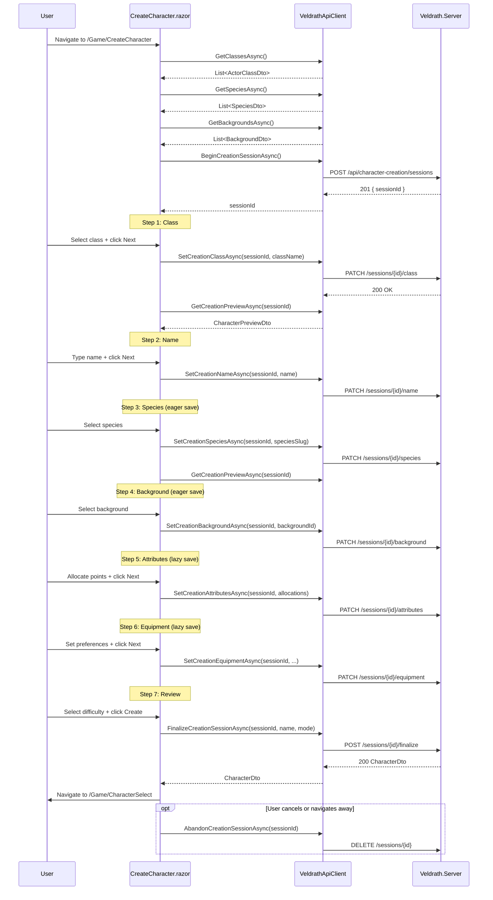

# Web Character Creation Sync-Up Plan

> **Date:** 2026-07-07
> **Status:** Draft — For Review
> **Scope:** Bring [`Veldrath.GameClient.Components/Components/Pages/CreateCharacter.razor`](Veldrath.GameClient.Components/Components/Pages/CreateCharacter.razor) (Blazor RCL) character creation flow to full parity with the desktop Avalonia wizard.

---

## Table of Contents

1. [Executive Summary](#1-executive-summary)
2. [Current State vs. Target State](#2-current-state-vs-target-state)
3. [Bug Fixes (Phase 0 — Immediate)](#3-bug-fixes-phase-0--immediate)
4. [Implementation Phases](#4-implementation-phases)
   - [Phase 1: Foundation — API Client Expansion & Session Management](#phase-1-foundation--api-client-expansion--session-management)
   - [Phase 2: Species & Background Selection](#phase-2-species--background-selection)
   - [Phase 3: Attributes (Point-Buy)](#phase-3-attributes-point-buy)
   - [Phase 4: Equipment & Difficulty](#phase-4-equipment--difficulty)
   - [Phase 5: Preview & Review](#phase-5-preview--review)
   - [Phase 6: Polish — Loading, Error, Responsive, Accessibility](#phase-6-polish--loading-error-responsive-accessibility)
5. [Component Tree](#5-component-tree)
6. [Data Flow & Session Lifecycle](#6-data-flow--session-lifecycle)
7. [Risk Assessment](#7-risk-assessment)
8. [Testing Strategy](#8-testing-strategy)
9. [Open Questions](#9-open-questions)

---

## 1. Executive Summary

The desktop (Avalonia) client delivers a rich **7-step session-based wizard** backed by the `/api/character-creation/sessions/*` REST API. The web (Blazor RCL) client currently offers a **minimal 3-step flow** — class, name, confirm — that calls the legacy `POST /api/characters` endpoint and completely bypasses the session API. This means web-created characters lack species, background, custom attributes, equipment preferences, and difficulty mode selection. They also have no live character preview during creation.

The server-side session API is fully implemented and production-ready. The desktop [`ICharacterCreationService`](Veldrath.Client/Services/CharacterCreationService.cs) / [`HttpCharacterCreationService`](Veldrath.Client/Services/CharacterCreationService.cs) already wraps all 12 session endpoints with a clean interface. The web client simply needs its own API client methods added to [`IGameApiClient`](Veldrath.GameClient.Core/Abstractions/IGameApiClient.cs) / [`VeldrathApiClient`](Veldrath.Web/Services/VeldrathApiClient.cs), a new orchestration component, and individual step components — all within the existing [`Veldrath.GameClient.Components`](Veldrath.GameClient.Components/) RCL.

**There is also at least one critical endpoint-mismatch bug:** the web client calls `GET /api/characters/check-name`, which does not exist on the server. The correct endpoint is `GET /api/character-creation/sessions/check-name`. This bug silently breaks name validation for all web users and must be fixed first.

The plan breaks the work into 7 phases (0–6), each independently buildable and testable, targeting a complete 7-step wizard with live preview that matches the desktop experience.

---

## 2. Current State vs. Target State

### Desktop Wizard (7 Steps — The Target)

| # | Step | Desktop Implementation | Key Features |
|---|------|----------------------|--------------|
| 1 | **Name** | [`CreateCharacterViewModel`](Veldrath.Client/ViewModels/CreateCharacterViewModel.cs) step 0 | Debounced server availability check via `CheckNameAvailabilityAsync()`, letters-only validation (`^[a-zA-Z]+$`, 2–20 chars) |
| 2 | **Class** | Step 1 — dynamic list from `GET /api/content/classes` | Class icon display via `IAssetStore`, card-based selection |
| 3 | **Species** | Step 2 — dynamic list from `GET /api/content/species` | Lore description panel, eagerly saves to server on change via `SetSpeciesAsync()` |
| 4 | **Background** | Step 3 — dynamic list from `GET /api/content/backgrounds` | Lore description panel, eagerly saves to server on change via `SetBackgroundAsync()` |
| 5 | **Attributes (Point-Buy)** | Step 4 — 6 stats (STR/DEX/CON/INT/WIS/CHA) | Range 8–15, 27-point budget, +/- buttons, cost table `{8:0, 9:1, 10:2, 11:3, 12:4, 13:5, 14:7, 15:9}`, remaining points display |
| 6 | **Equipment Preferences (Optional)** | Step 5 | Armor type dropdown (Light/Medium/Heavy/Unarmored), weapon type dropdown (Sword/Axe/Dagger/Staff/Bow/Mace), shield checkbox |
| 7 | **Review & Finalize** | Step 6 | Summary of all choices, Hardcore mode toggle, permadeath warning, final confirmation |

**Plus:** A **Character Preview** panel (right sidebar) showing live projected stats (HP, Mana, all 6 attributes) that updates reactively from step 2 onward via `GetPreviewAsync()`.

### Web Wizard (3 Steps — Current State)

| # | Step | Web Implementation | Gaps |
|---|------|-------------------|------|
| 1 | **Class** | Card-based selection from `GET /api/content/classes` | No class icon (no asset store in web context). Functional but basic. |
| 2 | **Name** | Text input with availability check via `GET /api/characters/check-name` | 🔴 **BUG**: This endpoint does not exist. Correct endpoint is `GET /api/character-creation/sessions/check-name`. Also: validation allows 2–30 chars with `^[a-zA-Z0-9 \-'_]+$` but server enforces 2–20 chars letters-only `^[a-zA-Z]+$`. |
| 3 | **Confirm** | Shows class + name + hardcoded "Normal" difficulty, calls `POST /api/characters` | No species, background, attributes, equipment, or difficulty. Uses legacy endpoint that bypasses the session-based creation pipeline. |

### Missing Features Summary

| # | Missing Feature | Impact | Server API Available? |
|---|----------------|--------|----------------------|
| 1 | **Species/Race selection** | Characters created with null SpeciesSlug; no species stat bonuses | ✅ `GET /api/content/species` + `PATCH /api/character-creation/sessions/{id}/species` |
| 2 | **Background selection** | Characters created with null BackgroundId; no background bonuses | ✅ `GET /api/content/backgrounds` + `PATCH /api/character-creation/sessions/{id}/background` |
| 3 | **Attributes/Point-Buy** | Characters get class defaults only; no player agency over stats | ✅ `PATCH /api/character-creation/sessions/{id}/attributes` |
| 4 | **Equipment Preferences** | Always uses class defaults for starting gear | ✅ `PATCH /api/character-creation/sessions/{id}/equipment` |
| 5 | **Difficulty Mode choice** | Hardcoded to "Normal"; Hardcore mode unavailable | ✅ `POST /api/character-creation/sessions/{id}/finalize` (accepts `DifficultyMode`) |
| 6 | **Character Preview** | No live stat preview during creation | ✅ `GET /api/character-creation/sessions/{id}/preview` |
| 7 | **Full Review step** | Only shows class + name, not species/background/stats/equipment | ✅ All session state available via `GET /api/character-creation/sessions/{id}` |

---

## 3. Bug Fixes (Phase 0 — Immediate)

These are **blocking bugs** that must be resolved before any new feature work begins. They can be done in a single small PR.

### Bug 0.1 — 🔴 Critical: Name Check Endpoint Mismatch

**Current code** in [`VeldrathApiClient.CheckCharacterNameAsync()`](Veldrath.Web/Services/VeldrathApiClient.cs:46-52):
```csharp
var resp = await Http.GetAsync($"/api/characters/check-name?name={Uri.EscapeDataString(name)}", ct);
```

**Correct endpoint:** `GET /api/character-creation/sessions/check-name?name={name}` (defined at [`CharacterCreationSessionEndpoints.cs:64`](Veldrath.Server/Features/Characters/CharacterCreationSessionEndpoints.cs:64))

**Fix:**
1. Change the URL in [`VeldrathApiClient.CheckCharacterNameAsync()`](Veldrath.Web/Services/VeldrathApiClient.cs:48) from `/api/characters/check-name` to `/api/character-creation/sessions/check-name`
2. This single-line fix unblocks name validation for all web users

### Bug 0.2 — 🟡 Medium: Name Validation Regex Mismatch

**Server-side validation** (in [`CharacterCreationSessionEndpoints.cs:41-42`](Veldrath.Server/Features/Characters/CharacterCreationSessionEndpoints.cs:41-42)):
- NameMinLength = 2, NameMaxLength = 20
- Pattern: `^[a-zA-Z]+$` (letters only)

**Web client validation** (in [`CreateCharacter.razor:170-179`](Veldrath.GameClient.Components/Components/Pages/CreateCharacter.razor:170-179)):
- Min 2 chars, max 30 chars
- No regex enforcement — accepts any characters

**Fix:**
1. Update [`CreateCharacter.razor`](Veldrath.GameClient.Components/Components/Pages/CreateCharacter.razor) name validation to match server: max 20 chars (not 30), letters-only regex `^[a-zA-Z]+$`
2. Add client-side regex validation with clear error message: "Name may only contain letters (a–z, A–Z)."
3. Ensure the `maxlength` attribute on the input is 20 (currently 30 at line 74)

**Files to modify:**
- [`Veldrath.Web/Services/VeldrathApiClient.cs`](Veldrath.Web/Services/VeldrathApiClient.cs) — line 48 URL change
- [`Veldrath.GameClient.Components/Components/Pages/CreateCharacter.razor`](Veldrath.GameClient.Components/Components/Pages/CreateCharacter.razor) — validation logic + maxlength

### Bug 0.3 — 🟡 Medium: Legacy Character Creation Endpoint Bypasses Session Pipeline

The web client calls `POST /api/characters` (legacy endpoint) instead of the session-based `POST /api/character-creation/sessions/{id}/finalize`. This means:
- No species, background, or attributes are attached to the character
- No equipment preferences are respected
- Difficulty mode is always Normal

**This is addressed in Phase 1** when the wizard is refactored to use the session API. The legacy `CreateCharacterAsync` method in [`IGameApiClient`](Veldrath.GameClient.Core/Abstractions/IGameApiClient.cs) and [`VeldrathApiClient`](Veldrath.Web/Services/VeldrathApiClient.cs) will be deprecated (kept for backward compatibility) and replaced with session-based methods.

---

## 4. Implementation Phases

### Phase 1: Foundation — API Client Expansion & Session Management

**Goal:** Add all session-based API methods to the web client's service layer and refactor the wizard orchestrator to manage a creation session. No new UI steps yet — the existing 3-step flow is preserved but switched to use the session API under the hood.

#### Files to Create

| File | Purpose |
|------|---------|
| *(none — this phase is pure modification)* | |

#### Files to Modify

| File | Change |
|------|--------|
| [`Veldrath.GameClient.Core/Abstractions/IGameApiClient.cs`](Veldrath.GameClient.Core/Abstractions/IGameApiClient.cs) | Add 10 new methods for session management, species/background fetch, PATCH operations, preview, finalize |
| [`Veldrath.Web/Services/VeldrathApiClient.cs`](Veldrath.Web/Services/VeldrathApiClient.cs) | Implement the 10 new `IGameApiClient` methods |
| [`Veldrath.GameClient.Components/Components/Pages/CreateCharacter.razor`](Veldrath.GameClient.Components/Components/Pages/CreateCharacter.razor) | Refactor to create a session on init, use `BeginSessionAsync()` / `SetNameAsync()` / `SetClassAsync()` / `FinalizeAsync()` instead of legacy `CreateCharacterAsync()` |

#### New IGameApiClient Methods

```csharp
// Session management
Task<Guid?> BeginCreationSessionAsync(CancellationToken ct = default);
Task AbandonCreationSessionAsync(Guid sessionId, CancellationToken ct = default);

// Step PATCH operations
Task<bool> SetCreationNameAsync(Guid sessionId, string name, CancellationToken ct = default);
Task<bool> SetCreationClassAsync(Guid sessionId, string className, CancellationToken ct = default);
Task<bool> SetCreationSpeciesAsync(Guid sessionId, string speciesSlug, CancellationToken ct = default);
Task<bool> SetCreationBackgroundAsync(Guid sessionId, string backgroundId, CancellationToken ct = default);
Task<bool> SetCreationAttributesAsync(Guid sessionId, Dictionary<string, int> allocations, CancellationToken ct = default);
Task<bool> SetCreationEquipmentAsync(Guid sessionId, string? preferredArmorType, string? preferredWeaponType, bool includeShield, CancellationToken ct = default);

// Finalize & preview
Task<CharacterPreviewDto?> GetCreationPreviewAsync(Guid sessionId, CancellationToken ct = default);
Task<CharacterDto?> FinalizeCreationSessionAsync(Guid sessionId, string? characterName, string difficultyMode, CancellationToken ct = default);

// Content (already existing: GetClassesAsync)
Task<List<SpeciesDto>> GetSpeciesAsync(CancellationToken ct = default);
Task<List<BackgroundDto>> GetBackgroundsAsync(CancellationToken ct = default);

// Name check (fix endpoint)
Task<CheckNameAvailabilityResponse?> CheckCharacterNameAsync(string name, CancellationToken ct = default);
```

#### New Using / Import in VeldrathApiClient

Add to [`Veldrath.Web/Services/VeldrathApiClient.cs`](Veldrath.Web/Services/VeldrathApiClient.cs):
```csharp
using Veldrath.Contracts.Content; // already imported for ActorClassDto — ensure SpeciesDto, BackgroundDto are resolved
```

#### CreateCharacter.razor Refactoring (Session Lifecycle)

The existing `@code` block gets these additions:
- `private Guid? _sessionId;` — session ID for the current wizard
- `OnInitializedAsync()` — calls `BeginSessionAsync()` after loading classes to create the session
- `GoToStep2()` — calls `SetCreationClassAsync(_sessionId, _selectedClass.DisplayName)` before advancing
- `GoToStep3()` — calls `SetCreationNameAsync(_sessionId, _characterName)` before advancing
- `ConfirmCreate()` — calls `FinalizeCreationSessionAsync(_sessionId, _characterName, "normal")` instead of `CreateCharacterAsync()`
- `Dispose()` or navigation-away handler — calls `AbandonCreationSessionAsync(_sessionId)` (best-effort)
- `ResetWizard()` — abandons old session, begins new one

**Key design decision:** Session is created on page load (after auth check and class list fetch). Session is abandoned on explicit cancel, navigation away, or error. The `IDisposable` pattern ensures cleanup even on circuit teardown.

#### UI/UX Design Notes

- No visible change to the user in this phase — the 3-step flow looks identical
- Behind the scenes, the wizard now talks to the session API
- The "Next" buttons become async (add loading spinners to buttons)
- Error handling for each PATCH call: if `SetCreationClassAsync` fails, show error and don't advance

#### Key Technical Decisions

1. **Why add methods to `IGameApiClient` instead of a separate `ICharacterCreationService`?** The web client already uses `IGameApiClient` as its single REST facade. The desktop has a separate `ICharacterCreationService` because it also has `TokenStore` and other desktop-specific concerns. For web, keeping all REST calls in one interface simplifies DI and component injection. The methods follow the same pattern (return nullable/bool, accept `CancellationToken`).

2. **Why keep `CreateCharacterAsync` in the interface?** For backward compatibility — the [`CharacterSelect.razor`](Veldrath.GameClient.Components/Components/Pages/CharacterSelect.razor) may still reference it indirectly. Mark it `[Obsolete]` with a message pointing to the session-based flow. Remove in a follow-up cleanup phase.

3. **Session creation timing:** Session is created eagerly on page load (not lazily on first step) to fail fast if the server is unavailable, and to have the session ID available for all subsequent operations.

---

### Phase 2: Species & Background Selection

**Goal:** Add species and background selection steps with lore description panels. These steps also eagerly save to the server on selection change (matching desktop behavior).

#### Files to Create

| File | Purpose |
|------|---------|
| `Veldrath.GameClient.Components/Components/Pages/CreateCharacter/StepSpecies.razor` | Species selection step with card grid + description panel |
| `Veldrath.GameClient.Components/Components/Pages/CreateCharacter/StepBackground.razor` | Background selection step with card grid + description panel |

#### Files to Modify

| File | Change |
|------|--------|
| [`Veldrath.GameClient.Components/Components/Pages/CreateCharacter.razor`](Veldrath.GameClient.Components/Components/Pages/CreateCharacter.razor) | Add new steps (reorder to: 1.Class, 2.Name, 3.Species, 4.Background, 5.Confirm → later 7 steps). Add `_speciesList`, `_backgroundList`, `_selectedSpecies`, `_selectedBackground` state. Fetch species/backgrounds in `OnInitializedAsync`. Wire up eager-save on selection change. |

#### New Wizard Step Order (after Phase 2)

```
1. Class        (existing, card grid)
2. Name         (existing, text input + availability check)
3. Species      (NEW — card grid, description panel, eager save)
4. Background   (NEW — card grid, description panel, eager save)
5. Confirm      (existing, updated to include species + background)
```

#### StepSpecies.razor Design

```
┌─────────────────────────────────────────────────────┐
│  Choose a Species                                   │
├─────────────────────────┬───────────────────────────┤
│  Species Cards (2-col)  │  Description Panel        │
│                         │                           │
│  [Human]  [Elf]         │  "Elves are graceful,     │
│  [Dwarf]  [Halfling]    │   long-lived beings..."   │
│  [Orc]    [Gnome]       │                           │
│                         │  Traits: +2 DEX, +1 INT   │
│                         │  (if available in DTO)    │
└─────────────────────────┴───────────────────────────┘
│  [Back]                              [Next →]       │
└─────────────────────────────────────────────────────┘
```

- Card selection: click to select, visual highlight (same `.cc-class-card-selected` pattern)
- Description panel: shown on the right when a species is selected, using the `Description` field from [`SpeciesDto`](Veldrath.Contracts/Content/ContentContracts.cs:128-133)
- **Eager save:** On species selection change, immediately call `SetCreationSpeciesAsync(_sessionId, species.Slug)`. Show a brief "Saved" indicator or error toast.
- Next button disabled until a species is selected

#### StepBackground.razor Design

Same pattern as StepSpecies but for backgrounds:
- Card grid of backgrounds from [`BackgroundDto`](Veldrath.Contracts/Content/ContentContracts.cs:139-145)
- Description panel using `BackgroundDto.Description`
- **Eager save:** On selection change, call `SetCreationBackgroundAsync(_sessionId, background.Slug)`

#### UI/UX Design Notes

- Reuse the existing `.cc-class-card` and `.cc-class-card-selected` CSS classes for species/background cards
- Add `.cc-description-panel` CSS class for the right-side lore panel
- The description panel should have a distinct background (e.g., `var(--vds-bg-3, #262736)`) to visually separate it from the card grid
- Cards should show any available metadata (e.g., species traits, background skill bonuses) if the DTO includes them

#### Key Technical Decisions

1. **Why eager save on species/background?** Matches desktop behavior. These choices are simple selections (no complex validation) so saving immediately reduces the amount of work at finalize time. If the user navigates back and changes their mind, the new selection overwrites the old one.
2. **Why separate StepSpecies.razor and StepBackground.razor instead of one generic component?** Species and backgrounds are different content types with potentially different metadata. Separate components allow for type-specific rendering (species might show stat bonuses, backgrounds might show skill proficiencies). A shared base component or partial class could be extracted later if duplication proves significant.
3. **Content fetch strategy:** Species and backgrounds are fetched once at page load (in `OnInitializedAsync`) and cached for the wizard's lifetime. This matches the existing pattern for classes.

---

### Phase 3: Attributes (Point-Buy)

**Goal:** Implement the 6-stat point-buy system with +/- controls, cost table, remaining points display, and validation.

#### Files to Create

| File | Purpose |
|------|---------|
| `Veldrath.GameClient.Components/Components/Pages/CreateCharacter/StepAttributes.razor` | Point-buy attribute allocation UI |

#### Files to Modify

| File | Change |
|------|--------|
| [`Veldrath.GameClient.Components/Components/Pages/CreateCharacter.razor`](Veldrath.GameClient.Components/Components/Pages/CreateCharacter.razor) | Add attributes state (`_strength`, `_dexterity`, ..., `_remainingPoints`), point-buy logic, and wire StepAttributes into the wizard flow |

#### Point-Buy Rules (from desktop [`CreateCharacterViewModel.cs:38-41`](Veldrath.Client/ViewModels/CreateCharacterViewModel.cs:38-41))

| Stat Value | 8 | 9 | 10 | 11 | 12 | 13 | 14 | 15 |
|------------|---|---|----|----|----|----|----|-----|
| Cost       | 0 | 1 | 2  | 3  | 4  | 5  | 7  | 9  |

- Total budget: **27 points**
- All stats start at **8** (minimum)
- Max stat value: **15**
- Stats: Strength, Dexterity, Constitution, Intelligence, Wisdom, Charisma

#### StepAttributes.razor Design

```
┌──────────────────────────────────────────────────────────┐
│  Allocate Attribute Points                                │
│  Remaining Points: [======27/27======]                    │
├──────────────────────────────────────────────────────────┤
│                                                          │
│  Strength      [−]  8  [+]    Cost: 0                    │
│  Dexterity     [−]  8  [+]    Cost: 0                    │
│  Constitution  [−]  8  [+]    Cost: 0                    │
│  Intelligence  [−]  8  [+]    Cost: 0                    │
│  Wisdom        [−]  8  [+]    Cost: 0                    │
│  Charisma      [−]  8  [+]    Cost: 0                    │
│                                                          │
│  ┌──────────────────────────────────────────────────┐    │
│  │  Cost Reference                                  │    │
│  │  8 → 0 pts   9 → 1 pt   10 → 2 pts  11 → 3 pts  │    │
│  │  12 → 4 pts  13 → 5 pts  14 → 7 pts  15 → 9 pts │    │
│  └──────────────────────────────────────────────────┘    │
│                                                          │
│  [Back]                              [Next →]            │
└──────────────────────────────────────────────────────────┘
```

- **Remaining points bar:** Visual progress bar showing `_remainingPoints / 27`. Turns red below 5 points, yellow below 10.
- **+/- buttons:** `[−]` decreases stat by 1 (refunds points), `[+]` increases stat by 1 (spends points). Disabled when stat would go below 8 or above 15, or when insufficient points remain.
- **Cost display:** Shows the current cost for the stat value (not cumulative).
- **Cost reference table:** Static reference showing the cost table for player reference.
- **Next button:** Enabled only when exactly 0 points remain (all 27 spent). Shows a tooltip "Spend all 27 points to continue" when disabled.

#### Point-Buy Logic (C# in CreateCharacter.razor @code)

```csharp
private static readonly int[] StatCosts = [0, 1, 2, 3, 4, 5, 7, 9];
private const int PointBuyTotal = 27;
private const int StatMin = 8;
private const int StatMax = 15;

private int _strength = 8;
private int _dexterity = 8;
private int _constitution = 8;
private int _intelligence = 8;
private int _wisdom = 8;
private int _charisma = 8;

private int RemainingPoints => PointBuyTotal - TotalSpent;
private int TotalSpent => StatCosts[_strength - 8] + StatCosts[_dexterity - 8] +
    StatCosts[_constitution - 8] + StatCosts[_intelligence - 8] +
    StatCosts[_wisdom - 8] + StatCosts[_charisma - 8];

private bool CanIncrement(int value) => value < StatMax && RemainingPoints >= StatCosts[value - 8 + 1];
private bool CanDecrement(int value) => value > StatMin;
```

#### Save Behavior

Attributes are saved lazily (not eagerly like species/background) — only when the user clicks Next. This is because point-buy is an interactive calculator where the user tweaks values repeatedly. Saving on every click would generate excessive PATCH traffic.

On Next: call `SetCreationAttributesAsync(_sessionId, new Dictionary<string, int> { ["Strength"] = _strength, ... })`.

#### UI/UX Design Notes

- Use a CSS Grid layout for the 6 stat rows: `grid-template-columns: 1fr 40px 40px 40px 60px`
- +/- buttons should be square, with clear hover/active states
- The remaining points bar uses the `.cc-progress-bar` pattern (reuse existing styles if any)
- On mobile (< 768px), the cost reference table collapses to a simple text line
- Add keyboard support: arrow keys to adjust focused stat

#### Key Technical Decisions

1. **Why lazy save for attributes vs eager save for species/background?** Attributes involve complex validation (point budget) and the user iterates rapidly. Eager save would mean calling the server on every +/- click, which is wasteful and adds latency. Lazy save on Next is the correct pattern.
2. **State location:** Stat values and remaining points are held in the parent `CreateCharacter.razor` component, passed to `StepAttributes.razor` as parameters with callbacks. This keeps the wizard orchestrator as the single source of truth for all creation state.

---

### Phase 4: Equipment & Difficulty

**Goal:** Add optional equipment preferences step and move difficulty mode selection from hardcoded to user-selectable.

#### Files to Create

| File | Purpose |
|------|---------|
| `Veldrath.GameClient.Components/Components/Pages/CreateCharacter/StepEquipment.razor` | Equipment preferences step |
| `Veldrath.GameClient.Components/Components/Pages/CreateCharacter/StepDifficulty.razor` | Difficulty mode selection step (could also be folded into the Review step) |

#### Files to Modify

| File | Change |
|------|--------|
| [`Veldrath.GameClient.Components/Components/Pages/CreateCharacter.razor`](Veldrath.GameClient.Components/Components/Pages/CreateCharacter.razor) | Add equipment state (`_preferredArmorType`, `_preferredWeaponType`, `_includeShield`), difficulty state (`_difficultyMode`), wire new steps |

#### StepEquipment.razor Design

```
┌──────────────────────────────────────────────────────────┐
│  Equipment Preferences (Optional)                         │
│  Choose your preferred gear — the game will try to equip  │
│  you accordingly. Leave blank for class defaults.         │
├──────────────────────────────────────────────────────────┤
│                                                          │
│  Preferred Armor Type:                                   │
│  [No Preference ▼]                                       │
│    • Light Armor                                         │
│    • Medium Armor                                        │
│    • Heavy Armor                                         │
│    • Unarmored                                           │
│                                                          │
│  Preferred Weapon Type:                                  │
│  [No Preference ▼]                                       │
│    • Sword    • Axe     • Dagger                         │
│    • Staff    • Bow     • Mace                           │
│                                                          │
│  [✓] Include a shield in starting equipment              │
│                                                          │
│  [Back]                              [Next →]            │
└──────────────────────────────────────────────────────────┘
```

- Armor type: `<select>` dropdown with "No Preference" as default (maps to `null`)
- Weapon type: `<select>` dropdown with "No Preference" as default (maps to `null`)
- Shield: checkbox `<input type="checkbox">`
- All fields are optional — Next is always enabled
- Eager save on Next: call `SetCreationEquipmentAsync(_sessionId, armorType, weaponType, includeShield)`

#### Difficulty Mode Selection

**Decision:** Difficulty mode is presented as part of the Review step (Phase 5), not as a separate step. The desktop presents it as a toggle in the final review. This is cleaner UX — the user sees all their choices summarized before committing to a difficulty.

However, if stakeholders prefer a dedicated step, this can be adjusted. The implementation approach is:

```
┌──────────────────────────────────────────────────────────┐
│  Select Difficulty                                       │
├──────────────────────────────────────────────────────────┤
│                                                          │
│  [Normal Mode]                    [Hardcore Mode]        │
│  ┌─────────────────────┐    ┌─────────────────────┐      │
│  │ ☠ Normal            │    │ 💀 Hardcore         │      │
│  │                     │    │                     │      │
│  │ Death is a setback. │    │ Death is permanent. │      │
│  │ You respawn at the  │    │ Your character is   │      │
│  │ nearest safe point. │    │ deleted forever.    │      │
│  └─────────────────────┘    └─────────────────────┘      │
│                                                          │
└──────────────────────────────────────────────────────────┘
```

#### Key Technical Decisions

1. **Dropdown vs. card selection for equipment:** Dropdowns are appropriate here because the options are mutually exclusive categories, not rich content items. Cards (like for classes/species) are better when there's descriptive content to display.
2. **Equipment optionality:** Equipment preferences are optional on both desktop and server. The server uses class defaults when no preferences are set. The UI should clearly communicate this with "Optional" labeling and "No Preference" defaults.

---

### Phase 5: Preview & Review

**Goal:** Add the live character preview panel (right sidebar) and a comprehensive review/finalize step that shows all choices.

#### Files to Create

| File | Purpose |
|------|---------|
| `Veldrath.GameClient.Components/Components/Pages/CreateCharacter/CharacterPreviewPanel.razor` | Live stat preview sidebar |
| `Veldrath.GameClient.Components/Components/Pages/CreateCharacter/StepReview.razor` | Comprehensive review & finalize step |

#### Files to Modify

| File | Change |
|------|--------|
| [`Veldrath.GameClient.Components/Components/Pages/CreateCharacter.razor`](Veldrath.GameClient.Components/Components/Pages/CreateCharacter.razor) | Add preview state (`_characterPreview`), preview refresh logic, review step wiring, hardcore toggle, permadeath warning |

#### CharacterPreviewPanel.razor Design

```
┌─────────────────────────────────┐
│  Character Preview              │
├─────────────────────────────────┤
│  Class:    Warrior              │
│  Species:  Human                │
│  Background: Soldier            │
│                                 │
│  ─────── Attributes ───────     │
│  STR: 15    INT: 10             │
│  DEX: 12    WIS: 10             │
│  CON: 14    CHA: 8              │
│                                 │
│  ─────── Vital Stats ──────     │
│  HP:  32/32                     │
│  MP:  10/10                     │
│                                 │
│  [Refresh Preview]              │
└─────────────────────────────────┘
```

- Positioned as a right sidebar (CSS: `position: sticky; top: 1rem;`)
- On desktop: always visible (fixed width ~280px)
- On mobile: collapsible panel (toggle button)
- Updates by calling `GetCreationPreviewAsync(_sessionId)` which returns a [`CharacterPreviewDto`](Veldrath.Contracts/Characters/CharacterCreationContracts.cs:58-69)
- Auto-refreshes when navigating between steps (after step 2 when class is selected)
- Manual refresh button as fallback

#### Preview Refresh Triggers

The preview should refresh after these events:
1. After class selection (step 1 → step 2)
2. After species eager-save completes (step 3)
3. After background eager-save completes (step 4)
4. After attributes save completes (step 5 → step 6)
5. On manual refresh button click

```csharp
private async Task RefreshPreviewAsync()
{
    if (_sessionId is null) return;
    try
    {
        _characterPreview = await Api.GetCreationPreviewAsync(_sessionId.Value);
    }
    catch (Exception ex)
    {
        Logger.LogWarning(ex, "Failed to refresh character preview for session {SessionId}", _sessionId);
        // Non-critical — preview is cosmetic, don't block the wizard
    }
}
```

#### StepReview.razor Design

```
┌──────────────────────────────────────────────────────────┐
│  Review Your Character                                    │
├──────────────────────────────────────────────────────────┤
│                                                          │
│  ┌──────────────────────────────────────────────────┐    │
│  │  Name:       Aldric                              │    │
│  │  Class:      Warrior (d10 HD, STR primary)       │    │
│  │  Species:    Human                               │    │
│  │  Background: Soldier                             │    │
│  │                                                  │    │
│  │  Attributes:                                     │    │
│  │    STR 15  DEX 12  CON 14                        │    │
│  │    INT 10  WIS 10  CHA  8                        │    │
│  │                                                  │    │
│  │  Equipment:                                      │    │
│  │    Armor: Heavy    Weapon: Sword    Shield: Yes  │    │
│  │    (or "Class defaults" if no preferences)       │    │
│  └──────────────────────────────────────────────────┘    │
│                                                          │
│  ─────── Difficulty ───────                              │
│  ○ Normal — Death is a setback. You respawn nearby.      │
│  ● Hardcore — Death is permanent. ⚠ Cannot be undone.    │
│                                                          │
│  [Back]                    [Create Character ➤]          │
└──────────────────────────────────────────────────────────┘
```

- Summary of all choices in a single card
- Hardcore mode toggle with clear warning text
- When Hardcore is selected, show an additional confirmation dialog before finalizing: "Are you sure? Hardcore characters are permanently deleted upon death. This cannot be reversed."
- Finalize button calls `FinalizeCreationSessionAsync(_sessionId, _characterName, _difficultyMode)`
- On success: navigate to `/Game/CharacterSelect`
- On failure: show error message, stay on review step

#### Finalize Flow

```csharp
private async Task ConfirmCreate()
{
    if (_sessionId is null || string.IsNullOrWhiteSpace(_characterName)) return;

    _isCreating = true;
    _errorMessage = null;

    try
    {
        var difficultyMode = _isHardcore ? "hardcore" : "normal";
        var result = await Api.FinalizeCreationSessionAsync(
            _sessionId.Value, _characterName, difficultyMode);

        if (result is null)
        {
            _errorMessage = "Failed to create character. Please try again.";
        }
        else
        {
            Navigation.NavigateTo("/Game/CharacterSelect");
        }
    }
    catch (Exception ex)
    {
        Logger.LogError(ex, "Failed to finalize creation session {SessionId}", _sessionId);
        _errorMessage = "Failed to create character. Please try again.";
    }
    finally
    {
        _isCreating = false;
    }
}
```

#### UI/UX Design Notes

- The review card uses the `.cc-confirm-details` CSS class (already exists in [`game.css`](Veldrath.GameClient.Components/wwwroot/css/game.css))
- Hardcore toggle uses a radio button group with card-style labels
- Permadeath warning is a `.cc-warning-banner` with red border and warning icon
- On mobile: collapse the preview panel to a toggle button at the top

#### Key Technical Decisions

1. **Preview is cosmetic-only:** The preview panel calls `GetCreationPreviewAsync()` which runs the character through the full engine pipeline without persisting. It's a read-only projection. If it fails, the wizard continues — preview is non-blocking.
2. **Hardcore mode placement:** Placed on the Review step rather than as a separate step to reduce step count and keep the flow natural. The user makes their final commitment after reviewing all choices.
3. **Double confirmation for Hardcore:** An additional JavaScript `confirm()` dialog or a Blazor modal before the final API call. This is a safety measure — hardcore death is irreversible.

---

### Phase 6: Polish — Loading, Error, Responsive, Accessibility

**Goal:** Production-quality UX — loading states, error handling, mobile-friendly layout, keyboard navigation, and screen-reader support.

#### Files to Modify

| File | Change |
|------|--------|
| [`Veldrath.GameClient.Components/Components/Pages/CreateCharacter.razor`](Veldrath.GameClient.Components/Components/Pages/CreateCharacter.razor) | Add `WizardProgressBar`, improved error handling, loading skeletons |
| [`Veldrath.GameClient.Components/wwwroot/css/game.css`](Veldrath.GameClient.Components/wwwroot/css/game.css) | Add responsive breakpoints, progress bar styles, skeleton loading styles, accessibility focus styles |

#### 6.1 WizardProgressBar Component

Add a visual step indicator above the step content:

```
● Class ──● Name ──○ Species ──○ Background ──○ Attributes ──○ Equipment ──○ Review
```

- Current step: filled circle with primary color
- Completed steps: checkmark or filled circle
- Future steps: outlined circle
- Clickable completed steps to navigate back (optional — can be disabled in v1)
- Responsive: horizontal on desktop, vertical or collapsed on mobile

This could be implemented inline in [`CreateCharacter.razor`](Veldrath.GameClient.Components/Components/Pages/CreateCharacter.razor) or as a separate `WizardProgressBar.razor` component. For simplicity (minimizing file count), inline implementation is recommended for Phase 6.

#### 6.2 Loading States

Replace the single "Loading..." text with skeleton placeholders:

```html
<div class="cc-loading">
    <div class="cc-skeleton-card"></div>
    <div class="cc-skeleton-card"></div>
    <div class="cc-skeleton-card"></div>
</div>
```

```css
.cc-skeleton-card {
    height: 120px;
    background: linear-gradient(90deg, var(--vds-bg-2) 25%, var(--vds-bg-3) 50%, var(--vds-bg-2) 75%);
    background-size: 200% 100%;
    animation: skeleton-shimmer 1.5s infinite;
    border-radius: 8px;
}

@keyframes skeleton-shimmer {
    0% { background-position: 200% 0; }
    100% { background-position: -200% 0; }
}
```

#### 6.3 Error Handling

| Scenario | Current Behavior | Target Behavior |
|----------|-----------------|-----------------|
| Content fetch fails (classes/species/backgrounds) | Shows generic error, "Try Again" resets wizard | Show specific error, retry button re-fetches, cancel returns to CharacterSelect |
| Session creation fails | N/A (no sessions) | Show error, offer retry or cancel |
| PATCH operation fails (name/class/etc.) | N/A | Toast notification with error, stay on current step, allow retry |
| Finalize fails | Shows error | Show server error message, stay on review step |
| Network timeout | Unhandled exception | Catch `TaskCanceledException`, show "Connection timed out" with retry |

#### 6.4 Responsive Design

| Breakpoint | Layout |
|------------|--------|
| ≥ 1024px (Desktop) | Full wizard with right preview sidebar, horizontal step indicator, 2-column card grids |
| 768–1023px (Tablet) | Full wizard, preview panel below step content, 2-column card grids |
| < 768px (Mobile) | Single column, preview panel as collapsible toggle, 1-column card grids, full-width buttons |

Key CSS additions:
```css
@media (max-width: 767px) {
    .cc-wizard {
        padding: var(--vds-space-2, 8px);
    }
    .cc-class-list {
        grid-template-columns: 1fr;
    }
    .cc-preview-panel {
        position: static;
        width: 100%;
        margin-top: var(--vds-space-4, 16px);
    }
    .cc-steps {
        flex-direction: column;
        gap: 4px;
    }
}
```

#### 6.5 Accessibility

- All interactive elements have `aria-label` attributes
- Step indicator has `role="progressbar"` with `aria-valuenow` and `aria-valuemin`/`aria-valuemax`
- +/- buttons have `aria-label` like "Increase Strength from 10 to 11 (costs 3 points)"
- Name input has `aria-describedby` pointing to the validation error/status element
- Hardcore toggle is a `<fieldset>` with `<legend>` and radio buttons
- Focus management: after advancing steps, focus moves to the new step's heading
- Keyboard navigation: Tab through cards, Enter/Space to select, Escape to go back

---

## 5. Component Tree

### Proposed Razor Component Hierarchy

```
CreateCharacter.razor                          [Route: /Game/CreateCharacter]
├── WizardProgressBar                          (inline or separate — step indicator)
├── @switch (_currentStep)
│   ├── case 1: StepClass.razor
│   ├── case 2: StepName.razor                 (inline in CreateCharacter.razor)
│   ├── case 3: StepSpecies.razor
│   ├── case 4: StepBackground.razor
│   ├── case 5: StepAttributes.razor
│   ├── case 6: StepEquipment.razor
│   └── case 7: StepReview.razor
└── CharacterPreviewPanel.razor                (right sidebar)
```

### Directory Structure

```
Veldrath.GameClient.Components/Components/Pages/
├── CreateCharacter.razor                      (orchestrator — manages session, tracks current step)
├── CreateCharacter.razor.cs                   (code-behind with all state + API calls)
└── CreateCharacter/
    ├── StepSpecies.razor                      (species card grid + description panel)
    ├── StepBackground.razor                   (background card grid + description panel)
    ├── StepAttributes.razor                   (point-buy grid with +/- controls)
    ├── StepEquipment.razor                    (armor/weapon dropdowns + shield checkbox)
    ├── StepReview.razor                       (summary card + difficulty toggle + finalize)
    └── CharacterPreviewPanel.razor            (live stat preview sidebar)
```

### Component Responsibilities

| Component | State Owned | API Calls | Events Emitted |
|-----------|------------|-----------|----------------|
| **CreateCharacter.razor** | `_currentStep`, `_sessionId`, `_isLoading`, `_errorMessage`, `_characterPreview` | `BeginSessionAsync`, `AbandonCreationSessionAsync`, `GetCreationPreviewAsync`, `FinalizeCreationSessionAsync` | — |
| **StepSpecies.razor** | `SelectedSpecies` (local or parameter) | None (save via callback) | `OnSpeciesSelected(SpeciesDto)` |
| **StepBackground.razor** | `SelectedBackground` (local or parameter) | None (save via callback) | `OnBackgroundSelected(BackgroundDto)` |
| **StepAttributes.razor** | 6 stat values, remaining points (local or parameter) | None (save via callback) | `OnAttributesChanged(Dictionary<string,int>)` |
| **StepEquipment.razor** | Armor type, weapon type, shield (local or parameter) | None (save via callback) | `OnEquipmentChanged(armor, weapon, shield)` |
| **StepReview.razor** | `IsHardcore` (local or parameter) | None (finalize via callback) | `OnFinalize(string difficultyMode)` |
| **CharacterPreviewPanel.razor** | None (receives `CharacterPreviewDto?` as parameter) | None | `OnRefreshRequested()` |

### Parameter Pattern

Step components receive their current value and a callback, following Blazor's parent-child data flow:

```razor
@* In CreateCharacter.razor *@
<StepSpecies AvailableSpecies="@_speciesList"
              SelectedSpecies="@_selectedSpecies"
              OnSelected="@HandleSpeciesSelected" />
```

```csharp
// In CreateCharacter.razor @code
private async Task HandleSpeciesSelected(SpeciesDto species)
{
    _selectedSpecies = species;
    await Api.SetCreationSpeciesAsync(_sessionId!.Value, species.Slug);
    await RefreshPreviewAsync();
}
```

---

## 6. Data Flow & Session Lifecycle

### Session Lifecycle Diagram



### Session Cleanup Scenarios

| Scenario | Cleanup Mechanism |
|----------|------------------|
| User clicks "Cancel" / back button | `Dispose()` calls `AbandonCreationSessionAsync()` |
| User navigates away (browser back, link click) | `Dispose()` calls `AbandonCreationSessionAsync()` |
| User closes browser tab | No client-side cleanup possible — server's 30-min idle cleanup removes abandoned sessions |
| Blazor circuit disconnects | `Dispose()` is called by the Blazor framework |
| Server-side cleanup | [`ICharacterCreationSessionStore`](Veldrath.Server/Features/Characters/CharacterCreationSessionEndpoints.cs) has 30-minute idle expiration |

### Preview Refresh Strategy

```
Step 1 Complete (class selected) ──→ RefreshPreview()
Step 3 Complete (species selected) ──→ RefreshPreview()  [eager save triggers]
Step 4 Complete (background selected) ──→ RefreshPreview()  [eager save triggers]
Step 5 Complete (attributes saved) ──→ RefreshPreview()
Step 7 Loaded (review) ──→ RefreshPreview()
Manual "Refresh" button ──→ RefreshPreview()
```

---

## 7. Risk Assessment

| # | Risk | Severity | Probability | Mitigation |
|---|------|----------|-------------|------------|
| 1 | **Session timeout during wizard** — user takes >30 min to complete, session expires server-side | 🟡 Medium | Low | Show a "session expired" message with option to restart. Auto-refresh session on each step advancement (PATCH calls extend idle timer implicitly). Add a visible "time remaining" indicator if needed. |
| 2 | **Concurrent sessions** — user opens wizard in two browser tabs, both create sessions, only one can finalize | 🟢 Low | Low | Each tab gets its own session. Both are valid. First to finalize wins. Second gets a "session conflict" error. Server handles this naturally (session status check). |
| 3 | **Mobile point-buy UX** — 6-stat grid with +/- buttons is cramped on small screens | 🟡 Medium | Medium | Single-column layout on mobile. Larger touch targets (48px minimum). Consider a stepper pattern instead of +/- buttons. |
| 4 | **Content endpoint rate limits** — fetching classes + species + backgrounds simultaneously could trigger rate limiting | 🟢 Low | Low | Three parallel GETs on page load is within any reasonable rate limit. If rate limiting becomes an issue, batch into a single endpoint (requires server change). |
| 5 | **Blazor Server circuit lifetime** — long wizard sessions risk circuit disconnection | 🟡 Medium | Low | Circuit idle timeout is configurable. Session state is server-side, so even if the circuit reconnects, the wizard can resume. Add circuit reconnection handling. |
| 6 | **Preview endpoint performance** — `GetCreationPreviewAsync` runs the full character pipeline, could be slow | 🟢 Low | Low | Preview is cosmetic. Add debouncing (don't refresh more than once per 500ms). Show loading spinner on the preview panel during refresh. |
| 7 | **Browser back button** — user navigates back and loses session | 🟡 Medium | Medium | Add a `beforeunload` event listener via JS interop: "You have an unsaved character. Are you sure you want to leave?" Detect navigation via `NavigationManager.LocationChanged` and attempt session abandonment. |
| 8 | **Name availability race condition** — name checked as available but taken by another user before finalize | 🟢 Low | Very Low | Server-side finalize checks name availability again. If taken, return error "Name was just taken. Please choose another." The wizard redirects back to the name step. |

---

## 8. Testing Strategy

### 8.1 Unit Tests — VeldrathApiClient (in [`Veldrath.Web.Tests`](Veldrath.Web.Tests/))

Test the new API client methods with mocked `HttpMessageHandler`:

| Test | Method Under Test | Scenario |
|------|------------------|----------|
| `BeginSession_ReturnsSessionId_OnCreated` | `BeginCreationSessionAsync()` | 201 with valid session ID |
| `BeginSession_ReturnsNull_OnServerError` | `BeginCreationSessionAsync()` | 500 server error |
| `SetCreationName_ReturnsTrue_OnSuccess` | `SetCreationNameAsync()` | 200 OK |
| `SetCreationName_ReturnsFalse_OnBadRequest` | `SetCreationNameAsync()` | 400 name already taken |
| `CheckCharacterName_UsesCorrectEndpoint` | `CheckCharacterNameAsync()` | Verify URL is `/api/character-creation/sessions/check-name` |
| `GetSpecies_ReturnsList` | `GetSpeciesAsync()` | 200 with species array |
| `GetBackgrounds_ReturnsList` | `GetBackgroundsAsync()` | 200 with backgrounds array |
| `GetCreationPreview_ReturnsDto` | `GetCreationPreviewAsync()` | 200 with CharacterPreviewDto |
| `FinalizeSession_ReturnsCharacterDto` | `FinalizeCreationSessionAsync()` | 200 with CharacterDto |
| `FinalizeSession_ReturnsNull_OnConflict` | `FinalizeCreationSessionAsync()` | 409 name taken |
| `AbandonSession_DoesNotThrow` | `AbandonCreationSessionAsync()` | Best-effort, no exception |

### 8.2 Component Tests — bUnit (in [`Veldrath.GameClient.Components.Tests`](Veldrath.GameClient.Components.Tests/))

Test each step component independently using a `FakeGameApiClient` (following the project's `FakeXxx` stub pattern):

| Test | Component | Scenario |
|------|-----------|----------|
| `SpeciesStep_RendersAllCards` | `StepSpecies.razor` | Given species list, renders a card for each |
| `SpeciesStep_ShowsDescription_OnSelection` | `StepSpecies.razor` | Clicking a card shows the description panel |
| `SpeciesStep_DisablesNext_WhenNoneSelected` | `StepSpecies.razor` | Next button disabled with no selection |
| `SpeciesStep_CallsOnSelected_Callback` | `StepSpecies.razor` | Clicking a card invokes the callback with correct SpeciesDto |
| `BackgroundStep_SamePattern` | `StepBackground.razor` | Same test patterns as species |
| `AttributesStep_InitialState` | `StepAttributes.razor` | All stats at 8, 27 points remaining |
| `AttributesStep_Increment_SpendsPoints` | `StepAttributes.razor` | Clicking [+] on Strength reduces remaining points by correct cost |
| `AttributesStep_Decrement_RefundsPoints` | `StepAttributes.razor` | Clicking [−] on a raised stat refunds points |
| `AttributesStep_CannotExceed15` | `StepAttributes.razor` | [+] disabled when stat is at 15 |
| `AttributesStep_CannotGoBelow8` | `StepAttributes.razor` | [−] disabled when stat is at 8 |
| `AttributesStep_CannotExceedBudget` | `StepAttributes.razor` | [+] disabled when remaining points < cost of increment |
| `AttributesStep_NextDisabled_WhenPointsRemain` | `StepAttributes.razor` | Next disabled when remaining points > 0 |
| `AttributesStep_NextEnabled_WhenAllSpent` | `StepAttributes.razor` | Next enabled when 0 points remain |
| `EquipmentStep_DefaultsToNoPreference` | `StepEquipment.razor` | All dropdowns show "No Preference" |
| `EquipmentStep_NextAlwaysEnabled` | `StepEquipment.razor` | Next button enabled even with no selections (optional step) |
| `ReviewStep_ShowsAllChoices` | `StepReview.razor` | Verify class, name, species, background, attributes, equipment all displayed |
| `ReviewStep_HardcoreTogglesWarning` | `StepReview.razor` | Selecting Hardcore shows the permadeath warning |
| `ReviewStep_CallsOnFinalize_WithDifficulty` | `StepReview.razor` | Create button calls OnFinalize with correct difficulty mode |
| `PreviewPanel_RendersStats` | `CharacterPreviewPanel.razor` | Given CharacterPreviewDto, renders all 6 stats + HP/MP |
| `PreviewPanel_HandlesNull` | `CharacterPreviewPanel.razor` | Given null preview, shows "No preview available" |

### 8.3 Integration Tests — Full Wizard Flow (in [`Veldrath.GameClient.Components.Tests`](Veldrath.GameClient.Components.Tests/))

| Test | Description |
|------|-------------|
| `FullWizard_CompletesSuccessfully` | Walk through all 7 steps, verify each API call made, verify final redirect |
| `FullWizard_AbandonOnCancel` | Start wizard, click cancel, verify `AbandonCreationSessionAsync` called |
| `FullWizard_HandlesApiError_Gracefully` | Simulate server error on a PATCH, verify error message shown, wizard not stuck |
| `FullWizard_NameValidation_RejectsInvalid` | Enter invalid name (numbers, special chars), verify error shown, Next disabled |
| `FullWizard_NameValidation_AcceptsValid` | Enter valid name, verify availability check called, Next enabled |
| `FullWizard_PointBuy_MustSpendAllPoints` | Try to proceed with 5 points remaining, verify Next disabled |

### 8.4 Name Validation Edge Cases

| Input | Expected Result |
|-------|----------------|
| `""` (empty) | Error: "Name must be at least 2 characters." |
| `"A"` | Error: "Name must be at least 2 characters." |
| `"AB"` | Valid (if available) |
| `"abcdefghijklmnopqrst"` (20 chars) | Valid (if available) |
| `"abcdefghijklmnopqrstu"` (21 chars) | Error: "Name must be at most 20 characters." |
| `"John123"` | Error: "Name may only contain letters." |
| `"John_Doe"` | Error: "Name may only contain letters." |
| `"John Doe"` | Error: "Name may only contain letters." |
| `"élise"` | Error: "Name may only contain letters." (accented characters not in `[a-zA-Z]`) |
| `"AB"` (already taken) | Error: "That name is already taken." (from server) |

---

## 9. Open Questions

These questions should be resolved by the project stakeholders before implementation begins.

| # | Question | Options | Recommendation |
|---|----------|---------|----------------|
| 1 | **Should the web wizard be 7 distinct steps (matching desktop) or consolidated?** | A) 7 distinct steps matching desktop exactly. B) Consolidate Species+Background into one "Origin" step (5 steps total). C) Consolidate Equipment into Review step (6 steps total). | **A — 7 steps matching desktop.** Consistency across clients reduces confusion and documentation burden. The 7-step flow is already designed and tested via the desktop client. |
| 2 | **Should content lists (species, backgrounds) be fetched at session start or individually on step entry?** | A) All fetched eagerly at page load (current plan). B) Fetched lazily when each step is entered. | **A — eager at page load.** The lists are small (typically <20 items each). Fetching eagerly avoids a loading spinner on every step transition. The 3 parallel GETs add negligible page load time. |
| 3 | **Should the starting location step (`PATCH /sessions/{id}/location`) be exposed on web?** | A) Yes — add as an optional step. B) No — use server default (`crestfall-square`). | **B — no location step.** The server hardcodes the starting location (line 37 of [`CharacterCreationSessionEndpoints.cs`](Veldrath.Server/Features/Characters/CharacterCreationSessionEndpoints.cs:37)). The desktop client doesn't expose it either. This can be added later when zone progression is designed. |
| 4 | **Should the legacy `POST /api/characters` endpoint and `CreateCharacterAsync` be removed?** | A) Remove after web migration. B) Keep as fallback indefinitely. | **A — deprecate now, remove after migration verified.** Mark `[Obsolete]` in Phase 1. Remove in a follow-up cleanup PR after Phase 5 is deployed and stable. |
| 5 | **Should the preview panel auto-refresh or be manual-only?** | A) Auto-refresh after each step completion. B) Manual refresh button only. | **A — auto-refresh after step completion.** The preview is the key differentiator from the current web flow. Auto-refresh makes it feel reactive and polished. Add a manual refresh button as fallback. |
| 6 | **Should the Species DTO be extended to include stat bonuses/traits?** | A) Extend `SpeciesDto` with trait data. B) Keep current minimal DTO, fetch details separately if needed. | **B — keep current DTO.** The preview already shows projected stats that include species bonuses (calculated server-side). The species description field is sufficient for selection UI. Trait details can be added later as a content enhancement. |

---

## Appendix A: Complete File Change Summary

### Files to Create (Phase 2–5)

```
Veldrath.GameClient.Components/Components/Pages/CreateCharacter/
├── StepSpecies.razor
├── StepBackground.razor
├── StepAttributes.razor
├── StepEquipment.razor
├── StepReview.razor
└── CharacterPreviewPanel.razor
```

### Files to Modify

```
Veldrath.GameClient.Core/Abstractions/IGameApiClient.cs          # Add 12 new methods
Veldrath.Web/Services/VeldrathApiClient.cs                        # Implement 12 new methods
Veldrath.GameClient.Components/Components/Pages/CreateCharacter.razor  # Refactor to 7-step session-based wizard
Veldrath.GameClient.Components/wwwroot/css/game.css               # Add new CSS for steps, preview, responsive, progress bar
```

### Files NOT to Modify (Reference Only)

```
Veldrath.Contracts/Characters/CharacterCreationContracts.cs       # All DTOs already exist
Veldrath.Contracts/Content/ContentContracts.cs                    # SpeciesDto, BackgroundDto, ActorClassDto already exist
Veldrath.Server/Features/Characters/CharacterCreationSessionEndpoints.cs  # Server API is complete
Veldrath.Client/Services/CharacterCreationService.cs              # Desktop reference implementation
```

---

## Appendix B: CSS Class Naming Convention

All new CSS classes follow the existing `cc-*` (character creation) prefix pattern:

| CSS Class | Purpose |
|-----------|---------|
| `.cc-progress-bar` | Wizard step progress indicator |
| `.cc-progress-step` | Individual step dot/connector |
| `.cc-description-panel` | Species/background lore description sidebar |
| `.cc-attributes-grid` | Point-buy stat row container |
| `.cc-attr-row` | Single attribute row (label + minus + value + plus + cost) |
| `.cc-attr-btn` | +/- adjustment button |
| `.cc-attr-value` | Current stat value display |
| `.cc-attr-cost` | Point cost display |
| `.cc-equipment-grid` | Equipment preferences layout |
| `.cc-preview-panel` | Right sidebar character preview |
| `.cc-preview-stat` | Individual stat row in preview |
| `.cc-review-card` | Review summary card |
| `.cc-difficulty-toggle` | Difficulty mode radio group |
| `.cc-warning-banner` | Permadeath/hardcore warning |
| `.cc-skeleton-card` | Loading skeleton placeholder |

---

## Appendix C: Deprecation Plan — Legacy Character Creation Path

| Phase | Action |
|-------|--------|
| Phase 1 | Add `[Obsolete("Use session-based creation flow instead.")]` to `CreateCharacterAsync` in [`IGameApiClient`](Veldrath.GameClient.Core/Abstractions/IGameApiClient.cs) |
| Phase 5 | Verify no remaining callers of `CreateCharacterAsync` in web code |
| Post-Phase 5 Cleanup | Remove `CreateCharacterAsync` from [`IGameApiClient`](Veldrath.GameClient.Core/Abstractions/IGameApiClient.cs) and [`VeldrathApiClient`](Veldrath.Web/Services/VeldrathApiClient.cs) |
| Post-Phase 5 Cleanup | Consider removing/archiving `POST /api/characters` server endpoint |

---

*End of plan document.*
